```{r global_options, include=FALSE}
knitr::opts_chunk$set(fig.align = 'center', warning=FALSE, message=FALSE, fig.asp=0.625, dev='png', global.par = TRUE, dev.args=list(pointsize=10), fig.path = 'figs/')
```

```{r setup, include=FALSE}
library(knitr)
local({
  hook_plot = knit_hooks$get('plot')
  knit_hooks$set(plot = function(x, options) {
    paste0('\n\n----\n\n', hook_plot(x, options))
  })
})
knitr::opts_chunk$set(echo = FALSE)#, tidy = TRUE)
```

```{r message=FALSE, include=FALSE}
library(MASS)
library(readr)
library(dplyr)
library(ggplot2)
library(bayesplot)
library(ggthemes)
library(ggrepel)
library(RColorBrewer)
library(leaflet)
library(geojsonio)
library(htmltools)
library(htmlwidgets)
library(rstan)
library(lubridate)
library(ciTools)
library(reshape2)
library(data.table) # data mgmt
library(gtools) # combination
library(plotly) # interactive graphics
library(fastDummies)
library(kableExtra)
library(mgcv) # gam
library(purrr) # gam
library(stringr) # gam
```

## Our project

We decided to do **central Colombia**, basically because it is where the capital is.

We built a model for the number of `confirmed` cases using all the others covariates (plus some we created) and we estimated the predictive accuracy of our selected model.

We decided to consider as **central Colombia** the following departments/districts: Bogotà DC, Boyacá, Tolima, Cundinamarca, Meta, Quindío, Valle del Cauca, Risaralda, Celdas, Boyacá, Antioquia, Santander, Casanare.

## Loading the dataset

This dataset is missing completely the department `Valle del Cauca`!

```{r loading, echo=TRUE}
colombia_covid <- as.data.frame(read_csv("data/covid19co.csv"))
cols <- colnames(colombia_covid)[c(1, 4, 5, 6, 7, 8, 9, 11, 14)]
colombia_covid <- colombia_covid[cols]
colombia_covid <- colombia_covid[, c(1, 9, 2, 3, 4, 5, 6, 7, 8)]
colnames(colombia_covid) <- c("ID de caso", "Fecha de diagnóstico", "Ciudad de ubicación", "Departamento o Distrito", "Atención", "Edad" , "Sexo", "Tipo", "País de procedencia")
#colombia_covid$`Departamento o Distrito`[which(colombia_covid$`Departamento o Distrito` == "Valle Del Cauca")] <- "Valle del Cauca"
central.colombia.dep <- c("Bogotá D.C.", "Tolima", "Cundinamarca", "Meta", "Boyacá", "Quindío", "Cauca",
    "Valle del Cauca", "Risaralda", "Caldas", "Boyacá", "Antioquia", "Santander", "Casanare")
central.colombia.rows <- which(colombia_covid$`Departamento o Distrito` %in% central.colombia.dep)
colombia_covid <- colombia_covid[central.colombia.rows, ]
colombia_covid <- colombia_covid[-which(colombia_covid$`Fecha de diagnóstico`== "-"), ]
head(colombia_covid, 5)
```
 
## Description of variables

- **ID de caso**: ID of the confirmed case. 

- **Fecha de diagnóstico**: Date in which the disease was diagnosed. 

- **Ciudad de ubicación**: City where the case was diagnosed.

- **Departamento o Distrito**: Department or district where the city belongs to.

- **Atención**: Situation of the patient: recovered, at home, at the hospital, at the ICU or deceased.

- **Edad**: Age of the confirmed case.

- **Sexo**: Sex of the confirmed case.

- **Tipo**: How the person got infected: in Colombia, abroad or unknown. 

- **País de procedencia**: Country of origin if the person got infected abroad.
 
## Map

Here we can see our selected cities. The color of the pins is related with the number of cases: if they are less than $10$ the color is "green", if they are less than $100$ the color is "orange", otherwise it is "red".

```{r create_gis_df, include=FALSE}
#lat-long
#bogota<c(4.592164298, -74.072166378, 542)
valle_de_cauca<-c("Valle del Cauca", 3.4372200, -76.5225000, 150)
cauca<-c("Cauca", 2.43823, -76.6131592, 763) 
antioquia<-c("Antioquia",6.2518400, -75.5635900, 9042)
cartagena<-c("Cartagena D.T. y C", 10.39972, -75.51444, 39)
huila<-c("Huila", 2.9273, -75.2818909, 30)
meta<-c("Meta", 4.1420000, -73.6266400, 1584)
risaralda<-c("Risaralda", 4.8133302, -75.6961136, 742)
norte_santander<-c("Norte de Santander", 7.8939100, -72.5078200, 21)
caldas<-c("Caldas", 5.0688900, -75.5173800, 302)
cudinamarca<-c("Cundinamarca", 4.862437, -74.058655, 4071)
barraquilla<-c("Barranquilla D.E.", 10.9685400, -74.7813200, 35) #atlantico
santader<-c("Santander", 7.1253900, -73.1198000, 1301)
quindio<-c("Quindío", 4.535000, -75.675690, 194)
tolima<-c("Tolima", 4.43889, -75.2322235, 174)
santa_marta<-c("Santa Marta D.T. y C.", 11.24079, -74.19904, 12)
cesar<-c("Cesar", 10.4631400, -73.2532200, 16)
san_andres<-c("San Andrés", 12.5847197, -81.7005615, 2)
casanare<-c("Casanare", 5.3377500, -72.3958600, 118)
narino<-c("Nariño", 1.2136100, -77.2811100, 6)
boyaca<-c("Boyacá", 5.767222, -72.940651, 485)
cordoba<-c("Córdoba", 8.7479800, -75.8814300, 2)
bolivar<-c("Bolívar", 10.3997200, -75.5144400, 3)
sucre<-c("Sucre", 9.3047199, -75.3977814, 1)
guajira<-c("La Guajira", 11.5444400, -72.9072200, 1)

gis_data<-data.frame(name="Bogotá D.C.", latitude=4.624335, longitude=-74.063644, cases=49605) #bogotà
gis_data$name<-as.character(gis_data$name)
gis_data<-rbind(gis_data, cauca)
gis_data<-rbind(gis_data, valle_de_cauca)
gis_data<-rbind(gis_data, antioquia)
gis_data<-rbind(gis_data, cartagena)
gis_data<-rbind(gis_data, huila)
gis_data<-rbind(gis_data, meta)
gis_data<-rbind(gis_data, risaralda)
gis_data<-rbind(gis_data, norte_santander)
gis_data<-rbind(gis_data, caldas)
gis_data<-rbind(gis_data, cudinamarca)
gis_data<-rbind(gis_data, barraquilla)
gis_data<-rbind(gis_data, santader)
gis_data<-rbind(gis_data, quindio)
gis_data<-rbind(gis_data, tolima)
gis_data<-rbind(gis_data, santa_marta)
gis_data<-rbind(gis_data, cesar)
gis_data<-rbind(gis_data, san_andres)
gis_data<-rbind(gis_data, casanare)
gis_data<-rbind(gis_data, narino)
gis_data<-rbind(gis_data, boyaca)
gis_data<-rbind(gis_data, cordoba)
gis_data<-rbind(gis_data, bolivar)
gis_data<-rbind(gis_data, sucre)
gis_data<-rbind(gis_data, guajira)

gis_data$latitude<-as.numeric(gis_data$latitude)
gis_data$longitude<-as.numeric(gis_data$longitude)
gis_data$cases<-as.numeric(gis_data$cases)
```

```{r central_colombia, inlcude=FALSE}
dept<-geojsonio::geojson_read("data/Colombia.geo.json", what="sp")
#slice the gis_data dataset
central_gis_data<-gis_data[which(gis_data$name %in% central.colombia.dep),]
#slice the geojson dataset 
central_dept<-c("SANTAFE DE BOGOTA D.C", "TOLIMA", "CUNDINAMARCA", "META", "BOYACA", "QUINDIO", "CAUCA", "VALLE DEL CAUCA", "RISARALDA", "CALDAS", "BOYACA", "ANTIOQUIA", "SANTANDER", "CASANARE")
central.dept<-dept[which(dept@data$NOMBRE_DPT %in% central_dept),]
```

```{r our_map, echo=TRUE, warning=FALSE, include=FALSE}
getColor <- function(central_gis_data) {
  sapply(central_gis_data$cases, function(cases) {
  if(cases <= 500) {
    "green"
  } else if(cases>501 & cases <= 5000) {
    "orange"
  } else {
    "red"
  } })
}

icons <- awesomeIcons(
  icon = 'ios-close',
  iconColor = 'black',
  library = 'ion',
  markerColor = getColor(central_gis_data)
)

#now colombia is yellow and our departments are red

central_map <- leaflet(data=central_gis_data) %>% addTiles() %>%
  addAwesomeMarkers(~longitude, ~latitude, icon=icons, label = ~htmlEscape(paste(name,cases,sep=" : "))) %>%
  addProviderTiles(providers$CartoDB.Positron) %>%
  addPolygons(data=dept,
              opacity=0.1,
              color="yellow",
              fillOpacity = 0.1) %>%
  addPolygons(data=central.dept,     
              opacity = 0.2,
              color = "red",
              dashArray = "3",
              fillOpacity = 0.1)
#saveWidget(central_map, file="figs/central_colombia.html")
```

```{r map}
central_map
```


## Preprocessing {.smaller}

```{r types, include=FALSE}
## day column in "international" format (so that R can fix the sorting properly)
colombia_covid$`Fecha de diagnóstico` <- as.Date(colombia_covid$`Fecha de diagnóstico`, format="%d/%m/%Y")
colombia_covid <- colombia_covid[order(colombia_covid$`Fecha de diagnóstico`), ]
# there were missing rows since we cancelled some departments
colombia_covid$`ID de caso` <- 1:dim(colombia_covid)[1]
colombia_covid <- colombia_covid %>% mutate("Grupo de edad" = case_when(Edad <= 18 ~ '0_18',
                                                   Edad >= 19  & Edad <= 30 ~ '19_30',
                                                   Edad >=  31 & Edad <= 45 ~ '31_45',
                                                   Edad >= 46 & Edad <= 60 ~ '46_60',
                                                   Edad >=61 & Edad <= 75 ~ '60_75',
                                                   Edad >=76 ~ '76+'))
#colombia_covid$`Grupo de edad` <- as.factor(colombia_covid$`Grupo de edad`)
#colombia_covid$`Departamento o Distrito` <- as.factor(colombia_covid$`Departamento o Distrito`)
#colombia_covid$`Ciudad de ubicación` <- as.factor(colombia_covid$`Ciudad de ubicación`)
#colombia_covid$Sexo <- as.factor(colombia_covid$Sexo)
#colombia_covid$Atención <- as.factor(colombia_covid$Atención)
#colombia_covid$Tipo <- as.factor(colombia_covid$Tipo)
```

We had to clean the dataset:

- We transformed the `Fecha de diagnóstico` variable into a `Date` type variable,

- we fixed the variable `Id de caso` (since we removed some departments, so some lines, the numbers weren't consecutive),

- we created a variable `Grupo de edad`,

- we cleaned the column `País de procedencia` (replaced cities with the country) and created the variable `Continente de procedencia` (as the first is too fragmented we thought to consider the continents).

<!-- - we transformed the variables `Grupo de edad`, `Departamento o Distrito`, `Ciudad de ubicación`, `Sexo`, `Atención`, `Tipo` into factors, -->

```{r display}
head(colombia_covid, 10)
```

## New dataset I

```{r cases}
cases <- colombia_covid %>%
  group_by(`Fecha de diagnóstico`) %>%
  count() %>% rename("Date" = `Fecha de diagnóstico`, "New cases/day" = n)
cases2 <- colombia_covid %>%
  group_by(`Fecha de diagnóstico`) %>%
  summarise(`Cumulative cases` = max(`ID de caso`))
cases <- bind_cols(cases, cases2%>%
  dplyr::select(-c(`Fecha de diagnóstico`)))
cases <- as.data.frame(cases)
cases <- cases %>% mutate(BETWEEN0 = as.numeric(difftime(Date, lag(Date, 1), units = "days")),
            BETWEEN = ifelse(is.na(BETWEEN0), 0, BETWEEN0), `Elapsed time` =
              cumsum(as.numeric(BETWEEN))) %>% dplyr::select(-c(BETWEEN0,BETWEEN))
cases <- cases[, c(1,4,2,3)]
```

```{r cases_head, echo=FALSE}
head(cases, 10)
```

## New dataset II

```{r cases_per_dep}
cases_dep <- colombia_covid %>%
  group_by(`Fecha de diagnóstico`, `Departamento o Distrito`) %>%
  count() %>% rename("Date" = `Fecha de diagnóstico`, "Department"=`Departamento o Distrito`, "New cases/day" = n)
cases_dep <- cases_dep %>%
  group_by(`Department`) %>%
  mutate(`Cumulative cases/Department` = cumsum(`New cases/day`))
cases_dep <- as.data.frame(cases_dep)
cases_dep <- cases_dep %>% mutate(BETWEEN0 = as.numeric(difftime(Date, lag(Date, 1), units = "days")),
            BETWEEN = ifelse(is.na(BETWEEN0), 0, BETWEEN0), `Elapsed time` =
            cumsum(as.numeric(BETWEEN))) %>% dplyr::select(-c(BETWEEN0,BETWEEN))
```


```{r fix_dataset, warning=FALSE, include=FALSE}
cases_dep <- cases_dep[order(cases_dep$Department) ,]
cases_dep <- cases_dep %>%
  dplyr::mutate(dep_idx = factor(Department, levels=unique(Department)),
         `Department ID` = as.integer(dep_idx)) %>%
  dplyr::select(-dep_idx)
cases_dep <- cases_dep[, c(1, 5, 2, 6, 3, 4)]

mean_age <- colombia_covid %>%
  group_by(`Departamento o Distrito`, `Fecha de diagnóstico`) %>% 
  summarise_at(vars(Edad), funs(`Mean age` = mean(., na.rm=TRUE)))

cases_dep <- cbind(cases_dep, `Mean age` = mean_age$`Mean age`)
```

```{r}
head(cases_dep, 10)
#head(cases_dep[order(cases_dep$Date), ], 10)
#cases_dep[c(1, 118, 243, 321, 401, 444, 526, 641, 736, 805), ]
```

```{r relevant_dep, include=FALSE}
#departments with more than 30 cases:
relevant <- unique(cases_dep[cases_dep$`Cumulative cases/Department`>30,]$Department)
cases_relev_dep <- as.data.frame(subset(cases_dep, Department %in% relevant))
cases_relev_dep <- cases_relev_dep[order(cases_relev_dep$Department), ]
row.names(cases_relev_dep) <- seq(1:nrow(cases_relev_dep))
```

```{r cases_dep_head, eval=FALSE, include=FALSE}
#head(cases_relev_dep)
cases_relev_dep[c(1, 2, 16, 17, 18, 40, 41, 42, 54, 55), ]
```

## Exploring the dataset {.smaller}

Scattered infos about pandemic in Colombia (https://en.wikipedia.org/wiki/COVID-19_pandemic_in_Colombia): 

  * the quarantine started on the 20th of March, since our data are from 6th of March to 2nd of April, it is very likeliy that quarantine effects are not witnessed in our data.
  
  * on March the 26th there was a damage in the machine that prepared the samples for processing and subsequent diagnosis of COVID-19, which affected the speed at which results were being produced. This could explain the very low number of confirmed cases.

```{r cases_dep, echo=FALSE, warning=FALSE}
#group, count, sort and rename
df1 <- colombia_covid %>% group_by(`Departamento o Distrito`) %>% count()%>%arrange(n)%>%rename(`Number of cases`=n)
#Convert x variable into a factor
df1$`Departamento o Distrito` <- factor(df1$`Departamento o Distrito`, levels = df1$`Departamento o Distrito`)

#plotting
#theme_set(theme_bw())
ggplot(df1, aes(x=`Departamento o Distrito`, y=`Number of cases`)) + 
  geom_bar(stat="identity", width=.5, fill="tomato3") + 
  labs(title="Number of cases per department") + 
  theme(axis.text.x = element_text(angle=65, vjust=0.6)) +
  theme_bw()
#scale_fill_gradient(low = "white", high = "steelblue")
```

```{r donut, echo=FALSE, warning=FALSE}
#group, count, sort and rename
#df1 <- colombia_covid %>% group_by(`Departamento o Distrito`) %>% count()%>%arrange(n)%>%rename(`Number of cases`=n)
#Convert x variable into a factor
#df1$`Departamento o Distrito` <- factor(df1$`Departamento o Distrito`, levels = df1$`Departamento o Distrito`)
 
# Compute percentages
df1$fraction <- df1$`Number of cases` / sum(df1$`Number of cases`)

# Compute the cumulative percentages (top of each rectangle)
df1$ymax <- cumsum(df1$fraction)

# Compute the bottom of each rectangle
df1$ymin <- c(0, head(df1$ymax, n=-1))
 
# Make the plot
ggplot(df1, aes(ymax=ymax, ymin=ymin, xmax=4, xmin=3, fill=`Departamento o Distrito`)) +
  geom_rect() +
  coord_polar(theta = "y") +
  xlim(c(2, 4)) +
  scale_fill_brewer(palette="Set3") +
  labs(title="Number of cases per department")
  theme(panel.grid  = element_blank(),
        panel.background  = element_blank(),
        axis.line = element_line())
```

<!-- Number of cases confirmed day by day -->

```{r barplot, echo=FALSE, warning=FALSE, fig.pos='htb!'}
theme_set(theme_classic())

colorCount<-length(unique(colombia_covid$`Departamento o Distrito`)) 
getPalette<-colorRampPalette(brewer.pal(12, "Spectral"), bias=1.8)(colorCount)

ggplot(as.data.frame(colombia_covid), aes(x = `Fecha de diagnóstico`)) +
  scale_fill_manual(values = getPalette) +
  geom_histogram(aes(fill=`Departamento o Distrito`), width = 0.8, stat="count") + 
  #guides(fill = guide_legend(reverse = TRUE))+
  theme(axis.text.x = element_text(angle=65, vjust=0.6),
        legend.position = "right") +
  labs(title = "Daily number of confirmed cases", 
       subtitle = "subdivided across departments",
       x = "Date of confirmation",
       fill = "Department")
```

The previous plot represents the daily incidence of the desease across all the departments we are taking into account.

### Frequency of cases across Departments

```{r waffle_chart, echo=FALSE, warning=FALSE}
theme_set(theme_classic())
region<-colombia_covid$`Departamento o Distrito`
nrows<-10
df <- expand.grid(y = 1:nrows, x = 1:nrows)
categ_table <- round(table(region) * ((nrows*nrows+1)/(length(region))))
df$category<-factor(rep(names(categ_table), categ_table))
waffle_chart <- ggplot(df, aes(x = x, y = y, fill = df$category)) + 
        geom_tile(color = "black", size = 0.5) +
        scale_x_continuous(expand = c(0, 0)) +
        scale_y_continuous(expand = c(0, 0), trans = 'reverse') +
        scale_fill_brewer(palette = "Set3") +
        labs(title="Frequency of cases across Departments", subtitle="Waffle Chart") + 
        theme(#panel.border = element_rect(size = 2),
        plot.title = element_text(size = rel(1.2)),
              axis.text = element_blank(),
              axis.title = element_blank(),
              axis.ticks = element_blank(),
              legend.title = element_blank(),
              legend.position = "right")
waffle_chart
```

The major number of cases are in the capital Bogotà.

### Cumulative number of confirmed cases

```{r cumulative_plot, echo=FALSE}
ggplot(cases, aes(x=Date, y=`Cumulative cases`)) +
  geom_point(size=3) +
  geom_segment(aes(x=Date,
                   xend=Date,
                   y=0,
                   yend=`Cumulative cases`)) +
  labs(title = "Cumulative number of confirmed cases",
       x = "Date of confirmation") +
  theme(axis.text.x = element_text(angle=65, vjust=0.6))
```

Here the growth seems exponential (and this is consistent with the fact that we are studying the early stages of the outbreak).

## Variables plots

### Spread of the desease across genders

```{r gender_plot, echo=TRUE, warning=FALSE}
brks <- seq(-250, 250, 50)
lbls <- as.character(c(seq(-250, 0, 50), seq(50, 250, 50)))

ggplot(data=colombia_covid, aes(x=`Departamento o Distrito`, fill = Sexo)) +  
                              geom_bar(data = subset(colombia_covid, Sexo == "F")) +
                              geom_bar(data = subset(colombia_covid, Sexo == "M"), aes(y=..count..*(-1))) + 
                              scale_y_continuous(breaks = brks,
                                               labels = lbls) + 
                              coord_flip() +  
                              labs(title="Spread of the desease across genders",
                                   y = "Number of cases",
                                   x = "Department",
                                   fill = "Gender") +
                              theme_tufte() +
                              theme(plot.title = element_text(hjust = .5), 
                                    axis.ticks = element_blank(),
                                    axis.text.x = element_blank()) +  
                              scale_fill_brewer(palette = "Dark3")  
```

The desease (number of cases) is more or less equally distributed across genders.

### Distribution of the desease across ages

```{r age_grps_plot, echo=TRUE, warning=FALSE}
#compute percentage so that we can label more precisely the pie chart
age_groups_pie <- colombia_covid %>% 
  group_by(`Grupo de edad`) %>%
  count() %>%
  ungroup() %>%
  mutate(per=`n`/sum(`n`)) %>% 
  arrange(desc(`Grupo de edad`))
age_groups_pie$label <- scales::percent(age_groups_pie$per)

age_pie <- ggplot(age_groups_pie, aes(x = "", y = per, fill = factor(`Grupo de edad`))) + 
  geom_bar(stat="identity", width = 1) +
  theme(axis.line = element_blank(), 
        plot.title = element_text(hjust=0.5)) + 
  labs(fill="Age groups", 
       x=NULL, 
       y=NULL, 
       title="Distribution of the desease across ages") +
  coord_polar(theta = "y") +
  #geom_text(aes(x=1, y = cumsum(per) - per/2, label=label))
  geom_label_repel(aes(x=1, y=cumsum(per) - per/2, label=label), size=3, show.legend = F, nudge_x = 0) +
  guides(fill = guide_legend(title = "Group"))
  
age_pie 
```

People from 31 to 45 years old are the most affected by the disease and people over 76 years old are the least affected.
Colombia is a very young country. In 2018 the median age of the population was 30.4 years old and the largest age group is made of people from 25 to 54 years old, which comprises 41.98% of the population.
(https://www.indexmundi.com/colombia/demographics_profile.html)

### Age-Sex plot

```{r age-sex_plot, echo=FALSE, warning=FALSE}
keep <- c("Sexo", "Grupo de edad")
age_groups<-colombia_covid$`Grupo de edad`[names(colombia_covid$`Grupo de edad`)%in%keep]
age_groups_count <- aggregate(cbind(pop=Sexo) ~ `Grupo de edad` + Sexo,
                      data=colombia_covid,
                      FUN = function(x){NROW(x)})
age_groups_count$count <- ifelse(age_groups_count$Sexo == "F", age_groups_count$pop * -1, age_groups_count$pop)
age_groups_count<-as.data.frame(age_groups_count[names(age_groups_count)!="pop"])

ggplot(age_groups_count, aes(x=`Grupo de edad`, y=count, fill=Sexo)) +
  geom_col() + 
  #facet_share(~Sexo, dir = "h") +
  coord_flip(clip="off") +
  theme_minimal() +
  labs(title = "Distribution of sex by age",
       y = "",
       x = "Age group")
```

There isn’t much difference between the sexes among the different group of ages.

### Daily number per Tipo

```{r tipo_plot, echo=TRUE, warning=FALSE}
theme_set(theme_classic())

ggplot(colombia_covid, aes(x = `Fecha de diagnóstico`)) +
  scale_fill_brewer(palette = "Set3") +
  geom_histogram(aes(fill=Tipo), width = 0.8, stat="count") +
  theme(axis.text.x = element_text(angle=65, vjust=0.6)) +
  labs(title = "Daily number of confirmed cases", 
       subtitle = "subdivided across type",
       x = "Date of confirmation",
       fill = "Type")
```

### Tipo plot

I think that `en estudio` means that it is not clear while the case is imported or not, however it seems like there are more imported cases, we can count them:

```{r tipo2, echo=TRUE, warning=FALSE}
type_pie <- colombia_covid %>% 
  group_by(Tipo) %>%
  count() %>%
  ungroup() %>%
  mutate(per=`n`/sum(`n`)) %>% 
  arrange(desc(Tipo))
type_pie$label <- scales::percent(type_pie$per)
type_pie<-type_pie[names(type_pie)!="per"]
colnames(type_pie)<-c("Tipo", "Total number", "Percentage")
type_pie
```

<!-- ## Continent

Now let's plot a pie chart to be able to see the distribution of cases across the continents.  -->

<!-- ```{r country2, warning=FALSE, include=FALSE} -->
<!-- unique(colombia_covid$`Continente de procedencia`) -->
<!-- #Some observations came from more than one continent. So these observations we will assign them as "more than one continent" -->
<!-- #change the `Continente de procedencia` columns  (didn't modify the original dataset though) -->
<!-- continent_of_origin <- colombia_covid -->
<!-- continent_of_origin$`Continente de procedencia`[continent_of_origin$`Continente de procedencia`=="Europa - Asia"] <- "More than one continent" -->
<!-- continent_of_origin$`Continente de procedencia`[continent_of_origin$`Continente de procedencia`=="Europa - África"] <- "More than one continent" -->
<!-- continent_of_origin$`Continente de procedencia`[continent_of_origin$`Continente de procedencia`=="Europa - Centroamérica"] <- "More than one continent" -->
<!-- continent_of_origin$`Continente de procedencia`[continent_of_origin$`Continente de procedencia`=="Asia - África"] <- "More than one continent" -->
<!-- unique(continent_of_origin) -->

<!-- # compute percentage so that we can label more precisely the pie chart -->
<!-- continents_pie <- continent_of_origin %>% group_by(`Continente de procedencia`) %>% count() %>% ungroup() %>%  -->
<!--   mutate(per = n/sum(n)) %>% arrange(desc(`Continente de procedencia`)) -->
<!-- continents_pie$label <- scales::percent(continents_pie$per) -->

<!-- cont_pie <- ggplot(continents_pie, aes(x = "", y = per, fill = factor(`Continente de procedencia`))) +  -->
<!--   geom_bar(stat = "identity", width = 1) + theme(axis.line = element_blank(),  -->
<!--                                                  plot.title = element_text(hjust = 0.5)) + labs(fill = "Continents", x = NULL,  -->
<!--                                                                                                 y = NULL, title = "Distribution of the desease across infection location") + coord_polar(theta = "y") +  -->
<!--   # geom_text(aes(x=1, y = cumsum(per) - per/2, label=label)) -->
<!--   geom_label_repel(aes(x = 1, y = cumsum(per) - per/2, label = label), size = 3,  -->
<!--                    show.legend = F, nudge_x = 0) + guides(fill = guide_legend(title = "Group")) -->
<!-- ``` -->

<!-- ```{r country_plot} -->
<!-- cont_pie -->
<!-- ``` -->

The majority of the cases in the country are people that got infected inside Colombia. Then, people that contracted the disease abroad came mainly from Europe, followed by North America and Central America. 

```{r function, include=FALSE}
predict.confidence <- function(object, newdata, level = 0.95, ...) {
    if (!is(object, "glm")) {
        stop("Model should be a glm")
    }
    if (!is(newdata, "data.frame")) {
        stop("Plase input a data frame for newdata")
    }
    if (!is.numeric(level) | level < 0 | level > 1) {
        stop("level should be numeric and between 0 and 1")
    }
    ilink <- family(object)$linkinv
    ci.factor <- qnorm(1 - (1 - level)/2)
    # calculate CIs:
    fit <- predict(object, newdata = newdata, level = level, 
                    type = "link", se.fit = TRUE, ...)
    lwr <- ilink(fit$fit - ci.factor * fit$se.fit)
    upr <- ilink(fit$fit + ci.factor * fit$se.fit)
    df <- data.frame("fit" = ilink(fit$fit), "lwr" = lwr, "upr" = upr)
    return(df)
}
```

## Correlation between the categorical variables

We used Cramer's V to calculate the correlation between our categorical variables. 

```{r cramer, echo=FALSE, warning=FALSE}
cramervdata <- colombia_covid %>% select(`Ciudad de ubicación`,`Departamento o Distrito`,Atención,Sexo,Tipo,`País de procedencia`,`Grupo de edad`)
cramervdata[] <- lapply(cramervdata, factor)
cramervdata <- as.data.table(cramervdata)
cat_var <- colnames(cramervdata)

# Function to compute Cramer's V
# https://www.r-bloggers.com/example-8-39-calculating-cramers-v/
cv.test = function(x,y) {
  CV = sqrt(chisq.test(x, y, correct=FALSE)$statistic /
              (length(x)[1] * (min(length(unique(x))[1],length(unique(y))[1]) - 1)))
  return(as.numeric(CV))
}

# Apply the function to the combination of categorical variable
v_cramer_all <- function(cat_var, df){
  cat_var_grid <- data.table(combinations(n = length(cat_var), r = 2, v = cat_var, repeats.allowed = FALSE))
  do.call(rbind,
          apply(cat_var_grid, 1, function(x){
            tmp <- as.character(x)
            vec1 <- unlist(df[,tmp[1], with = FALSE])
            vec2 <- unlist(df[,tmp[2], with = FALSE])
            
            data.table(
              variable_x = tmp[1],
              variable_y = tmp[2],
              chi2 = chisq.test(x = vec1, vec2, correct=FALSE)$p.value,
              v_cramer = cv.test(x = vec1, y = vec2) ) }  ) ) }

results <- v_cramer_all(cat_var = cat_var, df = cramervdata)

#Reducing number of decimals of variable v_cramer
results <- results %>% 
  mutate_if(is.numeric, round, digits = 2)

# Heatmap vizualisation with ggplot2  -------------------------------------
ggplot(results, aes(variable_x, variable_y)) +
  geom_tile(aes(fill = v_cramer), colour = "black") +
  theme(axis.text.x=element_text(angle=45, hjust=1)) +
  scale_fill_gradient(low = "white", high = "steelblue") +
  theme_bw() + xlab(NULL) + ylab(NULL) +
  theme(axis.text.x=element_text(angle = -90, hjust = 0)) +
  ggtitle("Cramer's V heatmap")+
  geom_text(aes(label=v_cramer))
```

# The frequentist approach

## Train/test split

We splitted the data so to leave out the last three points for prediction, because we have few points and because in this models it has no sense to predict a week, because the situation changes really fast.

```{r dataset_Giullia, include=FALSE}
covid19 <- dplyr::select(colombia_covid, -c(`Ciudad de ubicación`,`Atención`,`Tipo`))
covid19_dummy <- dummy_cols(covid19, select_columns = c("Departamento o Distrito", "Grupo de edad", "Sexo", "País de procedencia"), remove_first_dummy = TRUE, ignore_na=TRUE, split="-", remove_selected_columns=TRUE)
group_dummy <- covid19_dummy %>%
  group_by(`Fecha de diagnóstico`) %>%
  summarise_all(funs(sum)) %>%
  dplyr::select(-c(`Fecha de diagnóstico`,`ID de caso`))
data1 <- bind_cols(cases, group_dummy)
```

## GLM

## Poisson

### Poisson with `Elapsed time` as predictor for `Cumulative cases`

```{r pois1_fit, echo=TRUE, warning=FALSE, results="hold"}
poisson1 <- glm(`Cumulative cases` ~ `Elapsed time`,
                data=data1[1:120, ], family=poisson)
```

```{r pois1_index, echo=FALSE, warning=FALSE, results="hold"}
plot(poisson1, which=1)
pred.pois1 <- poisson1$fitted.values
res.st1 <- (data1$`Cumulative cases`[1:120] - pred.pois1)/sqrt(pred.pois1)
#n=120, k=2, n-k=118
print(paste("Estimated overdispersion", sum(res.st1^2)/118))
poisson1.pred <- predict(poisson1, newdata = data1[120:126, ], type="response")
paste("RMSE:", poisson1.rmse <- sqrt(mean((poisson1.pred - data1$`Cumulative cases`[120:126])^2)))
#paste("MSE:", mean(poisson1$residuals^2))
#print(sprintf("MSE: %0.2f", sum(poisson1$residuals^2)/poisson1$df.residual))
#print(sprintf("MSE: %0.2f", anova(poisson1)['Residuals', 'Mean Sq']))
paste("AIC:", poisson1$aic)
paste(c("Null deviance: ", "Residual deviance:"),
       round(c(poisson1$null.deviance, deviance(poisson1)), 2))
```

#### Predictive accuracy

Predicting with a $95\%$ confidence interval

```{r pois1_pred_acc, echo=FALSE, warning=FALSE}
attach(data1)
conf.df_pois1 <- add_pi(data1, poisson1, names=c("lwr", "upr"))
n <- 126
freq_coverage_pois1 <- sum(`Cumulative cases` >= conf.df_pois1[, 64] & `Cumulative cases` <= conf.df_pois1[, 65])
paste("Frequency of coverage:", freq_coverage_pois1 <- freq_coverage_pois1/n)
detach(data1)
```

```{r pois1_pred_acc_plot, echo=FALSE, warning=FALSE}
ggplot(data1, aes(`Elapsed time`, `Cumulative cases`)) +
  geom_ribbon(aes(x = `Elapsed time`, ymin = conf.df_pois1$lwr[1:120], ymax = conf.df_pois1$upr[1:120]),
              data = data1[1:120, ],
              fill = color_scheme_get("blue")[[2]]) + 
  geom_ribbon(aes(x = `Elapsed time`, ymin = conf.df_pois1$lwr[120:126],
              ymax = conf.df_pois1$upr[120:126]),
              data = data1[120:126, ],
              fill = color_scheme_get("red")[[2]]) +
  geom_line(aes(x = `Elapsed time`, y = conf.df_pois1$pred[1:120]),
              data = data1[1:120, ],
              color = color_scheme_get("blue")[[4]], 
              size = 1.1) +
  geom_line(aes(x= `Elapsed time`, y = poisson1.pred),
              data = data1[120:126, ],
              color = color_scheme_get("red")[[4]],
              size = 1.1) +
  geom_point(aes(x = `Elapsed time`, y = `Cumulative cases`)) +
  expand_limits(x = 130) +
  ggtitle("Poisson regression", subtitle="Cumulative cases ~ Elapsed time") +
  xlab("Days") + ylab("Cumulative cases") +
  scale_x_discrete(limit = c(0, 21, 42, 63, 84, 105, 122, 128),
                labels = c("06-3", "29-3", "19-4", "10-5", "31-5", "21-6", "06-7", "12-7")) +
  # facet_wrap('reg', scales ='free') +
  theme(strip.text.x = element_text(size = 12, colour = "black"),
        axis.text.x = element_text(face = "bold",
        color = "#993333", angle = 45, size = 9),
        plot.title = element_text(size = 22),
        axis.title.x = element_text(size = 18), 
        axis.title.y = element_text(size = 18))
```

#### Prediction interval for test set

```{r pois1_pi, echo=FALSE, warning=FALSE}
test_data1<-data1[120:126,]
#unname(poisson1.pred)
#poisson1$fitted.values
poisson1.pi <- glm(`Cumulative cases` ~ `Elapsed time`, data=test_data1, family=poisson)
test_data1 %>% 
  #add_ci(poisson1.pi, names=c("lcb", "ucb")) %>%
  add_pi(poisson1.pi, names=c("lpb", "upb")) %>%
  ggplot(aes(x=test_data1$`Elapsed time`, y=test_data1$`Cumulative cases`)) +
  geom_point(size=2) +
  geom_point(aes(y=pred), size=2, color="maroon") +
  geom_ribbon(aes(ymin=lpb, ymax=upb), fill = color_scheme_get("red")[[2]], alpha=0.9) +
  #geom_ribbon(aes(ymin=lcb, ymax=ucb), fill = "royalblue1", alpha=0.3) +
  coord_cartesian(xlim = c(122, 128)) +
  scale_x_discrete(limit = c(122, 123, 124, 125, 126, 127, 128),
                   labels = c("06-7", "07-7", "08-7", "09-7", "10-7", "11-7", "12-7")) +
  ggtitle("Prediction Interval 95%") +
  xlab("Days") +
  ylab("Cumulative cases") +
  theme(strip.text.x = element_text(size = 12, colour = "black"),
        axis.text.x = element_text(face = "bold",
        color = "#993333", angle = 45, size = 9),
        plot.title = element_text(size = 22),
        axis.title.x = element_text(size = 18), 
        axis.title.y = element_text(size = 18))

```

<!-- ### Poisson with `Elapsed time` as predictor for `cases_relev_dep`

```{r poisExtra, results = "hold", echo=TRUE, warning=FALSE}
poissonExtra <- glm(`Cumulative cases/Department` ~ `Elapsed time`, data=cases_relev_dep, family=poisson)
plot(poissonExtra, which=1)
pred.poisExtra <- poissonExtra$fitted.values
res.stExtra <- (data1$`Cumulative cases`[1:120] - pred.poisExtra)/sqrt(pred.poisExtra)
#n=120, k=2, n-k=118
print(paste("Estimated overdispersion", sum(res.stExtra^2)/118))
poissonExtra.pred <- predict(poissonExtra, newdata = data1[120:126, ], type="response")
paste("RMSE:", sqrt(mean((poissonExtra.pred - data1$`Cumulative cases`[120:126])^2)))
#paste("MSE:", mean(poissonExtra$residuals^2))
paste("AIC:", poissonExtra$aic)
paste(c("Null deviance: ", "Residual deviance:"),
       round(c(poissonExtra$null.deviance, deviance(poissonExtra)), 2))
```

We can see that the AIC is enormous.

#### Predictive accuracy of the Poisson model for `Cumulative cases`

Predicting with a $95\%$ confidence interval

```{r pre_acc_poisExtra, echo=FALSE, warning=FALSE}
attach(data1)
conf.df_poisExtra <- predict.confidence(poissonExtra, newdata = data1[1:120, ])
#conf.df_pois <- predict.glm(poisson4, newdata = data1, interval = "confidence", type="response")
n <- 120
freq_coverage_poisExtra <- sum(`Cumulative cases` >= conf.df_poisExtra[, 2] & `Cumulative cases` <= conf.df_poisExtra[, 3])
paste("Frequency of coverage:", freq_coverage_poisExtra <- freq_coverage_poisExtra/n)
detach(data1)
```

```{r precc_acc_poisExtra_plot, echo=FALSE, warning=FALSE}
ggplot(data1, aes(`Elapsed time`, `Cumulative cases`)) +
  geom_ribbon(aes(x = `Elapsed time`, ymin = conf.df_poisExtra$lwr[1:120], ymax = conf.df_poisExtra$upr[1:120]),
              data = data1[1:120, ],
              fill = color_scheme_get("blue")[[2]]) + 
  geom_ribbon(aes(x = `Elapsed time`, ymin = conf.df_poisExtra$lwr[120:126],
              ymax = conf.df_poisExtra$upr[120:126]),
              data = data1[120:126, ],
              fill = color_scheme_get("red")[[2]]) +
  geom_line(aes(x = `Elapsed time`, y = conf.df_poisExtra$fit[1:120]),
              data = data1[1:120, ],
              color = color_scheme_get("blue")[[4]], 
              size = 1.1) +
  geom_line(aes(x= `Elapsed time`, y = poissonExtra.pred),
              data = data1[120:126, ],
              color = color_scheme_get("red")[[4]],
              size = 1.1) +
  geom_point(aes(x = `Elapsed time`, y = `Cumulative cases`)) +
  expand_limits(x = 130) +
  ggtitle("Poisson regression", subtitle="Cumulative cases/Department ~ Elapsed time") +
  xlab("Days") + ylab("Cumulative cases") +
  scale_x_discrete(limit = c(0, 21, 42, 63, 84, 105, 122, 128),
                labels = c("06-3", "29-3", "19-4", "10-5", "31-5", "21-6", "06-7", "12-7")) +
  # facet_wrap('reg', scales ='free') +
  theme(strip.text.x = element_text(size = 12, colour = "black"),
        axis.text.x = element_text(face = "bold",
        color = "#993333", angle = 45, size = 9),
        plot.title = element_text(size = 22),
        axis.title.x = element_text(size = 18), 
        axis.title.y = element_text(size = 18))
```
-->

### Poisson with `Elapsed time` as predictor for `New cases/day`

```{r pois1bis_fit, results = "hold", echo=TRUE, warning=FALSE}
poisson1bis <- glm(`New cases/day` ~ `Elapsed time`,
                   data=data1[1:120, ], family=poisson)
```

```{r pois1bis_index, echo=FALSE, warning=FALSE, results="hold"}
plot(poisson1bis, which=1)
pred.pois1bis <- poisson1bis$fitted.values
res.st1bis <- (data1$`New cases/day`[1:120] - pred.pois1bis)/sqrt(pred.pois1bis)
#n=120, k=2, n-k=118
print(paste("Estimated overdispersion", sum(res.st1bis^2)/118))
poisson1bis.pred <- predict(poisson1bis, newdata = data1[120:126, ], type="response")
paste("RMSE:", poisson1bis.rmse <- sqrt(mean((poisson1bis.pred - data1$`Cumulative cases`[120:126])^2)))
#paste("MSE:", mean(poisson1bis$residuals^2))
paste("AIC:", poisson1bis$aic)
paste(c("Null deviance: ", "Residual deviance:"),
       round(c(poisson1bis$null.deviance, deviance(poisson1bis)), 2))
```

#### Predictive accuracy

Predicting with a $95\%$ confidence interval

```{r pois1bis_pred_acc, echo=FALSE, warning=FALSE}
attach(data1)
conf.df_pois1bis <- add_pi(data1, poisson1bis, names=c("lwr", "upr"))
n <- 126
freq_coverage_pois1bis <- sum(`New cases/day` >= conf.df_pois1bis[, 6] & `New cases/day` <= conf.df_pois1bis[, 7])
paste("Frequency of coverage:", freq_coverage_pois1bis <- freq_coverage_pois1bis/n)
detach(data1)
```

```{r pois1bis_pred_acc_plot, echo=FALSE, warning=FALSE}
ggplot(data1, aes(`Elapsed time`, `New cases/day`)) +
  geom_ribbon(aes(x = `Elapsed time`, ymin = conf.df_pois1bis$lwr[1:120], ymax = conf.df_pois1bis$upr[1:120]),
              data = data1[1:120, ],
              fill = color_scheme_get("blue")[[2]]) + 
  geom_ribbon(aes(x = `Elapsed time`, ymin = conf.df_pois1bis$lwr[120:126],
              ymax = conf.df_pois1bis$upr[120:126]),
              data = data1[120:126, ],
              fill = color_scheme_get("red")[[2]]) +
  geom_line(aes(x = `Elapsed time`, y = conf.df_pois1bis$pred[1:120]),
              data = data1[1:120, ],
              color = color_scheme_get("blue")[[4]], 
              size = 1.1) +
  geom_line(aes(x= `Elapsed time`, y = poisson1bis.pred),
              data = data1[120:126, ],
              color = color_scheme_get("red")[[4]],
              size = 1.1) +
  geom_point(aes(x = `Elapsed time`, y = `New cases/day`)) +
  expand_limits(x = 130) +
  ggtitle("Poisson regression", subtitle="New cases/day ~ Elapsed time") +
  xlab("Days") + ylab("Daily cases") +
  scale_x_discrete(limit = c(0, 21, 42, 63, 84, 105, 122, 128),
                labels = c("06-3", "29-3", "19-4", "10-5", "31-5", "21-6", "06-7", "12-7")) +
  # facet_wrap('reg', scales ='free') +
  theme(strip.text.x = element_text(size = 12, colour = "black"),
        axis.text.x = element_text(face = "bold",
        color = "#993333", angle = 45, size = 9),
        plot.title = element_text(size = 22),
        axis.title.x = element_text(size = 18), 
        axis.title.y = element_text(size = 18))
```

#### Prediction interval for test set

```{r pois1bis_pi, echo=FALSE, warning=FALSE}
test_cases<-data1[120:126,]
poisson1bis.pi <- glm(`New cases/day` ~ `Elapsed time`, data=test_cases, family=poisson)
test_cases %>% 
  add_pi(poisson1bis.pi, names=c("lpb", "upb")) %>%
  ggplot(aes(x=test_cases$`Elapsed time`, y=test_cases$`New cases/day`)) +
  geom_point(size=2) +
  geom_point(aes(y=pred), size=2, color="maroon") +
  geom_ribbon(aes(ymin=lpb, ymax=upb), fill = color_scheme_get("red")[[2]], alpha=0.9) +
  coord_cartesian(xlim = c(122, 128)) +
  scale_x_discrete(limit = c(122, 123, 124, 125, 126, 127, 128),
                   labels = c("06-7", "07-7", "08-7", "09-7", "10-7", "11-7", "12-7")) +
  ggtitle("Prediction Interval 95%") +
  xlab("Days") +
  ylab("Daily cases") +
  theme(strip.text.x = element_text(size = 12, colour = "black"),
        axis.text.x = element_text(face = "bold",
        color = "#993333", angle = 45, size = 9),
        plot.title = element_text(size = 22),
        axis.title.x = element_text(size = 18), 
        axis.title.y = element_text(size = 18))
```

### Poisson with `Elapsed time` plus `Elapsed time`^2 as predictor for `Cumulative cases`

```{r pois2, echo=FALSE, warning=FALSE, results="hold"}
poisson2 <- glm(`Cumulative cases` ~ `Elapsed time` + I(`Elapsed time`^2),
                  data=data1[1:120, ], family=poisson)
plot(poisson2, which=1)
pred.pois2 <- poisson2$fitted.values
res.st2 <- (data1$`Cumulative cases`[1:120] - pred.pois2)/sqrt(pred.pois2)
#n=120, k=3, n-k=117
print(paste("Estimated overdispersion", sum(res.st2^2)/117))
poisson2.pred <- predict(poisson2, newdata = data1[120:126, ], type="response")
paste("RMSE:", poisson2.rmse <- sqrt(mean((poisson2.pred - data1$`Cumulative cases`[120:126])^2)))
#paste("MSE:", mean(poisson1$residuals^2))
#print(sprintf("MSE: %0.2f", sum(poisson1$residuals^2)/poisson1$df.residual))
#print(sprintf("MSE: %0.2f", anova(poisson1)['Residuals', 'Mean Sq']))
paste("AIC:", poisson2$aic)
paste(c("Null deviance: ", "Residual deviance:"),
       round(c(poisson2$null.deviance, deviance(poisson2)), 2))
```

#### Predictive accuracy

Predicting with a $95\%$ confidence interval

```{r pre_acc_pois2, echo=FALSE, warning=FALSE}
attach(data1)
conf.df_pois2 <- add_pi(data1, poisson2, names=c("lwr", "upr"))
n <- 126
freq_coverage_pois2 <- sum(`Cumulative cases` >= conf.df_pois2[, 6] & `Cumulative cases` <= conf.df_pois2[, 7])
paste("Frequency of coverage:", freq_coverage_pois2 <- freq_coverage_pois2/n)
detach(data1)
```

```{r precc_acc_pois2_plot, echo=FALSE, warning=FALSE}
ggplot(data1, aes(`Elapsed time`, `Cumulative cases`)) +
  geom_ribbon(aes(x = `Elapsed time`, ymin = conf.df_pois2$lwr[1:120], ymax = conf.df_pois2$upr[1:120]),
              data = data1[1:120, ],
              fill = color_scheme_get("blue")[[2]]) + 
  geom_ribbon(aes(x = `Elapsed time`, ymin = conf.df_pois2$lwr[120:126],
              ymax = conf.df_pois2$upr[120:126]),
              data = data1[120:126, ],
              fill = color_scheme_get("red")[[2]]) +
  geom_line(aes(x = `Elapsed time`, y = conf.df_pois2$pred[1:120]),
              data = data1[1:120, ],
              color = color_scheme_get("blue")[[4]], 
              size = 1.1) +
  geom_line(aes(x= `Elapsed time`, y = poisson2.pred),
              data = data1[120:126, ],
              color = color_scheme_get("red")[[4]],
              size = 1.1) +
  geom_point(aes(x = `Elapsed time`, y = `Cumulative cases`)) +
  expand_limits(x = 130) +
  ggtitle("Poisson regression", subtitle="Cumulative cases ~ Elapsed time + Elapsed time^2") +
  xlab("Days") + ylab("Cumulative cases") +
  scale_x_discrete(limit = c(0, 21, 42, 63, 84, 105, 122, 128),
                labels = c("06-3", "29-3", "19-4", "10-5", "31-5", "21-6", "06-7", "12-7")) +
  # facet_wrap('reg', scales ='free') +
  theme(strip.text.x = element_text(size = 12, colour = "black"),
        axis.text.x = element_text(face = "bold",
        color = "#993333", angle = 45, size = 9),
        plot.title = element_text(size = 22),
        axis.title.x = element_text(size = 18), 
        axis.title.y = element_text(size = 18))
```

#### Prediction interval for test set

```{r pois2_pi, echo=FALSE, warning=FALSE}
test_cases<-data1[120:126,]
poisson2.pi <- glm(`Cumulative cases` ~ `Elapsed time` + I(`Elapsed time`^2), data=test_cases, family=poisson)
test_cases %>% 
  add_pi(poisson2.pi, names=c("lpb", "upb")) %>%
  ggplot(aes(x=test_cases$`Elapsed time`, y=test_cases$`Cumulative cases`)) +
  geom_point(size=2) +
  geom_point(aes(y=unname(poisson2.pred)), size=2, color="maroon") +
  geom_ribbon(aes(ymin=lpb-(abs(lpb-unname(poisson2.pred)))-abs(lpb-upb)/2,
                  ymax=upb-(abs(upb-unname(poisson2.pred)))+abs(upb-lpb)/2),
              fill = color_scheme_get("red")[[2]], alpha=0.9) +
  coord_cartesian(xlim = c(122, 128)) +
  scale_x_discrete(limit = c(122, 123, 124, 125, 126, 127, 128),
                   labels = c("06-7", "07-7", "08-7", "09-7", "10-7", "11-7", "12-7")) +
  ggtitle("Prediction Interval 95%") +
  xlab("Days") +
  ylab("Cumulative cases") +
  theme(strip.text.x = element_text(size = 12, colour = "black"),
        axis.text.x = element_text(face = "bold",
        color = "#993333", angle = 45, size = 9),
        plot.title = element_text(size = 22),
        axis.title.x = element_text(size = 18), 
        axis.title.y = element_text(size = 18))
```

### Poisson with `Elapsed time` plus `Elapsed time`^2 as predictor for `New cases/day`

```{r pois2bis_fit, echo=TRUE, warning=FALSE, results="hold"}
poisson2bis <- glm(`New cases/day` ~ `Elapsed time` + I(`Elapsed time`^2),
                  data=data1[1:120, ], family=poisson)
```

```{r pois2bis_index, echo=FALSE, warning=FALSE, results="hold"}
plot(poisson2bis, which=1)
pred.pois2bis <- poisson2bis$fitted.values
res.st2bis <- (data1$`Cumulative cases`[1:120] - pred.pois2bis)/sqrt(pred.pois2bis)
#n=120, k=3, n-k=117
print(paste("Estimated overdispersion", sum(res.st2bis^2)/117))
poisson2bis.pred <- predict(poisson2bis, newdata = data1[120:126, ], type="response")
paste("RMSE:", poisson2bis.rmse <- sqrt(mean((poisson2bis.pred - data1$`New cases/day`[120:126])^2)))
#paste("MSE:", mean(poisson2bis$residuals^2))
#print(sprintf("MSE: %0.2f", sum(poisson2bis$residuals^2)/poisson2bis$df.residual))
#print(sprintf("MSE: %0.2f", anova(poisson2bis)['Residuals', 'Mean Sq']))
paste("AIC:", poisson2bis$aic)
paste(c("Null deviance: ", "Residual deviance:"),
       round(c(poisson2bis$null.deviance, deviance(poisson2bis)), 2))
```

#### Predictive accuracy

Predicting with a $95\%$ confidence interval

```{r pois2bis_pred_acc, echo=FALSE, warning=FALSE}
attach(data1)
conf.df_pois2bis <- add_pi(data1, poisson2bis, names=c("lwr", "upr"))
n <- 126
freq_coverage_pois2bis <- sum(`Cumulative cases` >= conf.df_pois2bis[, 6] & `Cumulative cases` <= conf.df_pois2bis[, 7])
paste("Frequency of coverage:", freq_coverage_pois2bis <- freq_coverage_pois2bis/n)
detach(data1)
```

```{r pois2bis_pred_acc_plot, echo=FALSE, warning=FALSE}
ggplot(data1, aes(`Elapsed time`, `New cases/day`)) +
  geom_ribbon(aes(x = `Elapsed time`, ymin = conf.df_pois2bis$lwr[1:120], ymax = conf.df_pois2bis$upr[1:120]),
              data = data1[1:120, ],
              fill = color_scheme_get("blue")[[2]]) + 
  geom_ribbon(aes(x = `Elapsed time`, ymin = conf.df_pois2bis$lwr[120:126],
              ymax = conf.df_pois2bis$upr[120:126]),
              data = data1[120:126, ],
              fill = color_scheme_get("red")[[2]]) +
  geom_line(aes(x = `Elapsed time`, y = conf.df_pois2bis$pred[1:120]),
              data = data1[1:120, ],
              color = color_scheme_get("blue")[[4]], 
              size = 1.1) +
  geom_line(aes(x= `Elapsed time`, y = poisson2bis.pred),
              data = data1[120:126, ],
              color = color_scheme_get("red")[[4]],
              size = 1.1) +
  geom_point(aes(x = `Elapsed time`, y = `New cases/day`)) +
  expand_limits(x = 130) +
  ggtitle("Poisson regression", subtitle="New cases/day ~ Elapsed time + Elapsed time^2") +
  xlab("Days") + ylab("Daily cases") +
  scale_x_discrete(limit = c(0, 21, 42, 63, 84, 105, 122, 128),
                labels = c("06-3", "29-3", "19-4", "10-5", "31-5", "21-6", "06-7", "12-7")) +
  # facet_wrap('reg', scales ='free') +
  theme(strip.text.x = element_text(size = 12, colour = "black"),
        axis.text.x = element_text(face = "bold",
        color = "#993333", angle = 45, size = 9),
        plot.title = element_text(size = 22),
        axis.title.x = element_text(size = 18), 
        axis.title.y = element_text(size = 18))
```

#### Prediction interval for test set

```{r pois2bis_pi, echo=FALSE, warning=FALSE}
test_cases<-data1[120:126,]
poisson2bis.pi <- glm(`New cases/day` ~ `Elapsed time` + I(`Elapsed time`^2), data=test_cases, family=poisson)
test_cases %>% 
  add_pi(poisson2bis.pi, names=c("lpb", "upb")) %>%
  ggplot(aes(x=test_cases$`Elapsed time`, y=test_cases$`New cases/day`)) +
  geom_point(size=2) +
  geom_point(aes(y=unname(poisson2bis.pred)), size=2, color="maroon") +
  geom_ribbon(aes(ymin=lpb-(abs(lpb-unname(poisson2bis.pred)))-abs(lpb-upb)/2,
                  ymax=upb-(abs(upb-unname(poisson2bis.pred)))+abs(upb-lpb)/2),
              fill = color_scheme_get("red")[[2]], alpha=0.9) +
  coord_cartesian(xlim = c(122, 128)) +
  scale_x_discrete(limit = c(122, 123, 124, 125, 126, 127, 128),
                   labels = c("06-7", "07-7", "08-7", "09-7", "10-7", "11-7", "12-7")) +
  ggtitle("Prediction Interval 95%") +
  xlab("Days") +
  ylab("Daily cases") +
  theme(strip.text.x = element_text(size = 12, colour = "black"),
        axis.text.x = element_text(face = "bold",
        color = "#993333", angle = 45, size = 9),
        plot.title = element_text(size = 22),
        axis.title.x = element_text(size = 18), 
        axis.title.y = element_text(size = 18))
```

### Poisson with `Elapsed time` plus `Sex` for `Cumulative cases`

```{r pois3_fit, echo=TRUE, warning=FALSE, results="hold"}
poisson3 <- glm(`Cumulative cases` ~ `Elapsed time` + Sexo_M,
                data=data1[1:120, ], family=poisson)
```

```{r pois3_index, echo=FALSE, warning=FALSE, results="hold"}
plot(poisson3, which=1)
poisson3.pred <- predict(poisson3, newdata = data1[120:126, ], type="response")
paste("RMSE:", poisson3.rmse <- sqrt(mean((poisson3.pred - data1$`Cumulative cases`[120:126])^2)))
#paste("MSE:", mean(poisson3$residuals^2))
paste("AIC:", poisson3$aic)
paste(c("Null deviance: ", "Residual deviance:"),
       round(c(poisson3$null.deviance, deviance(poisson3)), 2))
```

#### Predictive accuracy

Predicting with a $95\%$ confidence interval

```{r pois3_pred_acc, echo=FALSE, warning=FALSE}
attach(data1)
conf.df_pois3 <- add_pi(data1, poisson3, names=c("lwr", "upr"))
n <- 126
freq_coverage_pois3 <- sum(`Cumulative cases` >= conf.df_pois3[, 64] & `Cumulative cases` <= conf.df_pois3[, 65])
paste("Frequency of coverage:", freq_coverage_pois3 <- freq_coverage_pois3/n)
detach(data1)
```

```{r pois3_pred_acc_plot, echo=FALSE, warning=FALSE}
ggplot(data1, aes(x=`Elapsed time`, y=`Cumulative cases`)) +
  geom_ribbon(aes(x = `Elapsed time`, ymin = conf.df_pois3$lwr[1:120], ymax = conf.df_pois3$upr[1:120]),
              data = data1[1:120, ],
              fill = color_scheme_get("blue")[[2]]) + 
  geom_ribbon(aes(x = `Elapsed time`, ymin = conf.df_pois3$lwr[120:126],
              ymax = conf.df_pois3$upr[120:126]),
              data = data1[120:126, ],
              fill = color_scheme_get("red")[[2]]) +
  geom_line(aes(x = `Elapsed time`, y = conf.df_pois3$pred[1:120]),
              data = data1[1:120, ],
              color = color_scheme_get("blue")[[4]], 
              size = 1.1) +
  geom_line(aes(x= `Elapsed time`, y = poisson3.pred),
              data = data1[120:126, ],
              color = color_scheme_get("red")[[4]],
              size = 1.1) +
  geom_point(aes(x = `Elapsed time`, y = `Cumulative cases`)) +
  expand_limits(x = 130) +
  ggtitle("Poisson regression", subtitle="Cumulative cases ~ Elapsed time + Sex") +
  xlab("Days") + ylab("Cumulative cases") +
  scale_x_discrete(limit = c(0, 21, 42, 63, 84, 105, 122, 128),
                labels = c("06-3", "29-3", "19-4", "10-5", "31-5", "21-6", "06-7", "12-7")) +
  # facet_wrap('reg', scales ='free') +
  theme(strip.text.x = element_text(size = 12, colour = "black"),
        axis.text.x = element_text(face = "bold",
        color = "#993333", angle = 45, size = 9),
        plot.title = element_text(size = 22),
        axis.title.x = element_text(size = 18), 
        axis.title.y = element_text(size = 18))
```

#### Prediction interval for test set

```{r pois3_pi, echo=FALSE, warning=FALSE}
test_cases<-data1[120:126,]
poisson3.pi <- glm(`Cumulative cases` ~ `Elapsed time` + Sexo_M, data=test_data1, family=poisson)
test_data1 %>% 
  add_pi(poisson3.pi, names=c("lpb", "upb")) %>%
  ggplot(aes(x=test_cases$`Elapsed time`, y=test_cases$`Cumulative cases`)) +
  geom_point(size=2) +
  geom_point(aes(y=unname(poisson3.pred)), size=2, color="maroon") +
  geom_ribbon(aes(ymin=lpb-(abs(lpb-unname(poisson3.pred)))-abs(lpb-upb)/2,
                  ymax=upb-(abs(upb-unname(poisson3.pred)))+abs(upb-lpb)/2),
              fill = color_scheme_get("red")[[2]], alpha=0.9) +
  coord_cartesian(xlim = c(122, 128)) +
  scale_x_discrete(limit = c(122, 123, 124, 125, 126, 127, 128),
                   labels = c("06-7", "07-7", "08-7", "09-7", "10-7", "11-7", "12-7")) +
  ggtitle("Prediction Interval 95%") +
  xlab("Days") +
  ylab("Cumulative cases") +
  theme(strip.text.x = element_text(size = 12, colour = "black"),
        axis.text.x = element_text(face = "bold",
        color = "#993333", angle = 45, size = 9),
        plot.title = element_text(size = 22),
        axis.title.x = element_text(size = 18), 
        axis.title.y = element_text(size = 18))
```

### Poisson with `Elapsed time` plus `Sex` as predictor for `New cases/day`

```{r pois3bis_fit, echo=TRUE, warning=FALSE, results="hold"}
poisson3bis <- glm(`New cases/day` ~ `Elapsed time` + Sexo_M,
                  data=data1[1:120, ], family=poisson)
```

```{r pois3bis_index, echo=FALSE, warning=FALSE, results="hold"}
plot(poisson3bis, which=1)
pred.pois3bis <- poisson3bis$fitted.values
res.st3bis <- (data1$`Cumulative cases`[1:120] - pred.pois3bis)/sqrt(pred.pois3bis)
#n=120, k=3, n-k=117
print(paste("Estimated overdispersion", sum(res.st3bis^2)/117))
poisson3bis.pred <- predict(poisson3bis, newdata = data1[120:126, ], type="response")
paste("RMSE:", poisson3bis.rmse <- sqrt(mean((poisson3bis.pred - data1$`New cases/day`[120:126])^2)))
#paste("MSE:", mean(poisson3bis$residuals^2))
paste("AIC:", poisson3bis$aic)
paste(c("Null deviance: ", "Residual deviance:"),
       round(c(poisson3bis$null.deviance, deviance(poisson3bis)), 2))
```

#### Predictive accuracy

Predicting with a $95\%$ confidence interval

```{r pois3bis_pred_acc, echo=FALSE, warning=FALSE}
attach(data1)
conf.df_pois3bis <- add_pi(data1, poisson3bis, names=c("lwr", "upr"))
n <- 126
freq_coverage_pois3bis <- sum(`Cumulative cases` >= conf.df_pois3bis[, 6] & `Cumulative cases` <= conf.df_pois3bis[, 7])
paste("Frequency of coverage:", freq_coverage_pois3bis <- freq_coverage_pois3bis/n)
detach(data1)
```

```{r pois3bis_pred_acc_plot, echo=FALSE, warning=FALSE}
ggplot(data1, aes(`Elapsed time`, `New cases/day`)) +
  geom_ribbon(aes(x = `Elapsed time`, ymin = conf.df_pois3bis$lwr[1:120], ymax = conf.df_pois3bis$upr[1:120]),
              data = data1[1:120, ],
              fill = color_scheme_get("blue")[[2]]) + 
  geom_ribbon(aes(x = `Elapsed time`, ymin = conf.df_pois3bis$lwr[120:126],
              ymax = conf.df_pois3bis$upr[120:126]),
              data = data1[120:126, ],
              fill = color_scheme_get("red")[[2]]) +
  geom_line(aes(x = `Elapsed time`, y = conf.df_pois3bis$pred[1:120]),
              data = data1[1:120, ],
              color = color_scheme_get("blue")[[4]], 
              size = 1.1) +
  geom_line(aes(x= `Elapsed time`, y = poisson3bis.pred),
              data = data1[120:126, ],
              color = color_scheme_get("red")[[4]],
              size = 1.1) +
  geom_point(aes(x = `Elapsed time`, y = `New cases/day`)) +
  expand_limits(x = 130) +
  ggtitle("Poisson regression", subtitle="New cases/day ~ Elapsed time + Sex") +
  xlab("Days") + ylab("Daily cases") +
  scale_x_discrete(limit = c(0, 21, 42, 63, 84, 105, 122, 128),
                labels = c("06-3", "29-3", "19-4", "10-5", "31-5", "21-6", "06-7", "12-7")) +
  # facet_wrap('reg', scales ='free') +
  theme(strip.text.x = element_text(size = 12, colour = "black"),
        axis.text.x = element_text(face = "bold",
        color = "#993333", angle = 45, size = 9),
        plot.title = element_text(size = 22),
        axis.title.x = element_text(size = 18), 
        axis.title.y = element_text(size = 18))
```

#### Prediction interval for test set

```{r pois3bis_pi, echo=FALSE, warning=FALSE}
test_cases<-data1[120:126,]
poisson3bis.pi <- glm(`New cases/day` ~ `Elapsed time` + Sexo_M, data=test_cases, family=poisson)
test_cases %>%
  add_pi(poisson3bis.pi, names=c("lpb", "upb")) %>%
  ggplot(aes(x=test_cases$`Elapsed time`, y=test_cases$`New cases/day`)) +
  geom_point(size=2) +
  geom_point(aes(y=unname(poisson3bis.pred)), size=2, color="maroon") +
  geom_ribbon(aes(ymin=lpb-(abs(lpb-unname(poisson3bis.pred)))-abs(lpb-upb)/2,
                  ymax=upb-(abs(upb-unname(poisson3bis.pred)))+abs(upb-lpb)/2),
              fill = color_scheme_get("red")[[2]], alpha=0.9) +
  coord_cartesian(xlim = c(122, 128)) +
  scale_x_discrete(limit = c(122, 123, 124, 125, 126, 127, 128),
                   labels = c("06-7", "07-7", "08-7", "09-7", "10-7", "11-7", "12-7")) +
  ggtitle("Prediction Interval 95%") +
  xlab("Days") +
  ylab("Daily cases") +
  theme(strip.text.x = element_text(size = 12, colour = "black"),
        axis.text.x = element_text(face = "bold",
        color = "#993333", angle = 45, size = 9),
        plot.title = element_text(size = 22),
        axis.title.x = element_text(size = 18), 
        axis.title.y = element_text(size = 18))
```

### Poisson with `Elapsed time` plus `Age group` for `Cumulative cases`

```{r pois4_fit, echo=TRUE, warning=FALSE, results="hold"}
poisson4 <- glm(`Cumulative cases` ~ `Elapsed time` + `Grupo de edad_19_30` +
                  `Grupo de edad_31_45` + `Grupo de edad_46_60` +
                  `Grupo de edad_60_75` + `Grupo de edad_76+`,
                data=data1[1:120, ], family=poisson)
```

```{r pois4_index, echo=FALSE, warning=FALSE, results="hold"}
plot(poisson4, which=1)
pred.pois4 <- poisson4$fitted.values
res.st4 <- (data1$`Cumulative cases` - pred.pois4)/sqrt(pred.pois4)
#n=120, k=7, n-k=113
print(paste("Estimated overdispersion", est.overdispersion <- sum(res.st4^2)/113))
poisson4.pred <- predict(poisson4, newdata = data1[120:126, ], type="response")
paste("RMSE:", poisson4.rmse <- sqrt(mean((poisson4.pred - data1$`Cumulative cases`[120:126])^2)))
#paste("MSE:", mean(poisson4$residuals^2))
paste("AIC:", poisson4$aic)
paste(c("Null deviance: ", "Residual deviance:"),
       round(c(poisson4$null.deviance, deviance(poisson4)), 2))
```

#### Predictive accuracy

Predicting with a $95\%$ confidence interval

```{r pois4_pred_acc, echo=FALSE, warning=FALSE}
attach(data1)
conf.df_pois4 <- add_pi(data1, poisson4, names=c("lwr", "upr"))
n <- 126
freq_coverage_pois4 <- sum(`Cumulative cases` >= conf.df_pois4[, 64] & `Cumulative cases` <= conf.df_pois4[, 65])
paste("Frequency of coverage:", freq_coverage_pois4 <- freq_coverage_pois4/n)
detach(data1)
```

```{r pois4_pred_acc_plot, echo=FALSE, warning=FALSE}
ggplot(data1, aes(`Elapsed time`, `Cumulative cases`)) +
  geom_ribbon(aes(x = `Elapsed time`, ymin = conf.df_pois4$lwr[1:120], ymax = conf.df_pois4$upr[1:120]),
              data = data1[1:120, ],
              fill = color_scheme_get("blue")[[2]]) + 
  geom_ribbon(aes(x = `Elapsed time`, ymin = conf.df_pois4$lwr[120:126],
              ymax = conf.df_pois4$upr[120:126]),
              data = data1[120:126, ],
              fill = color_scheme_get("red")[[2]]) +
  geom_line(aes(x = `Elapsed time`, y = conf.df_pois4$pred[1:120]),
              data = data1[1:120, ],
              color = color_scheme_get("blue")[[4]], 
              size = 1.1) +
  geom_line(aes(x= `Elapsed time`, y = poisson4.pred),
              data = data1[120:126, ],
              color = color_scheme_get("red")[[4]],
              size = 1.1) +
  geom_point(aes(x = `Elapsed time`, y = `Cumulative cases`)) +
  expand_limits(x = 130) +
  ggtitle("Poisson regression", subtitle="Cumulative cases ~ Elapsed time + Age group") +
  xlab("Days") + ylab("Cumulative cases") +
  scale_x_discrete(limit = c(0, 21, 42, 63, 84, 105, 122, 128),
                labels = c("06-3", "29-3", "19-4", "10-5", "31-5", "21-6", "06-7", "12-7")) +
  # facet_wrap('reg', scales ='free') +
  theme(strip.text.x = element_text(size = 12, colour = "black"),
        axis.text.x = element_text(face = "bold",
        color = "#993333", angle = 45, size = 9),
        plot.title = element_text(size = 22),
        axis.title.x = element_text(size = 18), 
        axis.title.y = element_text(size = 18))
```

#### Prediction interval for test set

```{r pois4_pi, echo=FALSE, warning=FALSE}
poisson4.pi <- glm(`Cumulative cases` ~ `Elapsed time` + `Grupo de edad_19_30` +
                  `Grupo de edad_31_45` + `Grupo de edad_46_60` +
                  `Grupo de edad_60_75` + `Grupo de edad_76+`,
                data=test_data1, family=poisson)
test_data1 %>% 
  add_pi(poisson4.pi, names=c("lpb", "upb")) %>%
  ggplot(aes(x=test_cases$`Elapsed time`, y=test_cases$`Cumulative cases`)) +
  geom_point(size=2) +
  geom_point(aes(y=unname(poisson4.pred)), size=2, color="maroon") +
  geom_ribbon(aes(ymin=lpb-(abs(lpb-unname(poisson4.pred)))-abs(lpb-upb)/2,
                  ymax=upb-(abs(upb-unname(poisson4.pred)))+abs(upb-lpb)/2),
              fill = color_scheme_get("red")[[2]], alpha=0.9) +
  coord_cartesian(xlim = c(122, 128)) +
  scale_x_discrete(limit = c(122, 123, 124, 125, 126, 127, 128),
                   labels = c("06-7", "07-7", "08-7", "09-7", "10-7", "11-7", "12-7")) +
  ggtitle("Prediction Interval 95%") +
  xlab("Days") +
  ylab("Cumulative cases") +
  theme(strip.text.x = element_text(size = 12, colour = "black"),
        axis.text.x = element_text(face = "bold",
        color = "#993333", angle = 45, size = 9),
        plot.title = element_text(size = 22),
        axis.title.x = element_text(size = 18), 
        axis.title.y = element_text(size = 18))
```

### Poisson with `Elapsed time` plus `Age group` as predictor for `New cases/day`

```{r pois4bis_fit, echo=TRUE, warning=FALSE, results="hold"}
poisson4bis <- glm(`New cases/day` ~ `Elapsed time` + `Grupo de edad_19_30` +
                  `Grupo de edad_31_45` + `Grupo de edad_46_60` +
                  `Grupo de edad_60_75` + `Grupo de edad_76+`,
                data=data1[1:120, ], family=poisson)
```

```{r pois4bis_index, echo=FALSE, warning=FALSE, results="hold"}
plot(poisson4bis, which=1)
pred.pois4bis <- poisson4bis$fitted.values
res.st4bis <- (data1$`Cumulative cases`[1:120] - pred.pois4bis)/sqrt(pred.pois4bis)
#n=120, k=3, n-k=117
print(paste("Estimated overdispersion", sum(res.st4bis^2)/117))
poisson4bis.pred <- predict(poisson4bis, newdata = data1[120:126, ], type="response")
paste("RMSE:", poisson4bis.rmse <- sqrt(mean((poisson4bis.pred - data1$`New cases/day`[120:126])^2)))
#paste("MSE:", mean(poisson4bis$residuals^2))
paste("AIC:", poisson4bis$aic)
paste(c("Null deviance: ", "Residual deviance:"),
       round(c(poisson4bis$null.deviance, deviance(poisson4bis)), 2))
```

#### Predictive accuracy

Predicting with a $95\%$ confidence interval

```{r pois4bis_pred_acc, echo=FALSE, warning=FALSE}
attach(data1)
conf.df_pois4bis <- add_pi(data1, poisson4bis, names=c("lwr", "upr"))
n <- 126
freq_coverage_pois4bis <- sum(`Cumulative cases` >= conf.df_pois4bis[, 6] & `Cumulative cases` <= conf.df_pois4bis[, 7])
paste("Frequency of coverage:", freq_coverage_pois4bis <- freq_coverage_pois4bis/n)
detach(data1)
```

```{r pois4bis_pred_acc_plot, echo=FALSE, warning=FALSE}
ggplot(data1, aes(`Elapsed time`, `New cases/day`)) +
  geom_ribbon(aes(x = `Elapsed time`, ymin = conf.df_pois4bis$lwr[1:120], ymax = conf.df_pois4bis$upr[1:120]),
              data = data1[1:120, ],
              fill = color_scheme_get("blue")[[2]]) + 
  geom_ribbon(aes(x = `Elapsed time`, ymin = conf.df_pois4bis$lwr[120:126],
              ymax = conf.df_pois4bis$upr[120:126]),
              data = data1[120:126, ],
              fill = color_scheme_get("red")[[2]]) +
  geom_line(aes(x = `Elapsed time`, y = conf.df_pois4bis$pred[1:120]),
              data = data1[1:120, ],
              color = color_scheme_get("blue")[[4]], 
              size = 1.1) +
  geom_line(aes(x= `Elapsed time`, y = poisson4bis.pred),
              data = data1[120:126, ],
              color = color_scheme_get("red")[[4]],
              size = 1.1) +
  geom_point(aes(x = `Elapsed time`, y = `New cases/day`)) +
  expand_limits(x = 130) +
  ggtitle("Poisson regression", subtitle="New cases/day ~ Elapsed time + Age group") +
  xlab("Days") + ylab("Daily cases") +
  scale_x_discrete(limit = c(0, 21, 42, 63, 84, 105, 122, 128),
                labels = c("06-3", "29-3", "19-4", "10-5", "31-5", "21-6", "06-7", "12-7")) +
  # facet_wrap('reg', scales ='free') +
  theme(strip.text.x = element_text(size = 12, colour = "black"),
        axis.text.x = element_text(face = "bold",
        color = "#993333", angle = 45, size = 9),
        plot.title = element_text(size = 22),
        axis.title.x = element_text(size = 18), 
        axis.title.y = element_text(size = 18))
```

#### Prediction interval for test set

```{r pois4bis_pi, echo=FALSE, warning=FALSE}
test_cases<-data1[120:126,]
poisson4bis.pi <- glm(`New cases/day` ~ `Elapsed time` + `Grupo de edad_19_30` +
                  `Grupo de edad_31_45` + `Grupo de edad_46_60` +
                  `Grupo de edad_60_75` + `Grupo de edad_76+`,
                data = test_cases, family = poisson)
test_cases %>%
  add_pi(poisson4bis.pi, names=c("lpb", "upb")) %>%
  ggplot(aes(x=test_cases$`Elapsed time`, y=test_cases$`New cases/day`)) +
  geom_point(size=2) +
  geom_point(aes(y=unname(poisson4bis.pred)), size=2, color="maroon") +
  geom_ribbon(aes(ymin=lpb-(abs(lpb-unname(poisson4bis.pred)))-abs(lpb-upb)/2,
                  ymax=upb-(abs(upb-unname(poisson4bis.pred)))+abs(upb-lpb)/2),
              fill = color_scheme_get("red")[[2]], alpha=0.9) +
  coord_cartesian(xlim = c(122, 128)) +
  scale_x_discrete(limit = c(122, 123, 124, 125, 126, 127, 128),
                   labels = c("06-7", "07-7", "08-7", "09-7", "10-7", "11-7", "12-7")) +
  ggtitle("Prediction Interval 95%") +
  xlab("Days") +
  ylab("Daily cases") +
  theme(strip.text.x = element_text(size = 12, colour = "black"),
        axis.text.x = element_text(face = "bold",
        color = "#993333", angle = 45, size = 9),
        plot.title = element_text(size = 22),
        axis.title.x = element_text(size = 18), 
        axis.title.y = element_text(size = 18))
```

### Poisson with `Elapsed time` plus `Department` for `Cumulative cases`

```{r pois5_fit, echo=TRUE, warning=FALSE, results="hold"}
poisson5 <- glm(`Cumulative cases` ~ `Elapsed time` + `Departamento o Distrito_Bogotá D.C.` +
                  `Departamento o Distrito_Boyacá` + `Departamento o Distrito_Caldas` +
                  `Departamento o Distrito_Casanare` + `Departamento o Distrito_Cauca` +
                  `Departamento o Distrito_Cundinamarca` + `Departamento o Distrito_Meta` +
                  `Departamento o Distrito_Quindío` + `Departamento o Distrito_Risaralda` +
                  `Departamento o Distrito_Santander` + `Departamento o Distrito_Tolima`,
                data=data1[1:120, ], family=poisson)
```

```{r pois5_index, echo=FALSE, warning=FALSE, results="hold"}
plot(poisson5, which=1)
pred.pois5 <- poisson5$fitted.values
res.st5 <- (data1$`Cumulative cases` - pred.pois5)/sqrt(pred.pois5)
#n=120, k=13, n-k=107
print(paste("Estimated overdispersion", est.overdispersion <- sum(res.st5^2)/107))
poisson5.pred <- predict(poisson5, newdata = data1[120:126, ], type="response")
paste("RMSE:", poisson5.rmse <- sqrt(mean((poisson5.pred - data1$`Cumulative cases`[120:126])^2)))
#paste("MSE:", mean(poisson5$residuals^2))
paste("AIC:", poisson5$aic)
paste(c("Null deviance: ", "Residual deviance:"),
       round(c(poisson5$null.deviance, deviance(poisson5)), 2))
```

#### Predictive accuracy

Predicting with a $95\%$ confidence interval

```{r pois5_pred_acc, echo=FALSE, warning=FALSE}
attach(data1)
conf.df_pois5 <- add_pi(data1, poisson5, names=c("lwr", "upr"))
n <- 126
freq_coverage_pois5 <- sum(`Cumulative cases` >= conf.df_pois5[, 64] & `Cumulative cases` <= conf.df_pois5[, 65])
paste("Frequency of coverage:", freq_coverage_pois5 <- freq_coverage_pois5/n)
detach(data1)
```

```{r pois5_pred_acc_plot, echo=FALSE, warning=FALSE}
ggplot(data1, aes(`Elapsed time`, `Cumulative cases`)) +
  geom_ribbon(aes(x = `Elapsed time`, ymin = conf.df_pois5$lwr[1:120], ymax = conf.df_pois5$upr[1:120]),
              data = data1[1:120, ],
              fill = color_scheme_get("blue")[[2]]) + 
  geom_ribbon(aes(x = `Elapsed time`, ymin = conf.df_pois5$lwr[120:126],
              ymax = conf.df_pois5$upr[120:126]),
              data = data1[120:126, ],
              fill = color_scheme_get("red")[[2]]) +
  geom_line(aes(x = `Elapsed time`, y = conf.df_pois5$pred[1:120]),
              data = data1[1:120, ],
              color = color_scheme_get("blue")[[4]], 
              size = 1.1) +
  geom_line(aes(x= `Elapsed time`, y = poisson5.pred),
              data = data1[120:126, ],
              color = color_scheme_get("red")[[4]],
              size = 1.1) +
  geom_point(aes(x = `Elapsed time`, y = `Cumulative cases`)) +
  expand_limits(x = 130) +
  ggtitle("Poisson regression", subtitle="Cumulative cases ~ Elapsed time + Department") +
  xlab("Days") + ylab("Cumulative cases") +
  scale_x_discrete(limit = c(0, 21, 42, 63, 84, 105, 122, 128),
                labels = c("06-3", "29-3", "19-4", "10-5", "31-5", "21-6", "06-7", "12-7")) +
  # facet_wrap('reg', scales ='free') +
  theme(strip.text.x = element_text(size = 12, colour = "black"),
        axis.text.x = element_text(face = "bold",
        color = "#993333", angle = 45, size = 9),
        plot.title = element_text(size = 22),
        axis.title.x = element_text(size = 18), 
        axis.title.y = element_text(size = 18))
```

#### Prediction interval for test set

```{r pi_poisson5, echo=FALSE, warning=FALSE}
poisson5.pi <- glm(`Cumulative cases` ~ `Elapsed time` + `Grupo de edad_19_30` + `Grupo de edad_31_45` + `Grupo de edad_46_60` + `Grupo de edad_60_75` + `Grupo de edad_76+`, data=test_data1, family=poisson)
test_data1 %>% 
  add_pi(poisson5.pi, names=c("lpb", "upb")) %>%
  ggplot(aes(x=test_cases$`Elapsed time`, y=test_cases$`Cumulative cases`)) +
  geom_point(size=2) +
  geom_point(aes(y=unname(poisson5.pred)), size=2, color="maroon") +
  geom_ribbon(aes(ymin=lpb-(abs(lpb-unname(poisson5.pred)))-abs(lpb-upb)/2,
                  ymax=upb-(abs(upb-unname(poisson5.pred)))+abs(upb-lpb)/2),
              fill = color_scheme_get("red")[[2]], alpha=0.9) +
  coord_cartesian(xlim = c(122, 128)) +
  scale_x_discrete(limit = c(122, 123, 124, 125, 126, 127, 128),
                   labels = c("06-7", "07-7", "08-7", "09-7", "10-7", "11-7", "12-7")) +
  ggtitle("Prediction Interval 95%") +
  xlab("Days") +
  ylab("Cumulative cases") +
  theme(strip.text.x = element_text(size = 12, colour = "black"),
        axis.text.x = element_text(face = "bold",
        color = "#993333", angle = 45, size = 9),
        plot.title = element_text(size = 22),
        axis.title.x = element_text(size = 18), 
        axis.title.y = element_text(size = 18))
```

### Poisson with `Elapsed time` plus `Department` as predictor for `New cases/day`

```{r pois5bis_fit, echo=TRUE, warning=FALSE, results="hold"}
poisson5bis <- glm(`New cases/day` ~ `Elapsed time` + `Departamento o Distrito_Bogotá D.C.` +
                  `Departamento o Distrito_Boyacá` + `Departamento o Distrito_Caldas` +
                  `Departamento o Distrito_Casanare` + `Departamento o Distrito_Cauca` +
                  `Departamento o Distrito_Cundinamarca` + `Departamento o Distrito_Meta` +
                  `Departamento o Distrito_Quindío` + `Departamento o Distrito_Risaralda` +
                  `Departamento o Distrito_Santander` + `Departamento o Distrito_Tolima`,
                data=data1[1:120, ], family=poisson)
```

```{r pois5bis_index, echo=FALSE, warning=FALSE, results="hold"}
plot(poisson5bis, which=1)
pred.pois5bis <- poisson5bis$fitted.values
res.st5bis <- (data1$`Cumulative cases`[1:120] - pred.pois5bis)/sqrt(pred.pois5bis)
#n=120, k=13, n-k=107
print(paste("Estimated overdispersion", sum(res.st5bis^2)/107))
poisson5bis.pred <- predict(poisson5bis, newdata = data1[120:126, ], type="response")
paste("RMSE:", poisson5bis.rmse <- sqrt(mean((poisson5bis.pred - data1$`New cases/day`[120:126])^2)))
#paste("MSE:", mean(poisson5bis$residuals^2))
paste("AIC:", poisson5bis$aic)
paste(c("Null deviance: ", "Residual deviance:"),
       round(c(poisson5bis$null.deviance, deviance(poisson5bis)), 2))
```

#### Predictive accuracy

Predicting with a $95\%$ confidence interval

```{r pois5bis_pred_acc, echo=FALSE, warning=FALSE}
attach(data1)
conf.df_pois5bis <- add_pi(data1, poisson5bis, names=c("lwr", "upr"))
n <- 126
freq_coverage_pois5bis <- sum(`Cumulative cases` >= conf.df_pois5bis[, 6] & `Cumulative cases` <= conf.df_pois5bis[, 7])
paste("Frequency of coverage:", freq_coverage_pois5bis <- freq_coverage_pois5bis/n)
detach(data1)
```

```{r pois5bis_pred_acc_plot, echo=FALSE, warning=FALSE}
ggplot(data1, aes(`Elapsed time`, `New cases/day`)) +
  geom_ribbon(aes(x = `Elapsed time`, ymin = conf.df_pois5bis$lwr[1:120], ymax = conf.df_pois5bis$upr[1:120]),
              data = data1[1:120, ],
              fill = color_scheme_get("blue")[[2]]) + 
  geom_ribbon(aes(x = `Elapsed time`, ymin = conf.df_pois5bis$lwr[120:126],
              ymax = conf.df_pois5bis$upr[120:126]),
              data = data1[120:126, ],
              fill = color_scheme_get("red")[[2]]) +
  geom_line(aes(x = `Elapsed time`, y = conf.df_pois5bis$pred[1:120]),
              data = data1[1:120, ],
              color = color_scheme_get("blue")[[4]], 
              size = 1.1) +
  geom_line(aes(x= `Elapsed time`, y = poisson5bis.pred),
              data = data1[120:126, ],
              color = color_scheme_get("red")[[4]],
              size = 1.1) +
  geom_point(aes(x = `Elapsed time`, y = `New cases/day`)) +
  expand_limits(x = 130) +
  ggtitle("Poisson regression", subtitle="New cases/day ~ Elapsed time + Department") +
  xlab("Days") + ylab("Daily cases") +
  scale_x_discrete(limit = c(0, 21, 42, 63, 84, 105, 122, 128),
                labels = c("06-3", "29-3", "19-4", "10-5", "31-5", "21-6", "06-7", "12-7")) +
  # facet_wrap('reg', scales ='free') +
  theme(strip.text.x = element_text(size = 12, colour = "black"),
        axis.text.x = element_text(face = "bold",
        color = "#993333", angle = 45, size = 9),
        plot.title = element_text(size = 22),
        axis.title.x = element_text(size = 18), 
        axis.title.y = element_text(size = 18))
```

#### Prediction interval for test set

```{r pois5bis_pi, echo=FALSE, warning=FALSE}
test_cases<-data1[120:126,]
poisson5bis.pi <- glm(`New cases/day` ~ `Elapsed time` + `Grupo de edad_19_30` +
                  `Grupo de edad_31_45` + `Grupo de edad_46_60` +
                  `Grupo de edad_60_75` + `Grupo de edad_76+`,
                data = test_cases, family = poisson)
test_cases %>%
  add_pi(poisson5bis.pi, names=c("lpb", "upb")) %>%
  ggplot(aes(x=test_cases$`Elapsed time`, y=test_cases$`New cases/day`)) +
  geom_point(size=2) +
  geom_point(aes(y=unname(poisson5bis.pred)), size=2, color="maroon") +
  geom_ribbon(aes(ymin=lpb-(abs(lpb-unname(poisson5bis.pred)))-abs(lpb-upb)/2,
                  ymax=upb-(abs(upb-unname(poisson5bis.pred)))+abs(upb-lpb)/2),
              fill = color_scheme_get("red")[[2]], alpha=0.9) +
  coord_cartesian(xlim = c(122, 128)) +
  scale_x_discrete(limit = c(122, 123, 124, 125, 126, 127, 128),
                   labels = c("06-7", "07-7", "08-7", "09-7", "10-7", "11-7", "12-7")) +
  ggtitle("Prediction Interval 95%") +
  xlab("Days") +
  ylab("Daily cases") +
  theme(strip.text.x = element_text(size = 12, colour = "black"),
        axis.text.x = element_text(face = "bold",
        color = "#993333", angle = 45, size = 9),
        plot.title = element_text(size = 22),
        axis.title.x = element_text(size = 18), 
        axis.title.y = element_text(size = 18))
```

### Poisson with `Elapsed time`, `Age group` and `Departments` as predictors for `Cumulative cases`

```{r pois6_fit, echo=TRUE, warning=FALSE, results="hold"}
poisson6 <- glm(`Cumulative cases` ~ `Elapsed time` + `Grupo de edad_19_30` + `Grupo de edad_31_45` +
                  `Grupo de edad_46_60` + `Grupo de edad_60_75` +`Grupo de edad_76+` +
                  `Departamento o Distrito_Bogotá D.C.` + `Departamento o Distrito_Boyacá` +
                  `Departamento o Distrito_Caldas` + `Departamento o Distrito_Casanare` +
                  `Departamento o Distrito_Cauca` + `Departamento o Distrito_Cundinamarca` +
                  `Departamento o Distrito_Meta` + `Departamento o Distrito_Quindío` +
                  `Departamento o Distrito_Risaralda` + `Departamento o Distrito_Santander` +
                  `Departamento o Distrito_Tolima`, data=data1[1:120, ], family=poisson)
```

```{r pois6_index, echo=FALSE, warning=FALSE, results="hold"}
plot(poisson6, which=1)
pred.pois6 <- poisson6$fitted.values
res.st6 <- (data1$`Cumulative cases` - pred.pois6)/sqrt(pred.pois6)
#n=120, k=18, n-k=102
print(paste("Estimated overdispersion", est.overdispersion <- sum(res.st6^2)/102))
poisson6.pred <- predict(poisson6, newdata = data1[120:126, ], type="response")
#paste("Real: ", data1$`Cumulative cases`[120:126], "Predict: ", poisson6.pred)
paste("RMSE:", poisson6.rmse <- sqrt(mean((poisson6.pred - data1$`Cumulative cases`[120:126])^2)))
#paste("MSE:", mean(poisson6$residuals^2))
paste("AIC:", poisson6$aic)
paste(c("Null deviance: ", "Residual deviance:"),
       round(c(poisson6$null.deviance, deviance(poisson6)), 2))
```

#### Predictive accuracy

Predicting with a $95\%$ confidence interval

```{r pois6_pred_acc, echo=FALSE, warning=FALSE}
attach(data1)
conf.df_pois6 <- add_pi(data1, poisson6, names=c("lwr", "upr"))
n <- 126
freq_coverage_pois6 <- sum(`Cumulative cases` >= conf.df_pois6[, 64] & `Cumulative cases` <= conf.df_pois6[, 65])
paste("Frequency of coverage:", freq_coverage_pois6 <- freq_coverage_pois6/n)
detach(data1)
```

```{r pois6_pred_acc_plot, echo=FALSE, warning=FALSE}
ggplot(data1, aes(`Elapsed time`, `Cumulative cases`)) +
  geom_ribbon(aes(x = `Elapsed time`, ymin = conf.df_pois6$lwr[1:120], ymax = conf.df_pois6$upr[1:120]),
              data = data1[1:120, ],
              fill = color_scheme_get("blue")[[2]]) + 
  geom_ribbon(aes(x = `Elapsed time`, ymin = conf.df_pois6$lwr[120:126],
              ymax = conf.df_pois6$upr[120:126]),
              data = data1[120:126, ],
              fill = color_scheme_get("red")[[2]]) +
  geom_line(aes(x = `Elapsed time`, y = conf.df_pois6$pred[1:120]),
              data = data1[1:120, ],
              color = color_scheme_get("blue")[[4]], 
              size = 1.1) +
  geom_line(aes(x= `Elapsed time`, y = poisson6.pred),
              data = data1[120:126, ],
              color = color_scheme_get("red")[[4]],
              size = 1.1) +
  geom_point(aes(x = `Elapsed time`, y = `Cumulative cases`)) +
  expand_limits(x = 130) +
  ggtitle("Poisson regression", subtitle="Cumulative cases ~ Elapsed time + Age group + Department") +
  xlab("Days") + ylab("Cumulative cases") +
  scale_x_discrete(limit = c(0, 21, 42, 63, 84, 105, 122, 128),
                labels = c("06-3", "29-3", "19-4", "10-5", "31-5", "21-6", "06-7", "12-7")) +
  # facet_wrap('reg', scales ='free') +
  theme(strip.text.x = element_text(size = 12, colour = "black"),
        axis.text.x = element_text(face = "bold",
        color = "#993333", angle = 45, size = 9),
        plot.title = element_text(size = 22),
        axis.title.x = element_text(size = 18), 
        axis.title.y = element_text(size = 18))
```

#### Prediction interval for test set

```{r pois6_pi, echo=FALSE, warning=FALSE}
poisson6.pi <- glm(`Cumulative cases` ~ `Elapsed time` + `Grupo de edad_19_30` + `Grupo de edad_31_45` + `Grupo de edad_46_60` + `Grupo de edad_60_75` + `Grupo de edad_76+` + `Departamento o Distrito_Bogotá D.C.` + `Departamento o Distrito_Boyacá` + `Departamento o Distrito_Caldas` + `Departamento o Distrito_Casanare` + `Departamento o Distrito_Cauca` + `Departamento o Distrito_Cundinamarca` + `Departamento o Distrito_Meta` + `Departamento o Distrito_Quindío` + `Departamento o Distrito_Risaralda` + `Departamento o Distrito_Santander` + `Departamento o Distrito_Tolima`, data=test_data1, family=poisson)
test_data1 %>% 
  add_pi(poisson6.pi, names=c("lpb", "upb")) %>%
  ggplot(aes(x=test_cases$`Elapsed time`, y=test_cases$`Cumulative cases`)) +
  geom_point(size=2) +
  geom_point(aes(y=unname(poisson6.pred)), size=2, color="maroon") +
  geom_ribbon(aes(ymin=lpb-(abs(lpb-unname(poisson6.pred)))-abs(lpb-upb)/2,
                  ymax=upb-(abs(upb-unname(poisson6.pred)))+abs(upb-lpb)/2),
              fill = color_scheme_get("red")[[2]], alpha=0.9) +
  coord_cartesian(xlim = c(122, 128)) +
  scale_x_discrete(limit = c(122, 123, 124, 125, 126, 127, 128),
                   labels = c("06-7", "07-7", "08-7", "09-7", "10-7", "11-7", "12-7")) +
  ggtitle("Prediction Interval 95%") +
  xlab("Days") +
  ylab("Cumulative cases") +
  theme(strip.text.x = element_text(size = 12, colour = "black"),
        axis.text.x = element_text(face = "bold",
        color = "#993333", angle = 45, size = 9),
        plot.title = element_text(size = 22),
        axis.title.x = element_text(size = 18), 
        axis.title.y = element_text(size = 18))
```

### Poisson with `Elapsed time`, `Age group` and `Departments` as predictors for `New cases/day`

```{r pois6bis_fit, echo=TRUE, warning=FALSE, results="hold"}
poisson6bis <- glm(`New cases/day` ~ `Elapsed time` + `Grupo de edad_19_30` +
                     `Grupo de edad_31_45` + `Grupo de edad_46_60` + `Grupo de edad_60_75` +
                     `Grupo de edad_76+` + `Departamento o Distrito_Bogotá D.C.` +
                     `Departamento o Distrito_Boyacá` + `Departamento o Distrito_Caldas` +
                     `Departamento o Distrito_Casanare` + `Departamento o Distrito_Cauca` +
                     `Departamento o Distrito_Cundinamarca` + `Departamento o Distrito_Meta` +
                     `Departamento o Distrito_Quindío` + `Departamento o Distrito_Risaralda` +
                     `Departamento o Distrito_Santander` + `Departamento o Distrito_Tolima`,
                   data=data1[1:120, ], family=poisson)
```

```{r pois6bis_index, echo=FALSE, warning=FALSE, results="hold"}
plot(poisson6bis, which=1)
pred.pois6bis <- poisson6bis$fitted.values
res.st6bis <- (data1$`Cumulative cases` - pred.pois6bis)/sqrt(pred.pois6bis)
#n=120, k=18, n-k=102
print(paste("Estimated overdispersion", est.overdispersion <- sum(res.st6bis^2)/102))
poisson6bis.pred <- predict(poisson6bis, newdata = data1[120:126, ], type="response")
paste("RMSE:", poisson6bis.rmse <- sqrt(mean((poisson6bis.pred - data1$`New cases/day`[120:126])^2)))
#paste("MSE:", mean(poisson5$residuals^2))
paste("AIC:", poisson6bis$aic)
paste(c("Null deviance: ", "Residual deviance:"),
       round(c(poisson6bis$null.deviance, deviance(poisson6bis)), 2))
```

#### Predictive accuracy

Predicting with a $95\%$ confidence interval

```{r pois6bis_pred_acc, echo=FALSE, warning=FALSE}
attach(data1)
conf.df_pois6bis <- add_pi(data1, poisson6bis, names=c("lwr", "upr"))
n <- 126
freq_coverage_pois6bis <- sum(`New cases/day` >= conf.df_pois6bis[, 64] & `New cases/day` <= conf.df_pois6bis[, 65])
paste("Frequency of coverage:", freq_coverage_pois6bis <- freq_coverage_pois6bis/n)
detach(data1)
```

```{r pois6bis_pred_acc_plot, echo=FALSE, warning=FALSE}
ggplot(data1, aes(`Elapsed time`, `New cases/day`)) +
  geom_ribbon(aes(x = `Elapsed time`, ymin = conf.df_pois6bis$lwr[1:120], ymax = conf.df_pois6bis$upr[1:120]),
              data = data1[1:120, ],
              fill = color_scheme_get("blue")[[2]]) + 
  geom_ribbon(aes(x = `Elapsed time`, ymin = conf.df_pois6bis$lwr[120:126],
              ymax = conf.df_pois6bis$upr[120:126]),
              data = data1[120:126, ],
              fill = color_scheme_get("red")[[2]]) +
  geom_line(aes(x = `Elapsed time`, y = conf.df_pois6bis$pred[1:120]),
              data = data1[1:120, ],
              color = color_scheme_get("blue")[[4]], 
              size = 1.1) +
  geom_line(aes(x= `Elapsed time`, y = poisson6bis.pred),
              data = data1[120:126, ],
              color = color_scheme_get("red")[[4]],
              size = 1.1) +
  geom_point(aes(x = `Elapsed time`, y = `New cases/day`)) +
  expand_limits(x = 130) +
  ggtitle("Poisson regression", subtitle="New cases/day ~ Elapsed time Elapsed time^2 + Age group + Department") +
  xlab("Days") + ylab("Daily cases") +
  scale_x_discrete(limit = c(0, 21, 42, 63, 84, 105, 122, 128),
                labels = c("06-3", "29-3", "19-4", "10-5", "31-5", "21-6", "06-7", "12-7")) +
  # facet_wrap('reg', scales ='free') +
  theme(strip.text.x = element_text(size = 12, colour = "black"),
        axis.text.x = element_text(face = "bold",
        color = "#993333", angle = 45, size = 9),
        plot.title = element_text(size = 22),
        axis.title.x = element_text(size = 18), 
        axis.title.y = element_text(size = 18))
```

#### Prediction interval for test set

Work in progress.. the plot came out very strange, if we don't plan to include it in the presentation it is not worth spending time in it.. also because in the previous plot the interval is strangely visible!

### Poisson with `Elapsed time`, `Elapsed time`^2, `Age group` and `Departments` as predictors for `Cumulative cases`

```{r pois7_fit, echo=TRUE, warning=FALSE, results="hold"}
poisson7 <- glm(`Cumulative cases` ~ `Elapsed time` + I(`Elapsed time`^2) +`Grupo de edad_19_30` +
                  `Grupo de edad_31_45` + `Grupo de edad_46_60` + `Grupo de edad_60_75` +
                  `Grupo de edad_76+` + `Departamento o Distrito_Bogotá D.C.` +
                  `Departamento o Distrito_Boyacá` + `Departamento o Distrito_Caldas` +
                  `Departamento o Distrito_Casanare` + `Departamento o Distrito_Cauca` +
                  `Departamento o Distrito_Cundinamarca` + `Departamento o Distrito_Meta` +
                  `Departamento o Distrito_Quindío` + `Departamento o Distrito_Risaralda` +
                  `Departamento o Distrito_Santander` + `Departamento o Distrito_Tolima`,
                data=data1[1:120, ], family=poisson)
```

```{r pois7_index, echo=FALSE, warning=FALSE, results="hold"}
plot(poisson7, which=1)
pred.pois7 <- poisson7$fitted.values
res.st7 <- (data1$`Cumulative cases` - pred.pois7)/sqrt(pred.pois7)
#n=120, k=19, n-k=101
print(paste("Estimated overdispersion", est.overdispersion <- sum(res.st7^2)/101))
poisson7.pred <- predict(poisson7, newdata = data1[120:126, ], type="response")
#paste("Real: ", data1$`Cumulative cases`[120:126], "Predict: ", poisson7.pred)
paste("RMSE:", poisson7.rmse <- sqrt(mean((poisson7.pred - data1$`Cumulative cases`[120:126])^2)))
#paste("MSE:", mean(poisson7$residuals^2))
paste("AIC:", poisson7$aic)
paste(c("Null deviance: ", "Residual deviance:"),
       round(c(poisson7$null.deviance, deviance(poisson7)), 2))
```

#### Predictive accuracy

```{r pois7_pred_acc, echo=FALSE, warning=FALSE}
attach(data1)
conf.df_pois7 <- predict.confidence(poisson7, newdata = data1)
#conf.df_pois <- predict.glm(poisson7, newdata = data1, interval = "confidence", type="response")
n <- 120
freq_coverage_pois7 <- sum(`Cumulative cases` >= conf.df_pois7[, 2] & `Cumulative cases` <= conf.df_pois7[, 3])
paste("Frequency of coverage:", freq_coverage_pois7 <- freq_coverage_pois7/n)
detach(data1)
```

```{r pois7_pred_acc_plot, echo=FALSE, warning=FALSE}
ggplot(data1, aes(`Elapsed time`, `Cumulative cases`)) +
  geom_ribbon(aes(x = `Elapsed time`, ymin = conf.df_pois7$lwr[1:120], ymax = conf.df_pois7$upr[1:120]),
              data = data1[1:120, ],
              fill = color_scheme_get("blue")[[2]]) + 
  geom_ribbon(aes(x = `Elapsed time`, ymin = conf.df_pois7$lwr[120:126],
              ymax = conf.df_pois7$upr[120:126]),
              data = data1[120:126, ],
              fill = color_scheme_get("red")[[2]]) +
  geom_line(aes(x = `Elapsed time`, y = conf.df_pois7$fit[1:120]),
              data = data1[1:120, ],
              color = color_scheme_get("blue")[[4]], 
              size = 1.1) +
  geom_line(aes(x= `Elapsed time`, y = poisson7.pred),
              data = data1[120:126, ],
              color = color_scheme_get("red")[[4]],
              size = 1.1) +
  geom_point(aes(x = `Elapsed time`, y = `Cumulative cases`)) +
  expand_limits(x = 130) +
  ggtitle("Poisson regression", subtitle="Cumulative cases ~ Elapsed time + Elapsed time^2 + Age group + Department") +
  xlab("Days") + ylab("Cumulative cases") +
  scale_x_discrete(limit = c(0, 21, 42, 63, 84, 105, 122, 128),
                labels = c("06-3", "29-3", "19-4", "10-5", "31-5", "21-6", "06-7", "12-7")) +
  # facet_wrap('reg', scales ='free') +
  theme(strip.text.x = element_text(size = 12, colour = "black"),
        axis.text.x = element_text(face = "bold",
        color = "#993333", angle = 45, size = 9),
        plot.title = element_text(size = 22),
        axis.title.x = element_text(size = 18), 
        axis.title.y = element_text(size = 18))
```

#### Prediction interval for test set

Same obs as before.. there is something strange in the function when the model overestimates the predictions

### Poisson with `Elapsed time`, `Elapsed time`^2, `Age group` and `Departments` as predictors for `New cases/day`

```{r pois7bis_fit, echo=TRUE, warning=FALSE, results="hold"}
poisson7bis <- glm(`New cases/day` ~ `Elapsed time` + I(`Elapsed time`^2) +`Grupo de edad_19_30` +
                     `Grupo de edad_31_45` + `Grupo de edad_46_60` + `Grupo de edad_60_75` +
                     `Grupo de edad_76+` + `Departamento o Distrito_Bogotá D.C.` +
                     `Departamento o Distrito_Boyacá` + `Departamento o Distrito_Caldas` +
                     `Departamento o Distrito_Casanare` + `Departamento o Distrito_Cauca` +
                     `Departamento o Distrito_Cundinamarca` + `Departamento o Distrito_Meta` +
                     `Departamento o Distrito_Quindío` + `Departamento o Distrito_Risaralda` +
                     `Departamento o Distrito_Santander` + `Departamento o Distrito_Tolima`,
                   data=data1[1:120, ], family=poisson)
```

```{r pois7bis_index, echo=FALSE, warning=FALSE, results="hold"}
plot(poisson7bis, which=1)
pred.pois7bis <- poisson7bis$fitted.values
res.st7bis <- (data1$`Cumulative cases` - pred.pois7bis)/sqrt(pred.pois7bis)
#n=120, k=19, n-k=101
print(paste("Estimated overdispersion", est.overdispersion <- sum(res.st7bis^2)/101))
poisson7bis.pred <- predict(poisson7bis, newdata = data1[120:126, ], type="response")
paste("RMSE:", poisson7bis.rmse <- sqrt(mean((poisson7bis.pred - data1$`New cases/day`[120:126])^2)))
#paste("MSE:", mean(poisson5$residuals^2))
paste("AIC:", poisson7bis$aic)
paste(c("Null deviance: ", "Residual deviance:"),
       round(c(poisson7bis$null.deviance, deviance(poisson7bis)), 2))
```

#### Predictive accuracy

Predicting with a $95\%$ confidence interval

```{r pois7bis_pred_acc, echo=FALSE, warning=FALSE}
attach(data1)
conf.df_pois7bis <- add_pi(data1, poisson7bis, names=c("lwr", "upr"))
n <- 126
freq_coverage_pois7bis <- sum(`New cases/day` >= conf.df_pois7bis[, 64] & `New cases/day` <= conf.df_pois7bis[, 65])
paste("Frequency of coverage:", freq_coverage_pois7bis <- freq_coverage_pois7bis/n)
detach(data1)
```

```{r pois7bis_pred_acc_plot, echo=FALSE, warning=FALSE}
ggplot(data1, aes(`Elapsed time`, `New cases/day`)) +
  geom_ribbon(aes(x = `Elapsed time`, ymin = conf.df_pois7bis$lwr[1:120], ymax = conf.df_pois7bis$upr[1:120]),
              data = data1[1:120, ],
              fill = color_scheme_get("blue")[[2]]) + 
  geom_ribbon(aes(x = `Elapsed time`, ymin = conf.df_pois7bis$lwr[120:126],
              ymax = conf.df_pois7bis$upr[120:126]),
              data = data1[120:126, ],
              fill = color_scheme_get("red")[[2]]) +
  geom_line(aes(x = `Elapsed time`, y = conf.df_pois7bis$pred[1:120]),
              data = data1[1:120, ],
              color = color_scheme_get("blue")[[4]], 
              size = 1.1) +
  geom_line(aes(x= `Elapsed time`, y = poisson7bis.pred),
              data = data1[120:126, ],
              color = color_scheme_get("red")[[4]],
              size = 1.1) +
  geom_point(aes(x = `Elapsed time`, y = `New cases/day`)) +
  expand_limits(x = 130) +
  ggtitle("Poisson regression", subtitle="New cases/day ~ Elapsed time + Age group + Department") +
  xlab("Days") + ylab("Daily cases") +
  scale_x_discrete(limit = c(0, 21, 42, 63, 84, 105, 122, 128),
                labels = c("06-3", "29-3", "19-4", "10-5", "31-5", "21-6", "06-7", "12-7")) +
  # facet_wrap('reg', scales ='free') +
  theme(strip.text.x = element_text(size = 12, colour = "black"),
        axis.text.x = element_text(face = "bold",
        color = "#993333", angle = 45, size = 9),
        plot.title = element_text(size = 22),
        axis.title.x = element_text(size = 18), 
        axis.title.y = element_text(size = 18))
```

#### Prediction interval for test set

Same as before.

### Summary table - Poisson models for `Cumulative cases`

```{r summary_poisson_cumulative, echo=FALSE, warning=FALSE}
poisson.cumulative.summary<-data.frame(Model="Cumulative cases ~ Elapsed time", AIC = round(poisson1$aic, 2), RMSE = round(poisson1.rmse, 2))
poisson2.summary<-c("Cumulative cases ~ Elapsed time + Elapsed time^2", round(poisson2$aic, 2), round(poisson2.rmse, 2))
poisson3.summary<-c("Cumulative cases ~ Elapsed time + Sex", round(poisson3$aic, 2), round(poisson3.rmse, 2))
poisson4.summary<-c("Cumulative cases ~ Elapsed time + Age group", round(poisson4$aic, 2), round(poisson4.rmse, 2))
poisson5.summary<-c("Cumulative cases ~ Elapsed time + Department", round(poisson5$aic, 2), round(poisson5.rmse, 2))
poisson6.summary<-c("Cumulative cases ~ Elapsed time + Age group + Department", round(poisson6$aic, 2), round(poisson6.rmse, 2))
poisson7.summary<-c("Cumulative cases ~ Elapsed time + Elapsed time^2 + Age group + Department", round(poisson7$aic, 2), round(poisson7.rmse, 2))

poisson.cumulative.summary$Model<-as.character(poisson.cumulative.summary$Model)
poisson.cumulative.summary<-rbind(poisson.cumulative.summary, poisson2.summary,
                                  poisson3.summary, poisson4.summary,
                                  poisson5.summary, poisson6.summary, poisson7.summary)

kable(poisson.cumulative.summary) %>%
  kable_styling(bootstrap_options = "striped")
```

### Summary table - Poisson models for `New cases/day`

```{r summary_poisson_cases, echo=FALSE, warning=FALSE}
poisson.cases.summary<-data.frame(Model="New cases/day ~ Elapsed time", AIC = round(poisson1bis$aic, 2), RMSE = round(poisson1bis.rmse, 2))
poisson2bis.summary<-c("New cases/day ~ Elapsed time + Elapsed time^2", round(poisson2bis$aic, 2), round(poisson2bis.rmse, 2))
poisson3bis.summary<-c("New cases/day ~ Elapsed time + Sex", round(poisson3bis$aic, 2), round(poisson3bis.rmse, 2))
poisson4bis.summary<-c("New cases/day ~ Elapsed time + Age group", round(poisson4bis$aic, 2), round(poisson4bis.rmse, 2))
poisson5bis.summary<-c("New cases/day ~ Elapsed time + Department", round(poisson5bis$aic, 2), round(poisson5bis.rmse, 2))
poisson6bis.summary<-c("New cases/day ~ Elapsed time + Age group + Department", round(poisson6bis$aic, 2), round(poisson6bis.rmse, 2))
poisson7bis.summary<-c("New cases/day ~ Elapsed time + Elapsed time^2 + Age group + Department", round(poisson7bis$aic, 2), round(poisson7bis.rmse, 2))

poisson.cases.summary$Model<-as.character(poisson.cases.summary$Model)
poisson.cases.summary<-rbind(poisson.cases.summary,poisson2bis.summary,
                             poisson3bis.summary, poisson4bis.summary,
                             poisson5bis.summary, poisson6bis.summary, poisson7bis.summary)

kable(poisson.cases.summary) %>%
  kable_styling(bootstrap_options = "striped")
```

### Autocorrelation to compare Poisson models

We generated 1000 samples from each of the four Poisson models and calculated the autocorrelation and compared against the autocorrelation of our original sample.

#### Autocorrelation for the models when the response variable is `Cumulative Cases`

```{r Autocorrelation, echo=FALSE, warning=FALSE}
# Poisson1
rpois1 <- simulate(poisson1, nsim=10000)
matrix1 <- data.matrix(rpois1)
acf1 <- lapply(split(matrix1,col(matrix1)), function(ts) acf(ts, lag.max=1,plot=F))
Poisson_1 <- c()
for(i in 1:10000){ Poisson_1 <- c(Poisson_1, acf1[[c(i,1,2)]])}

# Poisson2 -> this is the model poisson2 with elapsed time squared. Let's call it Poisson1b to keep an order in the autocorrelation plot
rpois2 <- simulate(poisson2,nsim=10000)
matrix2 <- data.matrix(rpois2)
acf2 <- lapply(split(matrix2,col(matrix2)), function(ts) acf(ts, lag.max=1,plot=F))
Poisson_2 <- c()
for(i in 1:10000){ Poisson_2 <- c(Poisson_2, acf2[[c(i,1,2)]])}

# Poisson3
rpois3 <- simulate(poisson3,nsim=10000)
matrix3 <- data.matrix(rpois3)
acf3 <- lapply(split(matrix3,col(matrix3)), function(ts) acf(ts, lag.max=1,plot=F))
Poisson_3 <- c()
for(i in 1:10000){ Poisson_3 <- c(Poisson_3, acf3[[c(i,1,2)]])}

# Poisson4
rpois4 <- simulate(poisson4,nsim=10000)
matrix4 <- data.matrix(rpois4)
acf4 <- lapply(split(matrix4,col(matrix4)), function(ts) acf(ts, lag.max=1,plot=F))
Poisson_4 <- c()
for(i in 1:10000){ Poisson_4 <- c(Poisson_4, acf4[[c(i,1,2)]])}

# Poisson5
rpois5 <- simulate(poisson5,nsim=10000)
matrix5 <- data.matrix(rpois5)
acf5 <- lapply(split(matrix5,col(matrix5)), function(ts) acf(ts, lag.max=1,plot=F))
Poisson_5 <- c()
for(i in 1:10000){ Poisson_5 <- c(Poisson_5, acf5[[c(i,1,2)]])}

# Poisson6
rpois6 <- simulate(poisson6,nsim=10000)
matrix6 <- data.matrix(rpois6)
acf6 <- lapply(split(matrix6,col(matrix6)), function(ts) acf(ts, lag.max=1,plot=F))
Poisson_6 <- c()
for(i in 1:10000){ Poisson_6 <- c(Poisson_6, acf6[[c(i,1,2)]])}

# Poisson7
rpois7 <- simulate(poisson7,nsim=10000)
matrix7 <- data.matrix(rpois7)
acf7 <- lapply(split(matrix7,col(matrix7)), function(ts) acf(ts, lag.max=1,plot=F))
Poisson_7 <- c()
for(i in 1:10000){ Poisson_7 <- c(Poisson_7, acf7[[c(i,1,2)]])}

#autocorrelation dataframe
autocor <- data.frame(Poisson_1,Poisson_2,Poisson_3,Poisson_4,Poisson_5,Poisson_6,Poisson_7)
x1 <- melt(autocor)

#autocorrelation of original sample
tmp <- acf(data1$`Cumulative cases`,lag.max=1,plot=F)
hline1 <- as.numeric((unlist(tmp[1]))[1])

#boxplot
#theme_set(theme_gray())
ggplot(x1, aes(x=variable, y=value, fill=variable)) +
  geom_boxplot() +
  labs(title="Sample Autocorrelation", x="Models", y="Autocorrelation",fill='Models') +
  scale_fill_manual(values=c("darkorchid", "#FFFF00", "#00CCFF", "green", "#6633CC", "#FF6633", "deeppink")) + #FFFF00
  geom_hline(aes(yintercept=hline1,linetype="Autocorrelation"),color="red",size=1) +
  scale_linetype_manual(name = "Original sample",values = c(1, 1))
```

#### Autocorrelation for the models when the response variable is `New cases/day`

```{r Autocorrelation2, echo=FALSE, warning=FALSE}
# PoissonA -> This is the model poisson1bis. The predictor is Elapsed time.
# I am changing the name to make easier to understand the presentation
rpoisA <- simulate(poisson1bis,nsim=10000)
matrixA <- data.matrix(rpoisA)
acfA <- lapply(split(matrixA,col(matrixA)), function(ts) acf(ts, lag.max=1,plot=F))
Poisson_A <- c()
for(i in 1:10000){ Poisson_A <- c(Poisson_A, acfA[[c(i,1,2)]])}

# PoissonB <- This is the model poisson2bis.
rpoisB <- simulate(poisson2bis,nsim=10000)
matrixB <- data.matrix(rpoisB)
acfB <- lapply(split(matrixB,col(matrixB)), function(ts) acf(ts, lag.max=1,plot=F))
Poisson_B <- c()
for(i in 1:10000){ Poisson_B <- c(Poisson_B, acfB[[c(i,1,2)]])}

# PoissonC <- This is the model poisson3bis.
rpoisC <- simulate(poisson3bis,nsim=10000)
matrixC <- data.matrix(rpoisC)
acfC <- lapply(split(matrixC,col(matrixC)), function(ts) acf(ts, lag.max=1,plot=F))
Poisson_C <- c()
for(i in 1:10000){ Poisson_C <- c(Poisson_C, acfC[[c(i,1,2)]])}

# PoissonD <- This is the model poisson4bis. The predictors are elapsed time, age and departments.
rpoisD <- simulate(poisson4bis,nsim=10000)
matrixD <- data.matrix(rpoisD)
acfD <- lapply(split(matrixD,col(matrixD)), function(ts) acf(ts, lag.max=1,plot=F))
Poisson_D <- c()
for(i in 1:10000){ Poisson_D <- c(Poisson_D, acfD[[c(i,1,2)]])}

# PoissonE <- This is the model poisson5bis. The predictors are elapsed time, age and departments.
rpoisE <- simulate(poisson5bis,nsim=10000)
matrixE <- data.matrix(rpoisE)
acfE <- lapply(split(matrixE,col(matrixE)), function(ts) acf(ts, lag.max=1,plot=F))
Poisson_E <- c()
for(i in 1:10000){ Poisson_E <- c(Poisson_E, acfE[[c(i,1,2)]])}

# PoissonF <- This is the model poisson6bis.
rpoisF <- simulate(poisson6bis,nsim=10000)
matrixF <- data.matrix(rpoisF)
acfF <- lapply(split(matrixF,col(matrixF)), function(ts) acf(ts, lag.max=1,plot=F))
Poisson_F <- c()
for(i in 1:10000){ Poisson_F <- c(Poisson_F, acfF[[c(i,1,2)]])}

# PoissonG <- This is the model poisson7bis.
rpoisG <- simulate(poisson7bis,nsim=10000)
matrixG <- data.matrix(rpoisG)
acfG <- lapply(split(matrixG,col(matrixG)), function(ts) acf(ts, lag.max=1,plot=F))
Poisson_G <- c()
for(i in 1:10000){ Poisson_G <- c(Poisson_G, acfG[[c(i,1,2)]])}

#autocorrelation dataframe
autocor <- data.frame(Poisson_A,Poisson_B,Poisson_C,Poisson_D,Poisson_E,Poisson_F,Poisson_G)
x1 <- melt(autocor)

#autocorrelation of original sample
tmp2 <- acf(data1$`New cases/day`,lag.max=1,plot=F)
hline2 <- as.numeric((unlist(tmp[1]))[1])

#boxplot
#theme_set(theme_gray())
ggplot(x1, aes(x=variable, y=value, fill=variable)) +
  geom_boxplot() +
  labs(title="Sample Autocorrelation", x="Models", y="Autocorrelation",fill='Models') +
  scale_fill_manual(values=c("darkorchid", "#FFFF00", "#00CCFF", "green", "#6633CC", "#FF6633", "deeppink")) +
  geom_hline(aes(yintercept=hline2,linetype="Autocorrelation"),color="red",size=1) +
  scale_linetype_manual(name = "Original sample",values = c(1, 1))
```

<!-- #### Autocorrelation for the model when the response variable is `Cumulative cases/Department`

```{r Autocorrelation3, echo=FALSE, warning=FALSE}
#Poisson Cumulative cases/Department -> This is the model poissonExtra. The predictor is Elapsed time.  I am changing the name to make easier to understand the presentation
rpoisd <- simulate(poissonExtra,nsim=10000)
matrixd <- data.matrix(rpoisd)

acfd <- lapply(split(matrixd,col(matrixd)), function(ts) acf(ts, lag.max=1,plot=F))

Poisson_Cumulative_Cases_Per_Department <- c()
for(i in 1:10000){ Poisson_Cumulative_Cases_Per_Department <- c(Poisson_Cumulative_Cases_Per_Department, acfd[[c(i,1,2)]])}

#autocorrelation dataframe
autocor <- data.frame(Poisson_Cumulative_Cases_Per_Department)
x1 <- melt(autocor)

#autocorrelation of original sample
tmp3 <- acf(cases_relev_dep$`Cumulative cases/Department`,lag.max=1,plot=F)
hline3 <- as.numeric((unlist(tmp[1]))[1])

#boxplot
#theme_set(theme_gray())
ggplot(x1, aes(x=variable, y=value, fill=variable)) +
  geom_boxplot() +
  labs(title="Sample Autocorrelation", x="Models", y="Autocorrelation",fill='Models') +
  scale_fill_manual(values=c("green")) +
  geom_hline(aes(yintercept=hline3,linetype="Autocorrelation"),color="red",size=1) +
  scale_linetype_manual(name = "Original sample",values = c(1, 1))
```
-->

### ANOVA to compare the Poisson models

```{r Angela11, echo=TRUE, warning=FALSE}
anova(poisson1, poisson2, poisson3, poisson4, poisson5, poisson6, poisson7, test="Chisq")
```


## Quasi-Poisson

### Quasi Poisson with `Elapsed time` as predictor for `Cumulative cases`

```{r qpois1_fit, echo=TRUE, warning=FALSE, results="hold"}
quasipoisson1 <- glm(`Cumulative cases` ~ `Elapsed time`,
                     data=data1[1:120, ], family=quasipoisson)
```

```{r qpois1_index, echo=FALSE, warning=FALSE, results="hold"}
plot(quasipoisson1, which=1)
pred.qpois1 <- quasipoisson1$fitted.values
res.stq1 <- (data1$`Cumulative cases` - pred.qpois1)/sqrt(summary(quasipoisson1)$dispersion*pred.qpois1)
#n=120, k= 2, n-k=118
print(paste("Estimated overdispersion", sum(res.stq1^2)/118))
quasipoisson1.pred <- predict(quasipoisson1, newdata = data1[120:126, ], type = "response")
paste("RMSE:", quasipoisson1.rmse <- sqrt(mean((quasipoisson1.pred - data1$`Cumulative cases`[120:126])^2)))
#paste("MSE:", mean(quasipoisson1$residuals^2))
paste("AIC:", quasipoisson1$aic)
paste(c("Null deviance: ", "Residual deviance:"),
       round(c(quasipoisson1$null.deviance, deviance(quasipoisson1)), 2))
```

#### Predictive accuracy

Predicting with a $95\%$ confidence interval

```{r qpois1_pred_acc, echo=FALSE, warning=FALSE}
attach(data1)
conf.df_qpois1 <- add_pi(data1, quasipoisson1, names=c("lwr","upr"))
n <- 126
freq_coverage_qpois1 <- sum(`Cumulative cases` >= conf.df_qpois1[, 64] & `Cumulative cases` <= conf.df_qpois1[, 65])
paste("Frequency of coverage:", freq_coverage_qpois1 <- freq_coverage_qpois1/n)
detach(data1)
```

```{r qpois1_pred_acc_plot, echo=FALSE, warning=FALSE}
ggplot(data1, aes(`Elapsed time`, `Cumulative cases`)) +
  geom_ribbon(aes(x = `Elapsed time`, ymin = conf.df_qpois1$lwr[1:120], ymax = conf.df_qpois1$upr[1:120]),
              data = data1[1:120, ],
              fill = color_scheme_get("blue")[[2]]) + 
  geom_ribbon(aes(x = `Elapsed time`, ymin = conf.df_qpois1$lwr[120:126],
              ymax = conf.df_qpois1$upr[120:126]),
              data = data1[120:126, ],
              fill = color_scheme_get("red")[[2]]) +
  geom_line(aes(x = `Elapsed time`, y = conf.df_qpois1$pred[1:120]),
              data = data1[1:120, ],
              color = color_scheme_get("blue")[[4]], 
              size = 1.1) +
  geom_line(aes(x= `Elapsed time`, y = quasipoisson1.pred),
              data = data1[120:126, ],
              color = color_scheme_get("red")[[4]],
              size = 1.1) +
  geom_point(aes(x = `Elapsed time`, y = `Cumulative cases`)) +
  expand_limits(x = 130) +
  ggtitle("Quasi Poisson regression", subtitle="Cumulative cases ~ Elapsed time") +
  xlab("Days") + ylab("Cumulative cases") +
  scale_x_discrete(limit = c(0, 21, 42, 63, 84, 105, 122, 128),
                labels = c("06-3", "29-3", "19-4", "10-5", "31-5", "21-6", "06-7", "12-7")) +
  # facet_wrap('reg', scales ='free') +
  theme(strip.text.x = element_text(size = 12, colour = "black"),
        axis.text.x = element_text(face = "bold",
        color = "#993333", angle = 45, size = 9),
        plot.title = element_text(size = 22),
        axis.title.x = element_text(size = 18), 
        axis.title.y = element_text(size = 18))
```

### Quasi Poisson with `Elapsed time` as predictors for `New cases/day`

```{r qpois1bis_fit, echo=TRUE, warning=FALSE, results="hold"}
quasipoisson1bis <- glm(`New cases/day` ~ `Elapsed time`,
                        data=data1[1:120, ], family=quasipoisson)
```

```{r qpois1bis_index, echo=FALSE, warning=FALSE, results="hold"}
plot(quasipoisson1bis, which=1)
pred.pois1bis <- quasipoisson1bis$fitted.values
res.st1bis <- (data1$`Cumulative cases` - pred.pois1bis)/sqrt(pred.pois1bis)
#n=120, k=2, n-k=118
print(paste("Estimated overdispersion", est.overdispersion <- sum(res.st1bis^2)/118))
quasipoisson1bis.pred <- predict(quasipoisson1bis, newdata = data1[120:126, ], type="response")
paste("RMSE:", quasipoisson1bis.rmse <- sqrt(mean((quasipoisson1bis.pred - data1$`New cases/day`[120:126])^2)))
#paste("MSE:", mean(quasipoisson1bis$residuals^2))
paste("AIC:", quasipoisson1bis$aic)
paste(c("Null deviance: ", "Residual deviance:"),
       round(c(quasipoisson1bis$null.deviance, deviance(quasipoisson1bis)), 2))
```

#### Predictive accuracy

Predicting with a $95\%$ confidence interval

```{r qpois1bis_pred_acc, echo=FALSE, warning=FALSE}
attach(data1)
conf.df_qpois1bis <- predict.confidence(quasipoisson1bis, newdata = data1)
#conf.df_qpois1bis <- predict.glm(poisson1bis, newdata = as.data.frame(cbind(data1$`Elapsed time`, data1$`Cumulative cases`)), interval = 'confidence')
n <- 120
freq_coverage_qpois1bis <- sum(`New cases/day` >= conf.df_qpois1bis[, 2] & `New cases/day` <= conf.df_qpois1bis[, 3])
paste("Frequency of coverage:", freq_coverage_qpois1bis <- freq_coverage_qpois1bis/n)
detach(data1)
```

```{r qpois1bis_pred_acc_plot, echo=FALSE, warning=FALSE}
ggplot(data1, aes(`Elapsed time`, `New cases/day`)) +
  geom_ribbon(aes(x = `Elapsed time`, ymin = conf.df_qpois1bis$lwr[1:120],
              ymax = conf.df_qpois1bis$upr[1:120]),
              data = data1[1:120, ],
              fill = color_scheme_get("blue")[[2]]) + 
  geom_ribbon(aes(x = `Elapsed time`, ymin = conf.df_qpois1bis$lwr[120:126],
              ymax = conf.df_qpois1bis$upr[120:126]),
              data = data1[120:126, ],
              fill = color_scheme_get("red")[[2]]) +
  geom_line(aes(x = `Elapsed time`, y = conf.df_qpois1bis$fit[1:120]),
              data = data1[1:120, ],
              color = color_scheme_get("blue")[[4]], 
              size = 1.1) +
  geom_line(aes(x= `Elapsed time`, y = quasipoisson1bis.pred),
              data = data1[120:126, ],
              color = color_scheme_get("red")[[4]],
              size = 1.1) +
  geom_point(aes(x = `Elapsed time`, y = `New cases/day`)) +
  expand_limits(x = 130) +
  ggtitle("Quasi Poisson regression", subtitle="New cases/day ~ Elapsed time") +
  xlab("Days") + ylab("Daily cases") +
  scale_x_discrete(limit = c(0, 21, 42, 63, 84, 105, 122, 128),
                labels = c("06-3", "29-3", "19-4", "10-5", "31-5", "21-6", "06-7", "12-7")) +
  # facet_wrap('reg', scales ='free') +
  theme(strip.text.x = element_text(size = 12, colour = "black"),
        axis.text.x = element_text(face = "bold",
        color = "#993333", angle = 45, size = 9),
        plot.title = element_text(size = 22),
        axis.title.x = element_text(size = 18), 
        axis.title.y = element_text(size = 18))
```

#### Prediction interval for test set

```{r qpois1bis_pi, echo=FALSE, warning=FALSE}
quasipoisson1bis.pi <- glm(`New cases/day` ~ `Elapsed time`, data=test_data1, family=quasipoisson)
test_data1 %>% 
  add_pi(quasipoisson1bis.pi, names=c("lpb", "upb")) %>%
  ggplot(aes(x=test_data1$`Elapsed time`, y=test_data1$`New cases/day`)) +
  geom_point(size=2) +
  geom_point(aes(y=unname(quasipoisson1bis.pred)), size=2, color="maroon") +
  geom_ribbon(aes(ymin=lpb, ymax=upb), fill = color_scheme_get("red")[[2]], alpha=0.9) +
  coord_cartesian(xlim = c(122, 128)) +
  scale_x_discrete(limit = c(122, 123, 124, 125, 126, 127, 128),
                   labels = c("06-7", "07-7", "08-7", "09-7", "10-7", "11-7", "12-7")) +
  ggtitle("Prediction Interval 95%") +
  xlab("Days") +
  ylab("Daily cases") +
  theme(strip.text.x = element_text(size = 12, colour = "black"),
        axis.text.x = element_text(face = "bold",
        color = "#993333", angle = 45, size = 9),
        plot.title = element_text(size = 22),
        axis.title.x = element_text(size = 18), 
        axis.title.y = element_text(size = 18))
```

quite horrible.. maybe unnecessary since the previous plot is good!

### Quasi Poisson with `Elapsed time` and `Age group` as predictor for `Cumulative cases`

```{r qpois2_fit, echo=TRUE, warning=FALSE, results="hold"}
quasipoisson2 <- glm(`Cumulative cases` ~ `Elapsed time` + `Grupo de edad_19_30` +
                       `Grupo de edad_31_45` + `Grupo de edad_46_60` +
                       `Grupo de edad_60_75` + `Grupo de edad_76+`,
                     data=data1[1:120, ], family=quasipoisson)
```

```{r qpois2_index, echo=FALSE, warning=FALSE, results="hold"}
plot(quasipoisson2, which=1)
pred.poisq2 <- quasipoisson2$fitted.values
res.stq2 <- (data1$`Cumulative cases` - pred.poisq2)/sqrt(summary(quasipoisson2)$dispersion*pred.poisq2)
#n=120, k= 7, n-k=113
print(paste("Estimated overdispersion", sum(res.stq2^2)/113))
quasipoisson2.pred <- predict(quasipoisson2, newdata = data1[120:126, ], type = "response")
paste("RMSE:", quasipoisson2.rmse <- sqrt(mean((quasipoisson2.pred - data1$`Cumulative cases`[120:126])^2)))
#paste("MSE:", mean(quasipoisson2$residuals^2))
paste("AIC:", quasipoisson2$aic)
paste(c("Null deviance: ", "Residual deviance:"),
       round(c(quasipoisson2$null.deviance, deviance(quasipoisson2)), 2))
```

#### Predictive accuracy

Predicting with a $95\%$ confidence interval

```{r qpois2_pred_acc, echo=FALSE, warning=FALSE}
attach(data1)
conf.df_qpois2 <- add_pi(data1, quasipoisson2, names=c("lwr", "upr"))
n <- 126
freq_coverage_qpois2 <- sum(`Cumulative cases` >= conf.df_qpois2[, 64] & `Cumulative cases` <= conf.df_qpois2[, 65])
paste("Frequency of coverage:", freq_coverage_qpois2 <- freq_coverage_qpois2/n)
detach(data1)
```

```{r qpois2_pred_acc_plot, echo=FALSE, warning=FALSE}
ggplot(data1, aes(`Elapsed time`, `Cumulative cases`)) +
  geom_ribbon(aes(x = `Elapsed time`, ymin = conf.df_qpois2$lwr[1:120], ymax = conf.df_qpois2$upr[1:120]),
              data = data1[1:120, ],
              fill = color_scheme_get("blue")[[2]]) + 
  geom_ribbon(aes(x = `Elapsed time`, ymin = conf.df_qpois2$lwr[120:126],
              ymax = conf.df_qpois2$upr[120:126]),
              data = data1[120:126, ],
              fill = color_scheme_get("red")[[2]]) +
  geom_line(aes(x = `Elapsed time`, y = conf.df_qpois2$pred[1:120]),
              data = data1[1:120, ],
              color = color_scheme_get("blue")[[4]], 
              size = 1.1) +
  geom_line(aes(x= `Elapsed time`, y = quasipoisson2.pred),
              data = data1[120:126, ],
              color = color_scheme_get("red")[[4]],
              size = 1.1) +
  geom_point(aes(x = `Elapsed time`, y = `Cumulative cases`)) +
  expand_limits(x = 130) +
  ggtitle("Quasi Poisson regression", subtitle="Cumulative cases ~ Elapsed time + Age group") +
  xlab("Days") + ylab("Cumulative cases") +
  scale_x_discrete(limit = c(0, 21, 42, 63, 84, 105, 122, 128),
                labels = c("06-3", "29-3", "19-4", "10-5", "31-5", "21-6", "06-7", "12-7")) +
  # facet_wrap('reg', scales ='free') +
  theme(strip.text.x = element_text(size = 12, colour = "black"),
        axis.text.x = element_text(face = "bold",
        color = "#993333", angle = 45, size = 9),
        plot.title = element_text(size = 22),
        axis.title.x = element_text(size = 18), 
        axis.title.y = element_text(size = 18))
```

#### Prediction interval for test set

Almost like the previous one.. but maybe even here it is not necessary

### Summary table - Quasi Poisson models for `Cumulative cases`

```{r summary_quasi_poisson_cumulative, echo=FALSE, warning=FALSE}
quasipoisson.cumulative.summary<-data.frame(Model="Cumulative cases ~ Elapsed time", RMSE = round(quasipoisson1.rmse, 2))
quasipoisson2.summary<-c("Cumulative cases ~ Elapsed time + Age group", round(quasipoisson2.rmse, 2))

quasipoisson.cumulative.summary$Model<-as.character(quasipoisson.cumulative.summary$Model)
quasipoisson.cumulative.summary<-rbind(quasipoisson.cumulative.summary, quasipoisson2.summary)

kable(quasipoisson.cumulative.summary) %>%
  kable_styling(bootstrap_options = "striped")
```

### Summary table - Quasi Poisson models for `New cases/day`

```{r summary_quasi_poisson_cases, echo=FALSE, warning=FALSE}
quasipoisson.cases.summary<-data.frame(Model="New cases/day ~ Elapsed time", RMSE = round(quasipoisson1bis.rmse, 2))

quasipoisson.cases.summary$Model<-as.character(quasipoisson.cases.summary$Model)

kable(quasipoisson.cases.summary) %>%
  kable_styling(bootstrap_options = "striped")
```

## Negative Binomial

### Negative Binomial with `Elapsed time` as predictor for `Cumulative cases`

```{r nb1_fit, echo=TRUE, warning=FALSE, results="hold"}
nb1 <- glm.nb(`Cumulative cases` ~ `Elapsed time`,
              data=data1[1:120, ])
```

```{r nb1_index, echo=FALSE, warning=FALSE, results="hold"}
plot(nb1, which=1)
#n=120, k=2, n-k=118
stdres1 <- rstandard(nb1)
print(paste("Estimated overdispersion", sum(stdres1^2)/118))
nb1.pred <- predict(nb1, newdata = data1[120:126, ], type = "response")
paste("RMSE:", nb1.rmse <- sqrt(mean((nb1.pred - data1$`Cumulative cases`[120:126])^2)))
#paste("MSE:", mean(nb1$residuals^2))
paste("AIC:", nb1$aic)
paste(c("Null deviance: ", "Residual deviance:"),
       round(c(nb1$null.deviance, deviance(nb1)), 2))
```

#### Predictive accuracy

Predicting with a $95\%$ confidence interval

```{r nb1_pred_acc, echo=FALSE, warning=FALSE}
attach(data1)
conf.df_nb1 <- add_pi(data1, nb1, names=c("lwr", "upr"))
n <- 126
freq_coverage_nb1 <- sum(`Cumulative cases` >= conf.df_nb1[, 64] & `Cumulative cases` <= conf.df_nb1[, 65])
paste("Frequency of coverage:", freq_coverage_nb1 <- freq_coverage_nb1/n)
detach(data1)
```

```{r nb1_pred_acc_plot, echo=FALSE, warning=FALSE}
ggplot(data1, aes(`Elapsed time`, `Cumulative cases`)) +
  geom_ribbon(aes(x = `Elapsed time`, ymin = conf.df_nb1$lwr[1:120], ymax = conf.df_nb1$upr[1:120]),
              data = data1[1:120, ],
              fill = color_scheme_get("blue")[[2]]) + 
  geom_ribbon(aes(x = `Elapsed time`, ymin = conf.df_nb1$lwr[120:126], ymax = conf.df_nb1$upr[120:126]),
              data = data1[120:126, ],
              fill = color_scheme_get("red")[[2]]) +
  geom_line(aes(x = `Elapsed time`, y = conf.df_nb1$pred[1:120]),
              data = data1[1:120, ],
              color = color_scheme_get("blue")[[4]], 
              size = 1.1) +
  geom_line(aes(x= `Elapsed time`, y = nb1.pred),
              data = data1[120:126, ],
              color = color_scheme_get("red")[[4]],
              size = 1.1) +
  geom_point(aes(x = `Elapsed time`, y = `Cumulative cases`)) +
  expand_limits(x = 130) +
  ggtitle("Negative Binomial regression", subtitle="Cumulative cases ~ Elapsed time") +
  xlab("Days") + ylab("Cumulative cases") +
  scale_x_discrete(limit = c(0, 21, 42, 63, 84, 105, 122, 128),
                labels = c("06-3", "29-3", "19-4", "10-5", "31-5", "21-6", "06-7", "12-7")) +
  # facet_wrap(~"Department", scales ='free') +
  theme(strip.text.x = element_text(size = 12, colour = "black"),
        axis.text.x = element_text(face = "bold",
        color = "#993333", angle = 45, size = 9),
        plot.title = element_text(size = 22),
        axis.title.x = element_text(size = 18), 
        axis.title.y = element_text(size = 18))
```

#### Prediction interval for test set

```{r nb1_pi, echo=FALSE, warning=FALSE}
nb1.pi <- glm.nb(`Cumulative cases` ~ `Elapsed time`, data=test_data1)
test_data1 %>% 
  add_pi(nb1.pi, names=c("lpb", "upb")) %>%
  ggplot(aes(x=test_data1$`Elapsed time`, y=test_data1$`Cumulative cases`)) +
  geom_point(size=2) +
  geom_point(aes(y=unname(nb1.pred)), size=2, color="maroon") +
    geom_ribbon(aes(ymin=lpb+(abs(lpb-unname(nb1.pred)))-abs(lpb-upb)/2,
                    ymax=upb+(abs(upb-unname(nb1.pred)))+abs(upb-lpb)/2),
                fill = color_scheme_get("red")[[2]], alpha=0.9) +
  coord_cartesian(xlim = c(122, 128)) +
  scale_x_discrete(limit = c(122, 123, 124, 125, 126, 127, 128),
                   labels = c("06-7", "07-7", "08-7", "09-7", "10-7", "11-7", "12-7")) +
  ggtitle("Prediction Interval 95%") +
  xlab("Days") +
  ylab("Cumulative cases") +
  theme(strip.text.x = element_text(size = 12, colour = "black"),
        axis.text.x = element_text(face = "bold",
        color = "#993333", angle = 45, size = 9),
        plot.title = element_text(size = 22),
        axis.title.x = element_text(size = 18), 
        axis.title.y = element_text(size = 18))
```

### Negative Binomial with `Elapsed time` as pedictor for `New cases/day`

```{r nb1bis_fit, echo=TRUE, warning=FALSE, results="hold"}
nb1bis <- glm.nb(`New cases/day` ~ `Elapsed time`,
                 data=data1[1:120, ])
```

```{r nb1bis_index, echo=FALSE, warning=FALSE, results="hold"}
plot(nb1bis, which=1)
# Calculating overdispersion n=120 k=2 n-k=118
stdres1bis <- rstandard(nb1bis)
print(paste("Estimated overdispersion", sum(stdres1bis^2)/118))
nb1bis.pred <- predict(nb1bis, newdata = data1[120:126, ], type = "response")
paste("RMSE:", nb1bis.rmse <- sqrt(mean((nb1bis.pred - data1$`New cases/day`[120:126])^2)))
#paste("MSE:", mean(nb1bis$residuals^2))
paste("AIC:", nb1bis$aic)
paste(c("Null deviance: ", "Residual deviance:"),
       round(c(nb1bis$null.deviance, deviance(nb1bis)), 2))
```

#### Predictive accuracy

Predicting with a $95\%$ confidence interval

```{r nb1bis_pred_acc, echo=FALSE, warning=FALSE}
attach(data1)
conf.df_nb1bis <- add_pi(data1, nb1bis, names=c("lwr","upr"))
n <- 126
freq_coverage_nb1bis <- sum(`New cases/day` >= conf.df_nb1bis[, 64] & `New cases/day` <= conf.df_nb1bis[, 65])
paste("Frequency of coverage:", freq_coverage_nb1bis <- freq_coverage_nb1bis/n)
detach(data1)
```

```{r nb1bis_pred_acc_plot, echo=FALSE, warning=FALSE}
ggplot(data1, aes(`Elapsed time`, `New cases/day`)) +
  geom_ribbon(aes(x = `Elapsed time`, ymin = conf.df_nb1bis$lwr[1:120], ymax = conf.df_nb1bis$upr[1:120]),
              data = data1[1:120, ],
              fill = color_scheme_get("blue")[[2]]) + 
  geom_ribbon(aes(x = `Elapsed time`, ymin = conf.df_nb1bis$lwr[120:126], ymax = conf.df_nb1bis$upr[120:126]),
              data = data1[120:126, ],
              fill = color_scheme_get("red")[[2]]) +
  geom_line(aes(x = `Elapsed time`, y = conf.df_nb1bis$pred[1:120]),
              data = data1[1:120, ],
              color = color_scheme_get("blue")[[4]], 
              size = 1.1) +
  geom_line(aes(x= `Elapsed time`, y = nb1bis.pred),
              data = data1[120:126, ],
              color = color_scheme_get("red")[[4]],
              size = 1.1) +
  geom_point(aes(x = `Elapsed time`, y = `New cases/day`)) +
  expand_limits(x = 130) +
  ggtitle("Negative Binomial regression", subtitle="New cases/day ~ Elapsed time") +
  xlab("Days") + ylab("Daily cases") +
  scale_x_discrete(limit = c(0, 21, 42, 63, 84, 105, 122, 128),
                labels = c("06-3", "29-3", "19-4", "10-5", "31-5", "21-6", "06-7", "12-7")) +
  # facet_wrap('reg', scales ='free') +
  theme(strip.text.x = element_text(size = 12, colour = "black"),
        axis.text.x = element_text(face = "bold",
        color = "#993333", angle = 45, size = 9),
        plot.title = element_text(size = 22),
        axis.title.x = element_text(size = 18), 
        axis.title.y = element_text(size = 18))
```

#### Prediction interval for test set

```{r nb1bis_pi, echo=FALSE, warning=FALSE}
test_data1 %>% 
  add_pi(nb1bis, names=c("lpb", "upb")) %>%
  ggplot(aes(x=test_data1$`Elapsed time`, y=test_data1$`New cases/day`)) +
  geom_point(size=2) +
  geom_point(aes(y=pred), size=2, color="maroon") +
    geom_ribbon(aes(ymin=lpb, ymax=upb), fill = color_scheme_get("red")[[2]], alpha=0.9) +
  coord_cartesian(xlim = c(122, 128)) +
  scale_x_discrete(limit = c(122, 123, 124, 125, 126, 127, 128),
                   labels = c("06-7", "07-7", "08-7", "09-7", "10-7", "11-7", "12-7")) +
  ggtitle("Prediction Interval 95%") +
  xlab("Days") +
  ylab("Daily cases") +
  theme(strip.text.x = element_text(size = 12, colour = "black"),
        axis.text.x = element_text(face = "bold",
        color = "#993333", angle = 45, size = 9),
        plot.title = element_text(size = 22),
        axis.title.x = element_text(size = 18), 
        axis.title.y = element_text(size = 18))
```

### Negative Binomial with `Elapsed time` and `Elapsed time`^2 as predictors for `Cumulative cases`

```{r nb2_fit, echo=TRUE, warning=FALSE, results="hold"}
nb2 <- glm.nb(`Cumulative cases` ~ `Elapsed time` + I(`Elapsed time`^2),
              data=data1[1:120, ])
```

```{r nb2_index, echo=FALSE, warning=FALSE, results="hold"}
plot(nb2, which=1)
#n=120, k=3, n-k=117
stdres2 <- rstandard(nb2)
print(paste("Estimated overdispersion", sum(stdres2^2)/117))
nb2.pred <- predict(nb2, newdata = data1[120:126, ], type = "response")
paste("RMSE:", nb2.rmse <- sqrt(mean((nb2.pred - data1$`Cumulative cases`[120:126])^2)))
#paste("MSE:", mean(nb2$residuals^2))
paste("AIC:", nb2$aic)
paste(c("Null deviance: ", "Residual deviance:"),
       round(c(nb2$null.deviance, deviance(nb2)), 2))
```

#### Predictive accuracy

Predicting with a $95\%$ confidence interval

```{r nb2_pred_acc, echo=FALSE, warning=FALSE}
attach(data1)
conf.df_nb2 <- add_pi(data1, nb2, names=c("lwr", "upr"))
n <- 126
freq_coverage_nb2 <- sum(`Cumulative cases` >= conf.df_nb2[, 64] & `Cumulative cases` <= conf.df_nb2[, 65])
paste("Frequency of coverage:", freq_coverage_nb2 <- freq_coverage_nb2/n)
detach(data1)
```

```{r nb2_pred_acc_plot, echo=FALSE, warning=FALSE}
ggplot(data1, aes(`Elapsed time`, `Cumulative cases`)) +
  geom_ribbon(aes(x = `Elapsed time`, ymin = conf.df_nb2$lwr[1:120], ymax = conf.df_nb2$upr[1:120]),
              data = data1[1:120, ],
              fill = color_scheme_get("blue")[[2]]) + 
  geom_ribbon(aes(x = `Elapsed time`, ymin = conf.df_nb2$lwr[120:126], ymax = conf.df_nb2$upr[120:126]),
              data = data1[120:126, ],
              fill = color_scheme_get("red")[[2]]) +
  geom_line(aes(x = `Elapsed time`, y = conf.df_nb2$pred[1:120]),
              data = data1[1:120, ],
              color = color_scheme_get("blue")[[4]], 
              size = 1.1) +
  geom_line(aes(x= `Elapsed time`, y = nb2.pred),
              data = data1[120:126, ],
              color = color_scheme_get("red")[[4]],
              size = 1.1) +
  geom_point(aes(x = `Elapsed time`, y = `Cumulative cases`)) +
  expand_limits(x = 130) +
  ggtitle("Negative Binomial regression", subtitle="Cumulative cases ~ Elapsed time + Elapsed time^2") +
  xlab("Days") + ylab("Cumulative cases") +
  scale_x_discrete(limit = c(0, 21, 42, 63, 84, 105, 122, 128),
                labels = c("06-3", "29-3", "19-4", "10-5", "31-5", "21-6", "06-7", "12-7")) +
  # facet_wrap(~"Department", scales ='free') +
  theme(strip.text.x = element_text(size = 12, colour = "black"),
        axis.text.x = element_text(face = "bold",
        color = "#993333", angle = 45, size = 9),
        plot.title = element_text(size = 22),
        axis.title.x = element_text(size = 18), 
        axis.title.y = element_text(size = 18))
```

#### Prediction interval for test set

```{r nb2_pi, echo=FALSE, warning=FALSE}
nb2.pi <- glm.nb(`Cumulative cases` ~ `Elapsed time`, data=test_data1)
test_data1 %>% 
  add_pi(nb2.pi, names=c("lpb", "upb")) %>%
  ggplot(aes(x=test_data1$`Elapsed time`, y=test_data1$`Cumulative cases`)) +
  geom_point(size=2) +
  geom_point(aes(y=unname(nb2.pred)), size=2, color="maroon") +
    geom_ribbon(aes(ymin=lpb+(abs(lpb-unname(nb2.pred)))-abs(lpb-upb)/2,
                    ymax=upb+(abs(upb-unname(nb2.pred)))+abs(upb-lpb)/2),
                fill = color_scheme_get("red")[[2]], alpha=0.9) +
  coord_cartesian(xlim = c(122, 128)) +
  scale_x_discrete(limit = c(122, 123, 124, 125, 126, 127, 128),
                   labels = c("06-7", "07-7", "08-7", "09-7", "10-7", "11-7", "12-7")) +
  ggtitle("Prediction Interval 95%") +
  xlab("Days") +
  ylab("Cumulative cases") +
  theme(strip.text.x = element_text(size = 12, colour = "black"),
        axis.text.x = element_text(face = "bold",
        color = "#993333", angle = 45, size = 9),
        plot.title = element_text(size = 22),
        axis.title.x = element_text(size = 18), 
        axis.title.y = element_text(size = 18))
```

### Negative Binomial with `Elapsed time` and `Elapsed time`^2 as pedictors for `New cases/day`

```{r nb2bis_fit, echo=TRUE, warning=FALSE, results="hold"}
nb2bis <- glm.nb(`New cases/day` ~ `Elapsed time` + I(`Elapsed time`^2),
                 data=data1[1:120, ])
```

```{r nb2bis_index, echo=FALSE, warning=FALSE, results="hold"}
plot(nb2bis, which=1)
# Calculating overdispersion n=120 k=3 n-k=117
stdres2bis <- rstandard(nb2bis)
print(paste("Estimated overdispersion", sum(stdres2bis^2)/117))
nb2bis.pred <- predict(nb2bis, newdata = data1[120:126, ], type = "response")
paste("RMSE:", nb2bis.rmse <- sqrt(mean((nb2bis.pred - data1$`New cases/day`[120:126])^2)))
#paste("MSE:", mean(nb2bis$residuals^2))
paste("AIC:", nb2bis$aic)
paste(c("Null deviance: ", "Residual deviance:"),
       round(c(nb2bis$null.deviance, deviance(nb2bis)), 2))
```

#### Predictive accuracy

Predicting with a $95\%$ confidence interval

```{r nb2bis_pred_acc, echo=FALSE, warning=FALSE}
attach(data1)
conf.df_nb2bis <- add_pi(data1, nb2bis, names=c("lwr","upr"))
n <- 126
freq_coverage_nb2bis <- sum(`New cases/day` >= conf.df_nb2bis[, 64] & `New cases/day` <= conf.df_nb2bis[, 65])
paste("Frequency of coverage:", freq_coverage_nb2bis <- freq_coverage_nb2bis/n)
detach(data1)
```

```{r nb2bis_pred_acc_plot, echo=FALSE, warning=FALSE}
ggplot(data1, aes(`Elapsed time`, `New cases/day`)) +
  geom_ribbon(aes(x = `Elapsed time`, ymin = conf.df_nb2bis$lwr[1:120], ymax = conf.df_nb2bis$upr[1:120]),
              data = data1[1:120, ],
              fill = color_scheme_get("blue")[[2]]) + 
  geom_ribbon(aes(x = `Elapsed time`, ymin = conf.df_nb2bis$lwr[120:126], ymax = conf.df_nb2bis$upr[120:126]),
              data = data1[120:126, ],
              fill = color_scheme_get("red")[[2]]) +
  geom_line(aes(x = `Elapsed time`, y = conf.df_nb2bis$pred[1:120]),
              data = data1[1:120, ],
              color = color_scheme_get("blue")[[4]], 
              size = 1.1) +
  geom_line(aes(x= `Elapsed time`, y = nb2bis.pred),
              data = data1[120:126, ],
              color = color_scheme_get("red")[[4]],
              size = 1.1) +
  geom_point(aes(x = `Elapsed time`, y = `New cases/day`)) +
  expand_limits(x = 130) +
   ggtitle("Negative Binomial regression", subtitle="New daily/cases ~ Elapsed time + Elapsed time^2") +
  xlab("Days") + ylab("Daily cases") +
  scale_x_discrete(limit = c(0, 21, 42, 63, 84, 105, 122, 128),
                labels = c("06-3", "29-3", "19-4", "10-5", "31-5", "21-6", "06-7", "12-7")) +
  # facet_wrap('reg', scales ='free') +
  theme(strip.text.x = element_text(size = 12, colour = "black"),
        axis.text.x = element_text(face = "bold",
        color = "#993333", angle = 45, size = 9),
        plot.title = element_text(size = 22),
        axis.title.x = element_text(size = 18), 
        axis.title.y = element_text(size = 18))
```

#### Prediction interval for test set

```{r nb2bis_pi, echo=FALSE, warning=FALSE}
test_data1 %>% 
  add_pi(nb2bis, names=c("lpb", "upb")) %>%
  ggplot(aes(x=test_data1$`Elapsed time`, y=test_data1$`New cases/day`)) +
  geom_point(size=2) +
  geom_point(aes(y=pred), size=2, color="maroon") +
    geom_ribbon(aes(ymin=lpb, ymax=upb), fill = color_scheme_get("red")[[2]], alpha=0.9) +
  coord_cartesian(xlim = c(122, 128)) +
  scale_x_discrete(limit = c(122, 123, 124, 125, 126, 127, 128),
                   labels = c("06-7", "07-7", "08-7", "09-7", "10-7", "11-7", "12-7")) +
  ggtitle("Prediction Interval 95%") +
  xlab("Days") +
  ylab("Daily cases") +
  theme(strip.text.x = element_text(size = 12, colour = "black"),
        axis.text.x = element_text(face = "bold",
        color = "#993333", angle = 45, size = 9),
        plot.title = element_text(size = 22),
        axis.title.x = element_text(size = 18), 
        axis.title.y = element_text(size = 18))
```

### Negative Binomial with `Elapsed time` and `Sex` as predictors for `Cumulative cases`

```{r nb3_fit, echo=TRUE, warning=FALSE, results="hold"}
nb3 <- glm.nb(`Cumulative cases` ~ `Elapsed time` + Sexo_M,
              data=data1[1:120, ])
```

```{r nb3_index, echo=FALSE, warning=FALSE, results="hold"}
plot(nb3, which=1)
#n=120, k=3, n-k=117
stdres3 <- rstandard(nb3)
print(paste("Estimated overdispersion", sum(stdres3^2)/117))
nb3.pred <- predict(nb3, newdata = data1[120:126, ], type = "response")
paste("RMSE:", nb3.rmse <- sqrt(mean((nb3.pred - data1$`Cumulative cases`[120:126])^2)))
#paste("MSE:", mean(nb3$residuals^2))
paste("AIC:", nb3$aic)
paste(c("Null deviance: ", "Residual deviance:"),
       round(c(nb3$null.deviance, deviance(nb3)), 2))
```

#### Predictive accuracy

Predicting with a $95\%$ confidence interval

```{r nb3_pred_acc, echo=FALSE, warning=FALSE}
attach(data1)
conf.df_nb3 <- add_pi(data1, nb3, names=c("lwr", "upr"))
n <- 126
freq_coverage_nb3 <- sum(`Cumulative cases` >= conf.df_nb3[, 64] & `Cumulative cases` <= conf.df_nb3[, 65])
paste("Frequency of coverage:", freq_coverage_nb3 <- freq_coverage_nb3/n)
detach(data1)
```

```{r nb3_pred_acc_plot, echo=FALSE, warning=FALSE}
ggplot(data1, aes(`Elapsed time`, `Cumulative cases`)) +
  geom_ribbon(aes(x = `Elapsed time`, ymin = conf.df_nb3$lwr[1:120], ymax = conf.df_nb3$upr[1:120]),
              data = data1[1:120, ],
              fill = color_scheme_get("blue")[[2]]) + 
  geom_ribbon(aes(x = `Elapsed time`, ymin = conf.df_nb3$lwr[120:126], ymax = conf.df_nb3$upr[120:126]),
              data = data1[120:126, ],
              fill = color_scheme_get("red")[[2]]) +
  geom_line(aes(x = `Elapsed time`, y = conf.df_nb3$pred[1:120]),
              data = data1[1:120, ],
              color = color_scheme_get("blue")[[4]], 
              size = 1.1) +
  geom_line(aes(x= `Elapsed time`, y = nb3.pred),
              data = data1[120:126, ],
              color = color_scheme_get("red")[[4]],
              size = 1.1) +
  geom_point(aes(x = `Elapsed time`, y = `Cumulative cases`)) +
  expand_limits(x = 130) +
  ggtitle("Negative Binomial regression", subtitle="Cumulative cases ~ Elapsed time + Sex") +
  xlab("Days") + ylab("Cumulative cases") +
  scale_x_discrete(limit = c(0, 21, 42, 63, 84, 105, 122, 128),
                labels = c("06-3", "29-3", "19-4", "10-5", "31-5", "21-6", "06-7", "12-7")) +
  # facet_wrap(~"Department", scales ='free') +
  theme(strip.text.x = element_text(size = 12, colour = "black"),
        axis.text.x = element_text(face = "bold",
        color = "#993333", angle = 45, size = 9),
        plot.title = element_text(size = 22),
        axis.title.x = element_text(size = 18), 
        axis.title.y = element_text(size = 18))
```

#### Prediction interval for test set

```{r nb3_pi, echo=FALSE, warning=FALSE}
nb3.pi <- glm.nb(`Cumulative cases` ~ `Elapsed time`, data=test_data1)
test_data1 %>% 
  add_pi(nb3.pi, names=c("lpb", "upb")) %>%
  ggplot(aes(x=test_data1$`Elapsed time`, y=test_data1$`Cumulative cases`)) +
  geom_point(size=2) +
  geom_point(aes(y=unname(nb3.pred)), size=2, color="maroon") +
    geom_ribbon(aes(ymin=lpb+(abs(lpb-unname(nb3.pred)))-abs(lpb-upb)/2,
                    ymax=upb+(abs(upb-unname(nb3.pred)))+abs(upb-lpb)/2),
                fill = color_scheme_get("red")[[2]], alpha=0.9) +
  coord_cartesian(xlim = c(122, 128)) +
  scale_x_discrete(limit = c(122, 123, 124, 125, 126, 127, 128),
                   labels = c("06-7", "07-7", "08-7", "09-7", "10-7", "11-7", "12-7")) +
  ggtitle("Prediction Interval 95%") +
  xlab("Days") +
  ylab("Cumulative cases") +
  theme(strip.text.x = element_text(size = 12, colour = "black"),
        axis.text.x = element_text(face = "bold",
        color = "#993333", angle = 45, size = 9),
        plot.title = element_text(size = 22),
        axis.title.x = element_text(size = 18), 
        axis.title.y = element_text(size = 18))
```

### Negative Binomial with `Elapsed time` and `Sex` as pedictors for `New cases/day`

```{r nb3bis_fit, echo=TRUE, warning=FALSE, results="hold"}
nb3bis <- glm.nb(`New cases/day` ~ `Elapsed time` + Sexo_M,
                 data=data1[1:120, ])
```

```{r nb3bis_index, echo=FALSE, warning=FALSE, results="hold"}
plot(nb3bis, which=1)
# Calculating overdispersion n=120 k=3 n-k=117
stdres3bis <- rstandard(nb3bis)
print(paste("Estimated overdispersion", sum(stdres3bis^2)/117))
nb3bis.pred <- predict(nb3bis, newdata = data1[120:126, ], type = "response")
paste("RMSE:", nb3bis.rmse <- sqrt(mean((nb3bis.pred - data1$`New cases/day`[120:126])^2)))
#paste("MSE:", mean(nb3bis$residuals^2))
paste("AIC:", nb3bis$aic)
paste(c("Null deviance: ", "Residual deviance:"),
       round(c(nb3bis$null.deviance, deviance(nb3bis)), 2))
```

#### Predictive accuracy

Predicting with a $95\%$ confidence interval

```{r nb3bis_pred_acc, echo=FALSE, warning=FALSE}
attach(data1)
conf.df_nb3bis <- add_pi(data1, nb3bis, names=c("lwr","upr"))
n <- 126
freq_coverage_nb3bis <- sum(`New cases/day` >= conf.df_nb3bis[, 64] & `New cases/day` <= conf.df_nb3bis[, 65])
paste("Frequency of coverage:", freq_coverage_nb3bis <- freq_coverage_nb3bis/n)
detach(data1)
```

```{r nb3bis_pred_acc_plot, echo=FALSE, warning=FALSE}
ggplot(data1, aes(`Elapsed time`, `New cases/day`)) +
  geom_ribbon(aes(x = `Elapsed time`, ymin = conf.df_nb3bis$lwr[1:120], ymax = conf.df_nb3bis$upr[1:120]),
              data = data1[1:120, ],
              fill = color_scheme_get("blue")[[2]]) + 
  geom_ribbon(aes(x = `Elapsed time`, ymin = conf.df_nb3bis$lwr[120:126], ymax = conf.df_nb3bis$upr[120:126]),
              data = data1[120:126, ],
              fill = color_scheme_get("red")[[2]]) +
  geom_line(aes(x = `Elapsed time`, y = conf.df_nb3bis$pred[1:120]),
              data = data1[1:120, ],
              color = color_scheme_get("blue")[[4]], 
              size = 1.1) +
  geom_line(aes(x= `Elapsed time`, y = nb3bis.pred),
              data = data1[120:126, ],
              color = color_scheme_get("red")[[4]],
              size = 1.1) +
  geom_point(aes(x = `Elapsed time`, y = `New cases/day`)) +
  expand_limits(x = 130) +
  ggtitle("Negative Binomial regression", subtitle="New cases/day ~ Elapsed time + Sex") +
  xlab("Days") + ylab("Daily cases") +
  scale_x_discrete(limit = c(0, 21, 42, 63, 84, 105, 122, 128),
                labels = c("06-3", "29-3", "19-4", "10-5", "31-5", "21-6", "06-7", "12-7")) +
  # facet_wrap('reg', scales ='free') +
  theme(strip.text.x = element_text(size = 12, colour = "black"),
        axis.text.x = element_text(face = "bold",
        color = "#993333", angle = 45, size = 9),
        plot.title = element_text(size = 22),
        axis.title.x = element_text(size = 18), 
        axis.title.y = element_text(size = 18))
```

#### Prediction interval for test set

```{r nb3bis_pi, echo=FALSE, warning=FALSE}
test_data1 %>% 
  add_pi(nb3bis, names=c("lpb", "upb")) %>%
  ggplot(aes(x=test_data1$`Elapsed time`, y=test_data1$`New cases/day`)) +
  geom_point(size=2) +
  geom_point(aes(y=pred), size=2, color="maroon") +
    geom_ribbon(aes(ymin=lpb, ymax=upb), fill = color_scheme_get("red")[[2]], alpha=0.9) +
  coord_cartesian(xlim = c(122, 128)) +
  scale_x_discrete(limit = c(122, 123, 124, 125, 126, 127, 128),
                   labels = c("06-7", "07-7", "08-7", "09-7", "10-7", "11-7", "12-7")) +
  ggtitle("Prediction Interval 95%") +
  xlab("Days") +
  ylab("Daily cases") +
  theme(strip.text.x = element_text(size = 12, colour = "black"),
        axis.text.x = element_text(face = "bold",
        color = "#993333", angle = 45, size = 9),
        plot.title = element_text(size = 22),
        axis.title.x = element_text(size = 18), 
        axis.title.y = element_text(size = 18))
```

### Negative Binomial with `Elapsed time` plus `Age group` as predictors for `Cumulative cases`

```{r nb4_fit, echo=TRUE, warning=FALSE, results="hold"}
nb4 <- glm.nb(`Cumulative cases` ~ `Elapsed time` + `Grupo de edad_19_30`+
                `Grupo de edad_31_45` + `Grupo de edad_46_60` +
                `Grupo de edad_60_75` + `Grupo de edad_76+`,
              data=data1[1:120, ])
```

```{r nb4_index, echo=FALSE, warning=FALSE, results="hold"}
plot(nb4, which=1)
#n=120, k=7, n-k=113
stdres4 <- rstandard(nb4)
print(paste("Estimated overdispersion", sum(stdres4^2)/113))
nb4.pred <- predict(nb4, newdata = data1[120:126, ], type = "response")
paste("RMSE:", nb4.rmse <- sqrt(mean((nb4.pred - data1$`Cumulative cases`[120:126])^2)))
#paste("MSE:", mean(nb4$residuals^2))
paste("AIC:", nb4$aic)
paste(c("Null deviance: ", "Residual deviance:"),
       round(c(nb4$null.deviance, deviance(nb4)), 2))
```

#### Predictive accuracy

Predicting with a $95\%$ confidence interval

```{r nb4_pred_acc, echo=FALSE, warning=FALSE}
attach(data1)
conf.df_nb4 <- add_pi(data1, nb4, names=c("lwr", "upr"))
n <- 126
freq_coverage_nb4 <- sum(`Cumulative cases` >= conf.df_nb4[, 64] & `Cumulative cases` <= conf.df_nb4[, 65])
paste("Frequency of coverage:", freq_coverage_nb4 <- freq_coverage_nb4/n)
detach(data1)
```

```{r nb4_pred_acc_plot, echo=FALSE, warning=FALSE}
ggplot(data1, aes(`Elapsed time`, `Cumulative cases`)) +
  geom_ribbon(aes(x = `Elapsed time`, ymin = conf.df_nb4$lwr[1:120], ymax = conf.df_nb4$upr[1:120]),
              data = data1[1:120, ],
              fill = color_scheme_get("blue")[[2]]) + 
  geom_ribbon(aes(x = `Elapsed time`, ymin = conf.df_nb4$lwr[120:126], ymax = conf.df_nb4$upr[120:126]),
              data = data1[120:126, ],
              fill = color_scheme_get("red")[[2]]) +
  geom_line(aes(x = `Elapsed time`, y = conf.df_nb4$pred[1:120]),
              data = data1[1:120, ],
              color = color_scheme_get("blue")[[4]], 
              size = 1.1) +
  geom_line(aes(x= `Elapsed time`, y = nb4.pred),
              data = data1[120:126, ],
              color = color_scheme_get("red")[[4]],
              size = 1.1) +
  geom_point(aes(x = `Elapsed time`, y = `Cumulative cases`)) +
  expand_limits(x = 130) +
  ggtitle("Negative Binomial regression", subtitle="Cumulative cases ~ Elapsed time + Age group") +
  xlab("Days") + ylab("Cumulative cases") +
  scale_x_discrete(limit = c(0, 21, 42, 63, 84, 105, 122, 128),
                labels = c("06-3", "29-3", "19-4", "10-5", "31-5", "21-6", "06-7", "12-7")) +
  # facet_wrap(~"Department", scales ='free') +
  theme(strip.text.x = element_text(size = 12, colour = "black"),
        axis.text.x = element_text(face = "bold",
        color = "#993333", angle = 45, size = 9),
        plot.title = element_text(size = 22),
        axis.title.x = element_text(size = 18), 
        axis.title.y = element_text(size = 18))
```

#### Prediction interval for test set

```{r nb4_pi, echo=FALSE, warning=FALSE}
test_data1 %>% 
  add_pi(nb4, names=c("lpb", "upb")) %>%
  ggplot(aes(x=test_data1$`Elapsed time`, y=test_data1$`Cumulative cases`)) +
  geom_point(size=2) +
  geom_point(aes(y=unname(nb4.pred)), size=2, color="maroon") +
    geom_ribbon(aes(ymin=lpb+(abs(lpb-unname(nb2.pred)))-abs(lpb-upb)/2,
                    ymax=upb+(abs(upb-unname(nb2.pred)))+abs(upb-lpb)/2),
                fill = color_scheme_get("red")[[2]], alpha=0.9) +
  coord_cartesian(xlim = c(122, 128)) +
  scale_x_discrete(limit = c(122, 123, 124, 125, 126, 127, 128),
                   labels = c("06-7", "07-7", "08-7", "09-7", "10-7", "11-7", "12-7")) +
  ggtitle("Prediction Interval 95%") +
  xlab("Days") +
  ylab("Cumulative cases") +
  theme(strip.text.x = element_text(size = 12, colour = "black"),
        axis.text.x = element_text(face = "bold",
        color = "#993333", angle = 45, size = 9),
        plot.title = element_text(size = 22),
        axis.title.x = element_text(size = 18), 
        axis.title.y = element_text(size = 18))
```

### Negative Binomial with `Elapsed time` and `Age group` as pedictors for `New cases/day`

```{r nb4bis_fit, echo=TRUE, warning=FALSE, results="hold"}
nb4bis <- glm.nb(`New cases/day` ~ `Elapsed time` + `Grupo de edad_19_30`+
                   `Grupo de edad_31_45` + `Grupo de edad_46_60` +
                   `Grupo de edad_60_75` + `Grupo de edad_76+`,
                data=data1[1:120, ])
```

```{r nb4bis_index, echo=FALSE, warning=FALSE, results="hold"}
plot(nb4bis, which=1)
# Calculating overdispersion n=120 k=7 n-k=113
stdres4bis <- rstandard(nb4bis)
print(paste("Estimated overdispersion", sum(stdres4bis^2)/113))
nb4bis.pred <- predict(nb4bis, newdata = data1[120:126, ], type = "response")
paste("RMSE:", nb4bis.rmse <- sqrt(mean((nb4bis.pred - data1$`New cases/day`[120:126])^2)))
#paste("MSE:", mean(nb4bis$residuals^2))
paste("AIC:", nb4bis$aic)
paste(c("Null deviance: ", "Residual deviance:"),
       round(c(nb4bis$null.deviance, deviance(nb4bis)), 2))
```

#### Predictive accuracy

Predicting with a $95\%$ confidence interval

```{r nb4bis_pred_acc, echo=FALSE, warning=FALSE}
attach(data1)
conf.df_nb4bis <- add_pi(data1, nb4bis, names=c("lwr","upr"))
n <- 126
freq_coverage_nb4bis <- sum(`New cases/day` >= conf.df_nb4bis[, 64] & `New cases/day` <= conf.df_nb4bis[, 65])
paste("Frequency of coverage:", freq_coverage_nb4bis <- freq_coverage_nb4bis/n)
detach(data1)
```

```{r nb4bis_pred_acc_plot, echo=FALSE, warning=FALSE}
ggplot(data1, aes(`Elapsed time`, `New cases/day`)) +
  geom_ribbon(aes(x = `Elapsed time`, ymin = conf.df_nb4bis$lwr[1:120], ymax = conf.df_nb4bis$upr[1:120]),
              data = data1[1:120, ],
              fill = color_scheme_get("blue")[[2]]) + 
  geom_ribbon(aes(x = `Elapsed time`, ymin = conf.df_nb4bis$lwr[120:126], ymax = conf.df_nb4bis$upr[120:126]),
              data = data1[120:126, ],
              fill = color_scheme_get("red")[[2]]) +
  geom_line(aes(x = `Elapsed time`, y = conf.df_nb4bis$pred[1:120]),
              data = data1[1:120, ],
              color = color_scheme_get("blue")[[4]], 
              size = 1.1) +
  geom_line(aes(x= `Elapsed time`, y = nb4bis.pred),
              data = data1[120:126, ],
              color = color_scheme_get("red")[[4]],
              size = 1.1) +
  geom_point(aes(x = `Elapsed time`, y = `New cases/day`)) +
  expand_limits(x = 130) +
  ggtitle("Negative Binomial regression", subtitle="New cases/day ~ Elapsed time + Age group") +
  xlab("Days") + ylab("Daily cases") +
  scale_x_discrete(limit = c(0, 21, 42, 63, 84, 105, 122, 128),
                labels = c("06-3", "29-3", "19-4", "10-5", "31-5", "21-6", "06-7", "12-7")) +
  # facet_wrap('reg', scales ='free') +
  theme(strip.text.x = element_text(size = 12, colour = "black"),
        axis.text.x = element_text(face = "bold",
        color = "#993333", angle = 45, size = 9),
        plot.title = element_text(size = 22),
        axis.title.x = element_text(size = 18), 
        axis.title.y = element_text(size = 18))
```

#### Prediction interval for test set

```{r nb4bis_pi, echo=FALSE, warning=FALSE}
test_data1 %>% 
  add_pi(nb4bis, names=c("lpb", "upb")) %>%
  ggplot(aes(x=test_data1$`Elapsed time`, y=test_data1$`New cases/day`)) +
  geom_point(size=2) +
  geom_point(aes(y=pred), size=2, color="maroon") +
    geom_ribbon(aes(ymin=lpb, ymax=upb), fill = color_scheme_get("red")[[2]], alpha=0.9) +
  coord_cartesian(xlim = c(122, 128)) +
  scale_x_discrete(limit = c(122, 123, 124, 125, 126, 127, 128),
                   labels = c("06-7", "07-7", "08-7", "09-7", "10-7", "11-7", "12-7")) +
  ggtitle("Prediction Interval 95%") +
  xlab("Days") +
  ylab("Daily cases") +
  theme(strip.text.x = element_text(size = 12, colour = "black"),
        axis.text.x = element_text(face = "bold",
        color = "#993333", angle = 45, size = 9),
        plot.title = element_text(size = 22),
        axis.title.x = element_text(size = 18), 
        axis.title.y = element_text(size = 18))
```

### Negative Binomial with `Elapsed time` plus `Department` as predictors for `Cumulative cases`

```{r nb5_fit, echo=TRUE, warning=FALSE, results="hold"}
nb5 <- glm.nb(`Cumulative cases` ~ `Elapsed time` + `Departamento o Distrito_Bogotá D.C.` +
                `Departamento o Distrito_Boyacá` + `Departamento o Distrito_Caldas`+
                `Departamento o Distrito_Casanare` + `Departamento o Distrito_Cauca` +
                `Departamento o Distrito_Cundinamarca` + `Departamento o Distrito_Meta` +
                `Departamento o Distrito_Quindío` + `Departamento o Distrito_Risaralda` +
                `Departamento o Distrito_Santander` + `Departamento o Distrito_Tolima`,
              data=data1[1:120, ])
```

```{r nb5_index, echo=FALSE, warning=FALSE, results="hold"}
plot(nb5, which=1)
#n=120, k=13, n-k=107
stdres5 <- rstandard(nb5)
print(paste("Estimated overdispersion", sum(stdres5^2)/107))
nb5.pred <- predict(nb5, newdata = data1[120:126, ], type = "response")
paste("RMSE:", nb5.rmse <- sqrt(mean((nb5.pred - data1$`Cumulative cases`[120:126])^2)))
#paste("MSE:", mean(nb5$residuals^2))
paste("AIC:", nb5$aic)
paste(c("Null deviance: ", "Residual deviance:"),
       round(c(nb5$null.deviance, deviance(nb5)), 2))
```

#### Predictive accuracy

Predicting with a $95\%$ confidence interval

```{r nb5_pred_acc, echo=FALSE, warning=FALSE}
attach(data1)
conf.df_nb5 <- add_pi(data1, nb5, names=c("lwr", "upr"))
n <- 126
freq_coverage_nb5 <- sum(`Cumulative cases` >= conf.df_nb5[, 64] & `Cumulative cases` <= conf.df_nb5[, 65])
paste("Frequency of coverage:", freq_coverage_nb5 <- freq_coverage_nb5/n)
detach(data1)
```

```{r nb5_pred_acc_plot, echo=FALSE, warning=FALSE}
ggplot(data1, aes(`Elapsed time`, `Cumulative cases`)) +
  geom_ribbon(aes(x = `Elapsed time`, ymin = conf.df_nb5$lwr[1:120], ymax = conf.df_nb5$upr[1:120]),
              data = data1[1:120, ],
              fill = color_scheme_get("blue")[[2]]) + 
  geom_ribbon(aes(x = `Elapsed time`, ymin = conf.df_nb5$lwr[120:126], ymax = conf.df_nb5$upr[120:126]),
              data = data1[120:126, ],
              fill = color_scheme_get("red")[[2]]) +
  geom_line(aes(x = `Elapsed time`, y = conf.df_nb5$pred[1:120]),
              data = data1[1:120, ],
              color = color_scheme_get("blue")[[4]], 
              size = 1.1) +
  geom_line(aes(x= `Elapsed time`, y = nb5.pred),
              data = data1[120:126, ],
              color = color_scheme_get("red")[[4]],
              size = 1.1) +
  geom_point(aes(x = `Elapsed time`, y = `Cumulative cases`)) +
  expand_limits(x = 130) +
  ggtitle("Negative Binomial regression", subtitle="Cumulative cases ~ Elapsed time + Department") +
  xlab("Days") + ylab("Cumulative cases") +
  scale_x_discrete(limit = c(0, 21, 42, 63, 84, 105, 122, 128),
                labels = c("06-3", "29-3", "19-4", "10-5", "31-5", "21-6", "06-7", "12-7")) +
  # facet_wrap(~"Department", scales ='free') +
  theme(strip.text.x = element_text(size = 12, colour = "black"),
        axis.text.x = element_text(face = "bold",
        color = "#993333", angle = 45, size = 9),
        plot.title = element_text(size = 22),
        axis.title.x = element_text(size = 18), 
        axis.title.y = element_text(size = 18))
```

#### Prediction interval for test set

```{r nb5_pi, echo=FALSE, warning=FALSE}
test_data1 %>% 
  add_pi(nb5, names=c("lpb", "upb")) %>%
  ggplot(aes(x=test_data1$`Elapsed time`, y=test_data1$`Cumulative cases`)) +
  geom_point(size=2) +
  geom_point(aes(y=pred), size=2, color="maroon") +
    geom_ribbon(aes(ymin=lpb, ymax=upb), fill = color_scheme_get("red")[[2]], alpha=0.9) +
  coord_cartesian(xlim = c(122, 128)) +
  scale_x_discrete(limit = c(122, 123, 124, 125, 126, 127, 128),
                   labels = c("06-7", "07-7", "08-7", "09-7", "10-7", "11-7", "12-7")) +
  ggtitle("Prediction Interval 95%") +
  xlab("Days") +
  ylab("Cumulative cases") +
  theme(strip.text.x = element_text(size = 12, colour = "black"),
        axis.text.x = element_text(face = "bold",
        color = "#993333", angle = 45, size = 9),
        plot.title = element_text(size = 22),
        axis.title.x = element_text(size = 18), 
        axis.title.y = element_text(size = 18))
```

### Negative Binomial with `Elapsed time` and `Departments` as pedictors for `New cases/day`

```{r nb5bis_fit, echo=TRUE, warning=FALSE, results="hold"}
nb5bis <- glm.nb(`New cases/day` ~ `Elapsed time` + `Departamento o Distrito_Bogotá D.C.` +
                   `Departamento o Distrito_Boyacá` + `Departamento o Distrito_Caldas` +
                   `Departamento o Distrito_Casanare` + `Departamento o Distrito_Cauca` +
                   `Departamento o Distrito_Cundinamarca` + `Departamento o Distrito_Meta` +
                   `Departamento o Distrito_Quindío` + `Departamento o Distrito_Risaralda` +
                   `Departamento o Distrito_Santander` + `Departamento o Distrito_Tolima`,
                 data=data1[1:120, ])
```

```{r nb5bis_index, echo=FALSE, warning=FALSE, results="hold"}
plot(nb5bis, which=1)
# Calculating overdispersion n=120 k=13 n-k=117
stdres5bis <- rstandard(nb5bis)
print(paste("Estimated overdispersion", sum(stdres5bis^2)/117))
nb5bis.pred <- predict(nb5bis, newdata = data1[120:126, ], type = "response")
paste("RMSE:", nb5bis.rmse <- sqrt(mean((nb5bis.pred - data1$`New cases/day`[120:126])^2)))
#paste("MSE:", mean(nb5bis$residuals^2))
paste("AIC:", nb5bis$aic)
paste(c("Null deviance: ", "Residual deviance:"),
       round(c(nb5bis$null.deviance, deviance(nb5bis)), 2))
```

#### Predictive accuracy of the NB model for `New cases/day`

Predicting with a $95\%$ confidence interval

```{r nb5bis_pred_acc, echo=FALSE, warning=FALSE}
attach(data1)
conf.df_nb5bis <- add_pi(data1, nb5bis, names=c("lwr","upr"))
n <- 126
freq_coverage_nb5bis <- sum(`New cases/day` >= conf.df_nb5bis[, 64] & `New cases/day` <= conf.df_nb5bis[, 65])
paste("Frequency of coverage:", freq_coverage_nb5bis <- freq_coverage_nb5bis/n)
detach(data1)
```

```{r nb5bis_pred_acc_plot, echo=FALSE, warning=FALSE}
ggplot(data1, aes(`Elapsed time`, `New cases/day`)) +
  geom_ribbon(aes(x = `Elapsed time`, ymin = conf.df_nb5bis$lwr[1:120], ymax = conf.df_nb5bis$upr[1:120]),
              data = data1[1:120, ],
              fill = color_scheme_get("blue")[[2]]) + 
  geom_ribbon(aes(x = `Elapsed time`, ymin = conf.df_nb5bis$lwr[120:126], ymax = conf.df_nb5bis$upr[120:126]),
              data = data1[120:126, ],
              fill = color_scheme_get("red")[[2]]) +
  geom_line(aes(x = `Elapsed time`, y = conf.df_nb5bis$pred[1:120]),
              data = data1[1:120, ],
              color = color_scheme_get("blue")[[4]], 
              size = 1.1) +
  geom_line(aes(x= `Elapsed time`, y = nb5bis.pred),
              data = data1[120:126, ],
              color = color_scheme_get("red")[[4]],
              size = 1.1) +
  geom_point(aes(x = `Elapsed time`, y = `New cases/day`)) +
  expand_limits(x = 130) +
  ggtitle("Negative Binomial regression", subtitle="New cases/day ~ Elapsed time + Department") +
  xlab("Days") + ylab("Daily cases") +
  scale_x_discrete(limit = c(0, 21, 42, 63, 84, 105, 122, 128),
                labels = c("06-3", "29-3", "19-4", "10-5", "31-5", "21-6", "06-7", "12-7")) +
  # facet_wrap('reg', scales ='free') +
  theme(strip.text.x = element_text(size = 12, colour = "black"),
        axis.text.x = element_text(face = "bold",
        color = "#993333", angle = 45, size = 9),
        plot.title = element_text(size = 22),
        axis.title.x = element_text(size = 18), 
        axis.title.y = element_text(size = 18))
```

#### Prediction interval for test set

```{r nb5bis_pi, echo=FALSE, warning=FALSE}
test_data1 %>% 
  add_pi(nb5bis, names=c("lpb", "upb")) %>%
  ggplot(aes(x=test_data1$`Elapsed time`, y=test_data1$`New cases/day`)) +
  geom_point(size=2) +
  geom_point(aes(y=pred), size=2, color="maroon") +
    geom_ribbon(aes(ymin=lpb, ymax=upb), fill = color_scheme_get("red")[[2]], alpha=0.9) +
  coord_cartesian(xlim = c(122, 128)) +
  scale_x_discrete(limit = c(122, 123, 124, 125, 126, 127, 128),
                   labels = c("06-7", "07-7", "08-7", "09-7", "10-7", "11-7", "12-7")) +
  ggtitle("Prediction Interval 95%") +
  xlab("Days") +
  ylab("Daily cases") +
  theme(strip.text.x = element_text(size = 12, colour = "black"),
        axis.text.x = element_text(face = "bold",
        color = "#993333", angle = 45, size = 9),
        plot.title = element_text(size = 22),
        axis.title.x = element_text(size = 18), 
        axis.title.y = element_text(size = 18))
```

### Negative Binomial with `Elapsed time` plus `Continent of origin` as predictors

```{r nbNO, results = "hold", echo=TRUE, warning=FALSE}
# nbNO <- glm.nb(`Cumulative cases` ~ `Elapsed time` + `Continente de procedencia_Asia`+`Continente de procedencia_Centroamérica`+`Continente de procedencia_Colombia`+`Continente de procedencia_Europa`+`Continente de procedencia_Norteamérica`+`Continente de procedencia_Sudamerica`, data=data1[1:22, ])
# plot(nb4, which=1)
# nb4.pred <- predict(nb4, newdata = data1[23:25, ], type = "response")
# paste("RMSE:", sqrt(mean((nb4.pred - data1$`Cumulative cases`[23:25])^2)))
# #paste("MSE:", mean(nb4$residuals^2))
# paste("AIC:", nb4$aic)
# paste(c("Null deviance: ", "Residual deviance:"),
#        round(c(nb4$null.deviance, deviance(nb4)), 2))
```

### Negative Binomial with `Elapsed time`, `Age group` and `Departments` as pedictors

```{r nb6_fit, echo=TRUE, warning=FALSE, results="hold"}
nb6 <- glm.nb(`Cumulative cases` ~ `Elapsed time` + `Grupo de edad_19_30` + `Grupo de edad_31_45` +
                `Grupo de edad_46_60` + `Grupo de edad_60_75` + `Grupo de edad_76+` +
                `Departamento o Distrito_Bogotá D.C.` + `Departamento o Distrito_Boyacá` +
                `Departamento o Distrito_Caldas` + `Departamento o Distrito_Casanare` +
                `Departamento o Distrito_Cauca` + `Departamento o Distrito_Cundinamarca` +
                `Departamento o Distrito_Meta` + `Departamento o Distrito_Quindío` +
                `Departamento o Distrito_Risaralda` + `Departamento o Distrito_Santander` +
                `Departamento o Distrito_Tolima`, data=data1[1:120, ])
```

```{r nb6_index, echo=FALSE, warning=FALSE, results="hold"}
plot(nb6, which=1)
# Calculating overdispersion n=120 k=18 n-k=102
stdres6 <- rstandard(nb6)
print(paste("Estimated overdispersion", sum(stdres6^2)/102))
nb6.pred <- predict(nb6, newdata = data1[120:126, ], type = "response")
paste("RMSE:", nb6.rmse <- sqrt(mean((nb6.pred - data1$`Cumulative cases`[120:126])^2)))
#paste("MSE:", mean(nb5$residuals^2))
paste("AIC:", nb6$aic)
paste(c("Null deviance: ", "Residual deviance:"),
       round(c(nb6$null.deviance, deviance(nb6)), 2))
```

#### Predictive accuracy of the Negative Binomial model

Predicting with a $95\%$ confidence interval

```{r nb6_pred_acc, echo=FALSE, warning=FALSE}
attach(data1)
conf.df_nb6 <- add_pi(data1, nb6, names=c("lwr", "upr"))
n <- 126
freq_coverage_nb6 <- sum(`Cumulative cases` >= conf.df_nb6[, 64] & `Cumulative cases` <= conf.df_nb6[, 65])
paste("Frequency of coverage:", freq_coverage_nb6 <- freq_coverage_nb6/n)
detach(data1)
```

```{r nb6_pred_acc_plot, echo=FALSE, warning=FALSE}
ggplot(data1, aes(`Elapsed time`, `Cumulative cases`)) +
  geom_ribbon(aes(x = `Elapsed time`, ymin = conf.df_nb6$lwr[1:120], ymax = conf.df_nb6$upr[1:120]),
              data = data1[1:120, ],
              fill = color_scheme_get("blue")[[2]]) + 
  geom_ribbon(aes(x = `Elapsed time`, ymin = conf.df_nb6$lwr[120:126], ymax = conf.df_nb6$upr[120:126]),
              data = data1[120:126, ],
              fill = color_scheme_get("red")[[2]]) +
  geom_line(aes(x = `Elapsed time`, y = conf.df_nb6$pred[1:120]),
              data = data1[1:120, ],
              color = color_scheme_get("blue")[[4]], 
              size = 1.1) +
  geom_line(aes(x= `Elapsed time`, y = nb6.pred),
              data = data1[120:126, ],
              color = color_scheme_get("red")[[4]],
              size = 1.1) +
  geom_point(aes(x = `Elapsed time`, y = `Cumulative cases`)) +
  expand_limits(x = 130) +
  ggtitle("Negative Binomial regression", subtitle="Cumulative cases ~ Elapsed time + Age group + Department") +
  xlab("Days") + ylab("Cumulative cases") +
  scale_x_discrete(limit = c(0, 21, 42, 63, 84, 105, 122, 128),
                labels = c("06-3", "29-3", "19-4", "10-5", "31-5", "21-6", "06-7", "12-7")) +
  # facet_wrap(~"Department", scales ='free') +
  theme(strip.text.x = element_text(size = 12, colour = "black"),
        axis.text.x = element_text(face = "bold",
        color = "#993333", angle = 45, size = 9),
        plot.title = element_text(size = 22),
        axis.title.x = element_text(size = 18), 
        axis.title.y = element_text(size = 18))
```

#### Prediction interval for test set

```{r nb6_pi, echo=FALSE, warning=FALSE}
test_data1 %>% 
  add_pi(nb6, names=c("lpb", "upb")) %>%
  ggplot(aes(x=test_data1$`Elapsed time`, y=test_data1$`Cumulative cases`)) +
  geom_point(size=2) +
  geom_point(aes(y=pred), size=2, color="maroon") +
    geom_ribbon(aes(ymin=lpb, ymax=upb), fill = color_scheme_get("red")[[2]], alpha=0.9) +
  coord_cartesian(xlim = c(122, 128)) +
  scale_x_discrete(limit = c(122, 123, 124, 125, 126, 127, 128),
                   labels = c("06-7", "07-7", "08-7", "09-7", "10-7", "11-7", "12-7")) +
  ggtitle("Prediction Interval 95%") +
  xlab("Days") +
  ylab("Cumulative cases") +
  theme(strip.text.x = element_text(size = 12, colour = "black"),
        axis.text.x = element_text(face = "bold",
        color = "#993333", angle = 45, size = 9),
        plot.title = element_text(size = 22),
        axis.title.x = element_text(size = 18), 
        axis.title.y = element_text(size = 18))
```

### Negative Binomial with `Elapsed time`, `Age group` and `Departments` as pedictors for `New cases/day`

```{r nb6bis_fit, echo=TRUE, warning=FALSE, results="hold"}
nb6bis <- glm.nb(`New cases/day` ~ `Elapsed time` + `Grupo de edad_19_30` + `Grupo de edad_31_45` +
                   `Grupo de edad_46_60` + `Grupo de edad_60_75` + `Grupo de edad_76+` +
                   `Departamento o Distrito_Bogotá D.C.` + `Departamento o Distrito_Boyacá` +
                   `Departamento o Distrito_Caldas` + `Departamento o Distrito_Casanare` +
                   `Departamento o Distrito_Cauca` + `Departamento o Distrito_Cundinamarca` +
                   `Departamento o Distrito_Meta` + `Departamento o Distrito_Quindío` +
                   `Departamento o Distrito_Risaralda` + `Departamento o Distrito_Santander` +
                   `Departamento o Distrito_Tolima`, data=data1[1:120, ])
```

```{r nb6bis_index, echo=FALSE, warning=FALSE, results="hold"}
plot(nb6bis, which=1)
# Calculating overdispersion n=120 k=18 n-k=102
stdres6bis <- rstandard(nb6bis)
print(paste("Estimated overdispersion", sum(stdres6bis^2)/102))
nb6bis.pred <- predict(nb6bis, newdata = data1[120:126, ], type = "response")
paste("RMSE:", nb6bis.rmse <- sqrt(mean((nb6bis.pred - data1$`New cases/day`[120:126])^2)))
#paste("MSE:", mean(nb6bis$residuals^2))
paste("AIC:", nb6bis$aic)
paste(c("Null deviance: ", "Residual deviance:"),
       round(c(nb6bis$null.deviance, deviance(nb6bis)), 2))
```

#### Predictive accuracy of the NB model for `New cases/day`

Predicting with a $95\%$ confidence interval

```{r nb6bis_pred_acc, echo=FALSE, warning=FALSE}
attach(data1)
conf.df_nb6bis <- add_pi(data1, nb6bis, names=c("lwr","upr"))
n <- 126
freq_coverage_nb6bis <- sum(`New cases/day` >= conf.df_nb6bis[, 64] & `New cases/day` <= conf.df_nb6bis[, 65])
paste("Frequency of coverage:", freq_coverage_nb6bis <- freq_coverage_nb6bis/n)
detach(data1)
```

```{r nb6bis_pred_acc_plot, echo=FALSE, warning=FALSE}
ggplot(data1, aes(`Elapsed time`, `New cases/day`)) +
  geom_ribbon(aes(x = `Elapsed time`, ymin = conf.df_nb6bis$lwr[1:120], ymax = conf.df_nb6bis$upr[1:120]),
              data = data1[1:120, ],
              fill = color_scheme_get("blue")[[2]]) + 
  geom_ribbon(aes(x = `Elapsed time`, ymin = conf.df_nb6bis$lwr[120:126], ymax = conf.df_nb6bis$upr[120:126]),
              data = data1[120:126, ],
              fill = color_scheme_get("red")[[2]]) +
  geom_line(aes(x = `Elapsed time`, y = conf.df_nb6bis$pred[1:120]),
              data = data1[1:120, ],
              color = color_scheme_get("blue")[[4]], 
              size = 1.1) +
  geom_line(aes(x= `Elapsed time`, y = nb6bis.pred),
              data = data1[120:126, ],
              color = color_scheme_get("red")[[4]],
              size = 1.1) +
  geom_point(aes(x = `Elapsed time`, y = `New cases/day`)) +
  expand_limits(x = 130) +
  ggtitle("Negative Binomial regression", subtitle="New cases/day ~ Elapsed time + Age group + Department") +
  xlab("Days") + ylab("Daily cases") +
  scale_x_discrete(limit = c(0, 21, 42, 63, 84, 105, 122, 128),
                labels = c("06-3", "29-3", "19-4", "10-5", "31-5", "21-6", "06-7", "12-7")) +
  # facet_wrap('reg', scales ='free') +
  theme(strip.text.x = element_text(size = 12, colour = "black"),
        axis.text.x = element_text(face = "bold",
        color = "#993333", angle = 45, size = 9),
        plot.title = element_text(size = 22),
        axis.title.x = element_text(size = 18), 
        axis.title.y = element_text(size = 18))
```

#### Prediction interval for test set

```{r nb6bis_pi, echo=FALSE, warning=FALSE}
test_data1 %>% 
  add_pi(nb6bis, names=c("lpb", "upb")) %>%
  ggplot(aes(x=test_data1$`Elapsed time`, y=test_data1$`New cases/day`)) +
  geom_point(size=2) +
  geom_point(aes(y=pred), size=2, color="maroon") +
    geom_ribbon(aes(ymin=lpb, ymax=upb), fill = color_scheme_get("red")[[2]], alpha=0.9) +
  coord_cartesian(xlim = c(122, 128)) +
  scale_x_discrete(limit = c(122, 123, 124, 125, 126, 127, 128),
                   labels = c("06-7", "07-7", "08-7", "09-7", "10-7", "11-7", "12-7")) +
  ggtitle("Prediction Interval 95%") +
  xlab("Days") +
  ylab("Daily cases") +
  theme(strip.text.x = element_text(size = 12, colour = "black"),
        axis.text.x = element_text(face = "bold",
        color = "#993333", angle = 45, size = 9),
        plot.title = element_text(size = 22),
        axis.title.x = element_text(size = 18), 
        axis.title.y = element_text(size = 18))
```

One word.. horrible!

### Negative Binomial with `Elapsed time`, `Elapsed time`^2, `Age group` and `Departments` as pedictors

```{r nb7_fit, echo=TRUE, warning=FALSE, results="hold"}
nb7 <- glm.nb(`Cumulative cases` ~ `Elapsed time` + I(`Elapsed time`^2) +`Grupo de edad_19_30` +
                `Grupo de edad_31_45` + `Grupo de edad_46_60` + `Grupo de edad_60_75` +
                `Grupo de edad_76+` + `Departamento o Distrito_Bogotá D.C.` +
                `Departamento o Distrito_Boyacá` + `Departamento o Distrito_Caldas` +
                `Departamento o Distrito_Casanare` + `Departamento o Distrito_Cauca` +
                `Departamento o Distrito_Cundinamarca` + `Departamento o Distrito_Meta` +
                `Departamento o Distrito_Quindío` + `Departamento o Distrito_Risaralda` +
                `Departamento o Distrito_Santander` + `Departamento o Distrito_Tolima`,
              data=data1[1:120, ])
```

```{r nb7_index, echo=FALSE, warning=FALSE, results="hold"}
plot(nb7, which=1)
# Calculating overdispersion n=120 k=18 n-k=102
stdres7 <- rstandard(nb7)
print(paste("Estimated overdispersion", sum(stdres7^2)/102))
nb7.pred <- predict(nb7, newdata = data1[120:126, ], type = "response")
paste("RMSE:", nb7.rmse <- sqrt(mean((nb7.pred - data1$`Cumulative cases`[120:126])^2)))
#paste("MSE:", mean(nb5$residuals^2))
paste("AIC:", nb7$aic)
paste(c("Null deviance: ", "Residual deviance:"),
       round(c(nb7$null.deviance, deviance(nb7)), 2))
```

#### Predictive accuracy of the Negative Binomial model

Predicting with a $95\%$ confidence interval

```{r nb7_pred_acc, echo=FALSE, warning=FALSE}
attach(data1)
conf.df_nb7 <- add_pi(data1, nb7, names=c("lwr", "upr"))
n <- 126
freq_coverage_nb7 <- sum(`Cumulative cases` >= conf.df_nb7[, 64] & `Cumulative cases` <= conf.df_nb7[, 65])
paste("Frequency of coverage:", freq_coverage_nb7 <- freq_coverage_nb7/n)
detach(data1)
```

```{r nb7_pred_acc_plot, echo=FALSE, warning=FALSE}
ggplot(data1, aes(`Elapsed time`, `Cumulative cases`)) +
  geom_ribbon(aes(x = `Elapsed time`, ymin = conf.df_nb7$lwr[1:120], ymax = conf.df_nb7$upr[1:120]),
              data = data1[1:120, ],
              fill = color_scheme_get("blue")[[2]]) + 
  geom_ribbon(aes(x = `Elapsed time`, ymin = conf.df_nb7$lwr[120:126], ymax = conf.df_nb7$upr[120:126]),
              data = data1[120:126, ],
              fill = color_scheme_get("red")[[2]]) +
  geom_line(aes(x = `Elapsed time`, y = conf.df_nb7$pred[1:120]),
              data = data1[1:120, ],
              color = color_scheme_get("blue")[[4]], 
              size = 1.1) +
  geom_line(aes(x= `Elapsed time`, y = nb7.pred),
              data = data1[120:126, ],
              color = color_scheme_get("red")[[4]],
              size = 1.1) +
  geom_point(aes(x = `Elapsed time`, y = `Cumulative cases`)) +
  expand_limits(x = 130) +
  ggtitle("Negative Binomial regression", subtitle="Cumulative cases ~ Elapsed time + Elapsed time^2 + Age group + Department") +
  xlab("Days") + ylab("Cumulative cases") +
  scale_x_discrete(limit = c(0, 21, 42, 63, 84, 105, 122, 128),
                labels = c("06-3", "29-3", "19-4", "10-5", "31-5", "21-6", "06-7", "12-7")) +
  # facet_wrap(~"Department", scales ='free') +
  theme(strip.text.x = element_text(size = 12, colour = "black"),
        axis.text.x = element_text(face = "bold",
        color = "#993333", angle = 45, size = 9),
        plot.title = element_text(size = 22),
        axis.title.x = element_text(size = 18), 
        axis.title.y = element_text(size = 18))
```

#### Prediction interval for test set

```{r nb7_pi, echo=FALSE, warning=FALSE}
test_data1 %>% 
  add_pi(nb7, names=c("lpb", "upb")) %>%
  ggplot(aes(x=test_data1$`Elapsed time`, y=test_data1$`Cumulative cases`)) +
  geom_point(size=2) +
  geom_point(aes(y=pred), size=2, color="maroon") +
    geom_ribbon(aes(ymin=lpb, ymax=upb), fill = color_scheme_get("red")[[2]], alpha=0.9) +
  coord_cartesian(xlim = c(122, 128)) +
  scale_x_discrete(limit = c(122, 123, 124, 125, 126, 127, 128),
                   labels = c("06-7", "07-7", "08-7", "09-7", "10-7", "11-7", "12-7")) +
  ggtitle("Prediction Interval 95%") +
  xlab("Days") +
  ylab("Cumulative cases") +
  theme(strip.text.x = element_text(size = 12, colour = "black"),
        axis.text.x = element_text(face = "bold",
        color = "#993333", angle = 45, size = 9),
        plot.title = element_text(size = 22),
        axis.title.x = element_text(size = 18), 
        axis.title.y = element_text(size = 18))
```

### Negative Binomial with `Elapsed time`, `Elapsed time`^2, `Age group` and `Departments` as pedictors for `New cases/day`

```{r nb7bis_fit, echo=TRUE, warning=FALSE, results="hold"}
nb7bis <- glm.nb(`New cases/day` ~ `Elapsed time` + I(`Elapsed time`^2) +`Grupo de edad_19_30` +
                   `Grupo de edad_31_45` + `Grupo de edad_46_60` + `Grupo de edad_60_75` +
                   `Grupo de edad_76+` + `Departamento o Distrito_Bogotá D.C.` +
                   `Departamento o Distrito_Boyacá` + `Departamento o Distrito_Caldas` +
                   `Departamento o Distrito_Casanare` + `Departamento o Distrito_Cauca` +
                   `Departamento o Distrito_Cundinamarca` + `Departamento o Distrito_Meta` +
                   `Departamento o Distrito_Quindío` + `Departamento o Distrito_Risaralda` +
                   `Departamento o Distrito_Santander` + `Departamento o Distrito_Tolima`,
                data=data1[1:120, ])
```

```{r nb7bis_index, echo=FALSE, warning=FALSE, results="hold"}
plot(nb7bis, which=1)
# Calculating overdispersion n=120 k=18 n-k=102
stdres7bis <- rstandard(nb7bis)
print(paste("Estimated overdispersion", sum(stdres7bis^2)/102))
nb7bis.pred <- predict(nb7bis, newdata = data1[120:126, ], type = "response")
paste("RMSE:", nb7bis.rmse <- sqrt(mean((nb7bis.pred - data1$`New cases/day`[120:126])^2)))
#paste("MSE:", mean(nb7bis$residuals^2))
paste("AIC:", nb7bis$aic)
paste(c("Null deviance: ", "Residual deviance:"),
       round(c(nb7bis$null.deviance, deviance(nb7bis)), 2))
```

#### Predictive accuracy of the NB model for `New cases/day`

Predicting with a $95\%$ confidence interval

```{r nb7bis_pred_acc, echo=FALSE, warning=FALSE}
attach(data1)
conf.df_nb7bis <- add_pi(data1, nb7bis, names=c("lwr","upr"))
n <- 126
freq_coverage_nb7bis <- sum(`New cases/day` >= conf.df_nb7bis[, 64] & `New cases/day` <= conf.df_nb7bis[, 65])
paste("Frequency of coverage:", freq_coverage_nb7bis <- freq_coverage_nb7bis/n)
detach(data1)
```

```{r nb7bis_pred_acc_plot, echo=FALSE, warning=FALSE}
ggplot(data1, aes(`Elapsed time`, `New cases/day`)) +
  geom_ribbon(aes(x = `Elapsed time`, ymin = conf.df_nb7bis$lwr[1:120], ymax = conf.df_nb7bis$upr[1:120]),
              data = data1[1:120, ],
              fill = color_scheme_get("blue")[[2]]) + 
  geom_ribbon(aes(x = `Elapsed time`, ymin = conf.df_nb7bis$lwr[120:126], ymax = conf.df_nb7bis$upr[120:126]),
              data = data1[120:126, ],
              fill = color_scheme_get("red")[[2]]) +
  geom_line(aes(x = `Elapsed time`, y = conf.df_nb7bis$pred[1:120]),
              data = data1[1:120, ],
              color = color_scheme_get("blue")[[4]], 
              size = 1.1) +
  geom_line(aes(x= `Elapsed time`, y = nb7bis.pred),
              data = data1[120:126, ],
              color = color_scheme_get("red")[[4]],
              size = 1.1) +
  geom_point(aes(x = `Elapsed time`, y = `New cases/day`)) +
  expand_limits(x = 130) +
    ggtitle("Negative Binomial regression", subtitle="New cases/day ~ Elapsed time + Elapsed time^2 + Age group + Department") +
  xlab("Days") + ylab("Daily cases") +
  scale_x_discrete(limit = c(0, 21, 42, 63, 84, 105, 122, 128),
                labels = c("06-3", "29-3", "19-4", "10-5", "31-5", "21-6", "06-7", "12-7")) +
  # facet_wrap('reg', scales ='free') +
  theme(strip.text.x = element_text(size = 12, colour = "black"),
        axis.text.x = element_text(face = "bold",
        color = "#993333", angle = 45, size = 9),
        plot.title = element_text(size = 22),
        axis.title.x = element_text(size = 18), 
        axis.title.y = element_text(size = 18))
```

#### Prediction interval for test set

```{r nb7bis_pi, echo=FALSE, warning=FALSE}
test_data1 %>% 
  add_pi(nb7bis, names=c("lpb", "upb")) %>%
  ggplot(aes(x=test_data1$`Elapsed time`, y=test_data1$`New cases/day`)) +
  geom_point(size=2) +
  geom_point(aes(y=pred), size=2, color="maroon") +
    geom_ribbon(aes(ymin=lpb, ymax=upb), fill = color_scheme_get("red")[[2]], alpha=0.9) +
  coord_cartesian(xlim = c(122, 128)) +
  scale_x_discrete(limit = c(122, 123, 124, 125, 126, 127, 128),
                   labels = c("06-7", "07-7", "08-7", "09-7", "10-7", "11-7", "12-7")) +
  ggtitle("Prediction Interval 95%") +
  xlab("Days") +
  ylab("Daily cases") +
  theme(strip.text.x = element_text(size = 12, colour = "black"),
        axis.text.x = element_text(face = "bold",
        color = "#993333", angle = 45, size = 9),
        plot.title = element_text(size = 22),
        axis.title.x = element_text(size = 18), 
        axis.title.y = element_text(size = 18))
```

### Summary table - Negative Binomial models for `Cumulative cases`

```{r summary_nb_cumulative, echo=FALSE, warning=FALSE}
nb.cumulative.summary<-data.frame(Model="Cumulative cases ~ Elapsed time", AIC = round(nb1$aic, 2), RMSE = round(nb1.rmse, 2))
nb2.summary<-c("Cumulative cases ~ Elapsed time + Elapsed time^2", round(nb2$aic, 2), round(nb2.rmse, 2))
nb3.summary<-c("Cumulative cases ~ Elapsed time + Sex", round(nb3$aic, 2), round(nb3.rmse, 2))
nb4.summary<-c("Cumulative cases ~ Elapsed time + Age group", round(nb4$aic, 2), round(nb4.rmse, 2))
nb5.summary<-c("Cumulative cases ~ Elapsed time + Department", round(nb5$aic, 2), round(nb5.rmse, 2))
nb6.summary<-c("Cumulative cases ~ Elapsed time + Age group + Department", round(nb6$aic, 2), round(nb6.rmse, 2))
nb7.summary<-c("Cumulative cases ~ Elapsed time + Elapsed time^2 + Age group + Department", round(nb7$aic, 2), round(nb7.rmse, 2))

nb.cumulative.summary$Model<-as.character(nb.cumulative.summary$Model)
nb.cumulative.summary<-rbind(nb.cumulative.summary, nb2.summary, nb3.summary, nb4.summary,
                             nb5.summary, nb6.summary, nb7.summary)

kable(nb.cumulative.summary) %>%
  kable_styling(bootstrap_options = "striped")
```


### Summary table - Negative Binomial models for `New cases/day`

```{r summary_nb_cases, echo=FALSE, warning=FALSE}
nb.cases.summary<-data.frame(Model="New cases/day ~ Elapsed time + Age group + Department", AIC = round(nb1bis$aic, 2), RMSE = round(nb1bis.rmse, 2))
nb2bis.summary<-c("New cases/day ~ Elapsed time + Elapsed time^2", round(nb2bis$aic, 2), round(nb2bis.rmse, 2))
nb3bis.summary<-c("New cases/day ~ Elapsed time + Sex", round(nb3bis$aic, 2), round(nb3bis.rmse, 2))
nb4bis.summary<-c("New cases/day ~ Elapsed time + Age group", round(nb4bis$aic, 2), round(nb4bis.rmse, 2))
nb5bis.summary<-c("New cases/day ~ Elapsed time + Department", round(nb5bis$aic, 2), round(nb5bis.rmse, 2))
nb6bis.summary<-c("New cases/day ~ Elapsed time + Age group + Department", round(nb6bis$aic, 2), round(nb6bis.rmse, 2))
nb7bis.summary<-c("New cases/day ~ Elapsed time + Elapsed time^2 + Age group + Department", round(nb7bis$aic, 2), round(nb7bis.rmse, 2))

nb.cases.summary$Model<-as.character(nb.cases.summary$Model)
nb.cases.summary<-rbind(nb.cases.summary, nb2bis.summary, nb3bis.summary, nb4bis.summary,
                             nb5bis.summary, nb6bis.summary, nb7bis.summary)

kable(nb.cases.summary) %>%
  kable_styling(bootstrap_options = "striped")
```

### Autocorrelation to compare Negative Binomial models

We generated 1000 samples from each of the four Negative Binomial models and calculated the autocorrelation and compared against the autocorrelation of our original sample.

#### Autocorrelation for the models when the response variable is `Cumulative Cases`

```{r Autocorrelation4, echo=FALSE, warning=FALSE}
# nb1
rnb1 <- simulate(nb1,nsim=10000)
mat1 <- data.matrix(rnb1)
acfnb1 <- lapply(split(mat1,col(mat1)), function(ts) acf(ts, lag.max=1,plot=F))
Neg.Bin_1 <- c()
for(i in 1:10000){ Neg.Bin_1 <- c(Neg.Bin_1, acfnb1[[c(i,1,2)]])}

# nb2
rnb2 <- simulate(nb2,nsim=10000)
mat2 <- data.matrix(rnb2)
acfnb2 <- lapply(split(mat2,col(mat2)), function(ts) acf(ts, lag.max=1,plot=F))
Neg.Bin_2 <- c()
for(i in 1:10000){ Neg.Bin_2 <- c(Neg.Bin_2, acfnb2[[c(i,1,2)]])}

# nb3
rnb3 <- simulate(nb3,nsim=10000)
mat3 <- data.matrix(rnb3)
acfnb3 <- lapply(split(mat3,col(mat3)), function(ts) acf(ts, lag.max=1,plot=F))
Neg.Bin_3 <- c()
for(i in 1:10000){ Neg.Bin_3 <- c(Neg.Bin_3, acfnb3[[c(i,1,2)]])}

# nb4
rnb4 <- simulate(nb4,nsim=10000)
mat4 <- data.matrix(rnb4)
acfnb4 <- lapply(split(mat4,col(mat4)), function(ts) acf(ts, lag.max=1,plot=F))
Neg.Bin_4 <- c()
for(i in 1:10000){ Neg.Bin_4 <- c(Neg.Bin_4, acfnb4[[c(i,1,2)]])}

# nb5
rnb5 <- simulate(nb5,nsim=10000)
mat5 <- data.matrix(rnb5)
acfnb5 <- lapply(split(mat5,col(mat5)), function(ts) acf(ts, lag.max=1,plot=F))
Neg.Bin_5 <- c()
for(i in 1:10000){ Neg.Bin_5 <- c(Neg.Bin_5, acfnb5[[c(i,1,2)]])}

# nb6
rnb6 <- simulate(nb6,nsim=10000)
mat6 <- data.matrix(rnb6)
acfnb6 <- lapply(split(mat6,col(mat6)), function(ts) acf(ts, lag.max=1,plot=F))
Neg.Bin_6 <- c()
for(i in 1:10000){ Neg.Bin_6 <- c(Neg.Bin_6, acfnb6[[c(i,1,2)]])}

# nb7
rnb7 <- simulate(nb7,nsim=10000)
mat7 <- data.matrix(rnb7)
acfnb7 <- lapply(split(mat7,col(mat7)), function(ts) acf(ts, lag.max=1,plot=F))
Neg.Bin_7 <- c()
for(i in 1:10000){ Neg.Bin_7 <- c(Neg.Bin_7, acfnb7[[c(i,1,2)]])}

#autocorrelation dataframe
autocor <- data.frame(Neg.Bin_1,Neg.Bin_2,Neg.Bin_3,Neg.Bin_4,Neg.Bin_5,Neg.Bin_6,Neg.Bin_7)
x1 <- melt(autocor)

#autocorrelation of original sample
#tmp <- acf(data1$`Cumulative cases`,lag.max=1,plot=F)
#hline1 <- as.numeric((unlist(tmp[1]))[1])

#boxplot
#theme_set(theme_gray())
ggplot(x1, aes(x=variable, y=value, fill=variable)) +
  geom_boxplot() +
  labs(title="Sample Autocorrelation", x="Models", y="Autocorrelation",fill='Models') +
  scale_fill_manual(values=c("darkorchid", "#FFFF00", "#00CCFF", "green", "#6633CC", "#FF6633", "deeppink")) +
  geom_hline(aes(yintercept=hline1,linetype="Autocorrelation"),color="red",size=1) +
  scale_linetype_manual(name = "Original sample",values = c(1, 1))
```

#### Autocorrelation for the model when the response variable is `New cases/day`

```{r Autocorrelation5, echo=FALSE, warning=FALSE}
# Neg.Bin_A -> This is the model nb4bis.
# Changing the name to make easier to understand the presentation
rnbA <- simulate(nb1bis,nsim=10000)
matrixnbA <- data.matrix(rnbA)
acfnbA <- lapply(split(matrixnbA,col(matrixnbA)), function(ts) acf(ts, lag.max=1,plot=F))
Neg.Bin_A <- c()
for(i in 1:10000){ Neg.Bin_A <- c(Neg.Bin_A, acfnbA[[c(i,1,2)]])}

# Neg.Bin_B -> This is the model nb4bis.
rnbB <- simulate(nb2bis,nsim=10000)
matrixnbB <- data.matrix(rnbB)
acfnbB <- lapply(split(matrixnbB,col(matrixnbB)), function(ts) acf(ts, lag.max=1,plot=F))
Neg.Bin_B <- c()
for(i in 1:10000){ Neg.Bin_B <- c(Neg.Bin_B, acfnbB[[c(i,1,2)]])}

# Neg.Bin_C -> This is the model nb4bis.
rnbC <- simulate(nb3bis,nsim=10000)
matrixnbC <- data.matrix(rnbC)
acfnbC <- lapply(split(matrixnbC,col(matrixnbC)), function(ts) acf(ts, lag.max=1,plot=F))
Neg.Bin_C <- c()
for(i in 1:10000){ Neg.Bin_C <- c(Neg.Bin_C, acfnbC[[c(i,1,2)]])}

# Neg.Bin_D -> This is the model nb4bis.
rnbD <- simulate(nb4bis,nsim=10000)
matrixnbD <- data.matrix(rnbD)
acfnbD <- lapply(split(matrixnbD,col(matrixnbD)), function(ts) acf(ts, lag.max=1,plot=F))
Neg.Bin_D <- c()
for(i in 1:10000){ Neg.Bin_D <- c(Neg.Bin_D, acfnbD[[c(i,1,2)]])}

# Neg.Bin_E -> This is the model nb4bis.
rnbE <- simulate(nb5bis,nsim=10000)
matrixnbE <- data.matrix(rnbE)
acfnbE <- lapply(split(matrixnbE,col(matrixnbE)), function(ts) acf(ts, lag.max=1,plot=F))
Neg.Bin_E <- c()
for(i in 1:10000){ Neg.Bin_E <- c(Neg.Bin_E, acfnbE[[c(i,1,2)]])}

# Neg.Bin_F -> This is the model nb4bis.
rnbF <- simulate(nb6bis,nsim=10000)
matrixnbF <- data.matrix(rnbF)
acfnbF <- lapply(split(matrixnbF,col(matrixnbF)), function(ts) acf(ts, lag.max=1,plot=F))
Neg.Bin_F <- c()
for(i in 1:10000){ Neg.Bin_F <- c(Neg.Bin_F, acfnbF[[c(i,1,2)]])}

# Neg.Bin_G -> This is the model nb4bis.
rnbG <- simulate(nb7bis,nsim=10000)
matrixnbG <- data.matrix(rnbG)
acfnbG <- lapply(split(matrixnbG,col(matrixnbG)), function(ts) acf(ts, lag.max=1,plot=F))
Neg.Bin_G <- c()
for(i in 1:10000){ Neg.Bin_G <- c(Neg.Bin_G, acfnbG[[c(i,1,2)]])}

#autocorrelation dataframe
autocor <- data.frame(Neg.Bin_A, Neg.Bin_B, Neg.Bin_C, Neg.Bin_D, Neg.Bin_E, Neg.Bin_F, Neg.Bin_G)
x1 <- melt(autocor)

#autocorrelation of original sample
tmp2 <- acf(data1$`New cases/day`,lag.max=1,plot=F)
hline2 <- as.numeric((unlist(tmp[1]))[1])

#boxplot
#theme_set(theme_gray())
ggplot(x1, aes(x=variable, y=value, fill=variable)) +
  geom_boxplot() +
  labs(title="Sample Autocorrelation", x="Models", y="Autocorrelation",fill='Models') +
  scale_fill_manual(values=c("darkorchid", "#FFFF00", "#00CCFF", "green", "#6633CC", "#FF6633", "deeppink")) +
  geom_hline(aes(yintercept=hline2,linetype="Autocorrelation"),color="red",size=1) +
  scale_linetype_manual(name = "Original sample",values = c(1, 1))
```

### Applying ANOVA to compare the negative binomial models

```{r anova_nb, echo=TRUE, warning=FALSE}
#Applying ANOVA to compare the negative binomial models
anova(nb1, nb2, nb3, nb4, nb5, nb6, nb7)
```

## GAM 

```{r fix_data_for_GAM, warning=FALSE, include=FALSE}
df <- data1 %>% 
  set_names( ~ str_replace_all(names(data1)," ", "_"))
df <- df %>% 
  set_names( ~ str_replace_all(names(df),"/", "_"))
names(df)[names(df) == "Grupo_de_edad_76+"] <- "Grupo_de_edad_76"
```

### Gam with `Elapsed time` as covariate for `Cumulative cases`

```{r gam1_fit, echo=TRUE, warning=FALSE, results="hold"}
gam1 <- gam(Cumulative_cases ~ s(Elapsed_time),
            family = poisson, data = df[1:120,])
```

```{r gam1_index, results="hold", echo=FALSE, warning=FALSE}
gam1.pred<-predict(gam1, newdata=df[120:126,], type="response")
paste("RMSE:", gam1.rmse <- sqrt(mean((gam1.pred - df$Cumulative_cases[120:126])^2)))
paste("AIC:", AIC(gam1))
#intervals
se.gam1.train<-predict(gam1, se=TRUE, df[1:120,])$se.fit
train.lwr.gam1<-gam1$fitted.values - 1.96 * se.gam1.train
train.upr.gam1<-gam1$fitted.values + 1.96 * se.gam1.train

se.gam1.test<-predict(gam1, se=TRUE, df[120:126,])$se.fit
test.lwr.gam1<-gam1.pred - 1.96*se.gam1.test
test.upr.gam1<-gam1.pred + 1.96*se.gam1.test
```

```{r gam1_pred_acc_plot, echo=FALSE, warning=FALSE, results="hold"}
ggplot(df, aes(Elapsed_time, Cumulative_cases)) +
  geom_ribbon(aes(x = Elapsed_time, ymin = train.lwr.gam1, ymax = train.upr.gam1),
              data = df[1:120, ],
              fill = color_scheme_get("blue")[[2]]) + 
  geom_ribbon(aes(x = Elapsed_time, ymin = test.lwr.gam1, ymax = test.upr.gam1),
              data = df[120:126, ],
              fill = color_scheme_get("red")[[2]]) +
  geom_line(aes(x = Elapsed_time, y = gam1$fitted.values),
              data = df[1:120, ],
              color = color_scheme_get("blue")[[4]], 
              size = 1.1) +
  geom_line(aes(x= Elapsed_time, y = gam1.pred),
              data = df[120:126, ],
              color = color_scheme_get("red")[[4]],
              size = 1.1) +
  geom_point(aes(x = Elapsed_time, y = Cumulative_cases)) +
  expand_limits(x = 130) +
  ggtitle("GAM Model", subtitle="Cumulative cases ~ Elapsed time") +
  xlab("Days") + ylab("Cumulative cases") +
  scale_x_discrete(limit = c(0, 21, 42, 63, 84, 105, 122, 128),
                labels = c("06-3", "29-3", "19-4", "10-5", "31-5", "21-6", "06-7", "12-7")) +
  # facet_wrap(~"Department", scales ='free') +
  theme(strip.text.x = element_text(size = 12, colour = "black"),
        axis.text.x = element_text(face = "bold",
        color = "#993333", angle = 45, size = 9),
        plot.title = element_text(size = 22),
        axis.title.x = element_text(size = 18), 
        axis.title.y = element_text(size = 18))
```

### Prediction interval for test set

```{r gam1_pred_acc, echo=FALSE, warning=FALSE}

test_df<-df[120:126,]

test_df %>% 
  ggplot(aes(x=test_df$Elapsed_time, y=test_df$Cumulative_cases)) +
  geom_point(size=2) +
  geom_point(aes(y=gam1.pred), size=2, color="maroon") +
  geom_ribbon(aes(ymin=test.lwr.gam1, ymax=test.upr.gam1), fill = color_scheme_get("red")[[2]], data=test_df) +
  coord_cartesian(xlim = c(122, 128)) +
  scale_x_discrete(limit = c(122, 123, 124, 125, 126, 127, 128),
                   labels = c("06-7", "07-7", "08-7", "09-7", "10-7", "11-7", "12-7")) +
  ggtitle("Prediction Interval 95%") +
  xlab("Days") +
  ylab("Cumulative cases") +
  theme(strip.text.x = element_text(size = 12, colour = "black"),
        axis.text.x = element_text(face = "bold",
        color = "#993333", angle = 45, size = 9),
        plot.title = element_text(size = 22),
        axis.title.x = element_text(size = 18), 
        axis.title.y = element_text(size = 18))
```

Intervals are very very very thin..

### Gam with `Elapsed time` as covariate for `New cases/day`

```{r gam1bis_fit, echo=TRUE, warning=FALSE, results="hold"}
gam1bis <- gam(New_cases_day ~ s(Elapsed_time),
               family = poisson, data = df[1:120,])
```

```{r gam1bis_index, echo=FALSE, warning=FALSE, results="hold"}
gam1bis.pred<-predict(gam1bis, newdata=df[120:126,], type="response")
paste("RMSE:", gam1bis.rmse <- sqrt(mean((gam1bis.pred - df$New_cases_day[120:126])^2)))
paste("AIC:", AIC(gam1bis))
#intervals
se.gam1bis.train<-predict(gam1bis, se=TRUE, df[1:120,])$se.fit
train.lwr.gam1bis<-gam1bis$fitted.values - 1.96 * se.gam1bis.train
train.upr.gam1bis<-gam1bis$fitted.values + 1.96 * se.gam1bis.train

se.gam1bis.test<-predict(gam1bis, se=TRUE, df[120:126,])$se.fit
test.lwr.gam1bis<-gam1bis.pred - 1.96*se.gam1bis.test
test.upr.gam1bis<-gam1bis.pred + 1.96*se.gam1bis.test

ggplot(df, aes(Elapsed_time, New_cases_day)) +
  geom_ribbon(aes(x = Elapsed_time, ymin = train.lwr.gam1bis, ymax = train.upr.gam1bis),
              data = df[1:120, ],
              fill = color_scheme_get("blue")[[2]]) + 
  geom_ribbon(aes(x = Elapsed_time, ymin = test.lwr.gam1bis, ymax = test.upr.gam1bis),
              data = df[120:126, ],
              fill = color_scheme_get("red")[[2]]) +
  geom_line(aes(x = Elapsed_time, y = gam1bis$fitted.values),
              data = df[1:120, ],
              color = color_scheme_get("blue")[[4]], 
              size = 1.1) +
  geom_line(aes(x= Elapsed_time, y = gam1bis.pred),
              data = df[120:126, ],
              color = color_scheme_get("red")[[4]],
              size = 1.1) +
  geom_point(aes(x = Elapsed_time, y = New_cases_day)) +
  expand_limits(x = 130) +
  ggtitle("GAM Model", subtitle="New cases/day ~ Elapsed time") +
  xlab("Days") + ylab("Daily cases") +
  scale_x_discrete(limit = c(0, 21, 42, 63, 84, 105, 122, 128),
                labels = c("06-3", "29-3", "19-4", "10-5", "31-5", "21-6", "06-7", "12-7")) +
  # facet_wrap(~"Department", scales ='free') +
  theme(strip.text.x = element_text(size = 12, colour = "black"),
        axis.text.x = element_text(face = "bold",
        color = "#993333", angle = 45, size = 9),
        plot.title = element_text(size = 22),
        axis.title.x = element_text(size = 18), 
        axis.title.y = element_text(size = 18))
```

### Prediction interval for test set

```{r pred_acc_gam1bis, echo=FALSE, warning=FALSE}
test_df %>% 
  ggplot(aes(x=test_df$Elapsed_time, y=test_df$New_cases_day)) +
  geom_point(size=2) +
  geom_point(aes(y=gam1bis.pred), size=2, color="maroon") +
  geom_ribbon(aes(ymin=test.lwr.gam1bis, ymax=test.upr.gam1bis), fill = color_scheme_get("red")[[2]], data=test_df) +
  coord_cartesian(xlim = c(122, 128)) +
  scale_x_discrete(limit = c(122, 123, 124, 125, 126, 127, 128),
                   labels = c("06-7", "07-7", "08-7", "09-7", "10-7", "11-7", "12-7")) +
  ggtitle("Prediction Interval 95%") +
  xlab("Days") +
  ylab("Daily cases") +
  theme(strip.text.x = element_text(size = 12, colour = "black"),
        axis.text.x = element_text(face = "bold",
        color = "#993333", angle = 45, size = 9),
        plot.title = element_text(size = 22),
        axis.title.x = element_text(size = 18), 
        axis.title.y = element_text(size = 18))
```

### Gam with `Elapsed time` and `Elapsed time`^2 as covariate for `Cumulative cases`

```{r gam2_fit, echo=TRUE, warning=FALSE, results="hold"}
gam2 <- gam(Cumulative_cases ~ s(Elapsed_time) + I(Elapsed_time^2),
             family = poisson, data = df[1:120,])
```

```{r gam2_index, echo=FALSE, warning=FALSE, results="hold"}
gam2.pred <- predict(gam2, newdata=df[120:126,], type="response")
paste("RMSE:", gam2.rmse <- sqrt(mean((gam2.pred - df$Cumulative_cases[120:126])^2)))
paste("AIC:", AIC(gam2))
#intervals
se.gam2.train<-predict(gam2, se=TRUE, df[1:120,])$se.fit
train.lwr.gam2<-gam2$fitted.values - 1.96 * se.gam2.train
train.upr.gam2<-gam2$fitted.values + 1.96 * se.gam2.train

se.gam2.test<-predict(gam2, se=TRUE, df[120:126,])$se.fit
test.lwr.gam2<-gam2.pred - 1.96*se.gam2.test
test.upr.gam2<-gam2.pred + 1.96*se.gam2.test

ggplot(df, aes(Elapsed_time, Cumulative_cases)) +
  geom_ribbon(aes(x = Elapsed_time, ymin = train.lwr.gam2, ymax = train.upr.gam2),
              data = df[1:120, ],
              fill = color_scheme_get("blue")[[2]]) + 
  geom_ribbon(aes(x = Elapsed_time, ymin = test.lwr.gam2, ymax = test.upr.gam2),
              data = df[120:126, ],
              fill = color_scheme_get("red")[[2]]) +
  geom_line(aes(x = Elapsed_time, y = gam2$fitted.values),
              data = df[1:120, ],
              color = color_scheme_get("blue")[[4]], 
              size = 1.1) +
  geom_line(aes(x= Elapsed_time, y = gam2.pred),
              data = df[120:126, ],
              color = color_scheme_get("red")[[4]],
              size = 1.1) +
  geom_point(aes(x = Elapsed_time, y = Cumulative_cases)) +
  expand_limits(x = 130) +
  ggtitle("GAM Model", subtitle="Cumulative cases ~ Elapsed time + Elapsed time^2") +
  xlab("Days") + ylab("Cumulative cases") +
  scale_x_discrete(limit = c(0, 21, 42, 63, 84, 105, 122, 128),
                labels = c("06-3", "29-3", "19-4", "10-5", "31-5", "21-6", "06-7", "12-7")) +
  # facet_wrap(~"Department", scales ='free') +
  theme(strip.text.x = element_text(size = 12, colour = "black"),
        axis.text.x = element_text(face = "bold",
        color = "#993333", angle = 45, size = 9),
        plot.title = element_text(size = 22),
        axis.title.x = element_text(size = 18), 
        axis.title.y = element_text(size = 18))
```

### Prediction interval for test set

```{r pred_acc_gam2, echo=FALSE, warning=FALSE}
test_df %>% 
  ggplot(aes(x=test_df$Elapsed_time, y=test_df$Cumulative_cases)) +
  geom_point(size=2) +
  geom_point(aes(y=gam2.pred), size=2, color="maroon") +
  geom_ribbon(aes(ymin=test.lwr.gam2, ymax=test.upr.gam2), fill = color_scheme_get("red")[[2]], data=test_df) +
  coord_cartesian(xlim = c(122, 128)) +
  scale_x_discrete(limit = c(122, 123, 124, 125, 126, 127, 128),
                   labels = c("06-7", "07-7", "08-7", "09-7", "10-7", "11-7", "12-7")) +
  ggtitle("Prediction Interval 95%") +
  xlab("Days") +
  ylab("Cumulative cases") +
  theme(strip.text.x = element_text(size = 12, colour = "black"),
        axis.text.x = element_text(face = "bold",
        color = "#993333", angle = 45, size = 9),
        plot.title = element_text(size = 22),
        axis.title.x = element_text(size = 18), 
        axis.title.y = element_text(size = 18))
```

### Gam with `Elapsed time` and `Elapsed time^2` as covariate for `New cases/day`

```{r gam2bis, echo=TRUE, warning=FALSE}
gam2bis <- gam(New_cases_day~s(Elapsed_time)+I(Elapsed_time^2), family = poisson, data = df[1:120,])
```

```{r gam2bis_ind, echo=FALSE, warning=FALSE, results="hold"}
gam2bis.pred<-predict(gam2bis, newdata=df[120:126,], type="response")
paste("RMSE:", gam2bis.rmse <- sqrt(mean((gam2bis.pred - df$New_cases_day[120:126])^2)))
paste("AIC:", AIC(gam2bis))
#intervals
se.gam2bis.train<-predict(gam2bis, se=TRUE, df[1:120,])$se.fit
train.lwr.gam2bis<-gam2bis$fitted.values - 1.96 * se.gam2bis.train
train.upr.gam2bis<-gam2bis$fitted.values + 1.96 * se.gam2bis.train

se.gam2bis.test<-predict(gam2bis, se=TRUE, df[120:126,])$se.fit
test.lwr.gam2bis<-gam2bis.pred - 1.96*se.gam2bis.test
test.upr.gam2bis<-gam2bis.pred + 1.96*se.gam2bis.test

ggplot(df, aes(Elapsed_time, New_cases_day)) +
  geom_ribbon(aes(x = Elapsed_time, ymin = train.lwr.gam2bis, ymax = train.upr.gam2bis),
              data = df[1:120, ],
              fill = color_scheme_get("blue")[[2]]) + 
  geom_ribbon(aes(x = Elapsed_time, ymin = test.lwr.gam2bis, ymax = test.upr.gam2bis),
              data = df[120:126, ],
              fill = color_scheme_get("red")[[2]]) +
  geom_line(aes(x = Elapsed_time, y = gam2bis$fitted.values),
              data = df[1:120, ],
              color = color_scheme_get("blue")[[4]], 
              size = 1.1) +
  geom_line(aes(x= Elapsed_time, y = gam2bis.pred),
              data = df[120:126, ],
              color = color_scheme_get("red")[[4]],
              size = 1.1) +
  geom_point(aes(x = Elapsed_time, y = New_cases_day)) +
  expand_limits(x = 130) +
  ggtitle("GAM Model", subtitle="Daily cases ~ Elapsed time + Elapsed time^2") +
  xlab("Days") + ylab("Daily cases") +
  scale_x_discrete(limit = c(0, 21, 42, 63, 84, 105, 122, 128),
                labels = c("06-3", "29-3", "19-4", "10-5", "31-5", "21-6", "06-7", "12-7")) +
  # facet_wrap(~"Department", scales ='free') +
  theme(strip.text.x = element_text(size = 12, colour = "black"),
        axis.text.x = element_text(face = "bold",
        color = "#993333", angle = 45, size = 9),
        plot.title = element_text(size = 22),
        axis.title.x = element_text(size = 18), 
        axis.title.y = element_text(size = 18))
```

### Prediction interval for test set

```{r pred_acc_gam2bis, echo=FALSE, warning=FALSE}
test_df %>% 
  ggplot(aes(x=test_df$Elapsed_time, y=test_df$New_cases_day)) +
  geom_point(size=2) +
  geom_point(aes(y=gam2bis.pred), size=2, color="maroon") +
  geom_ribbon(aes(ymin=test.lwr.gam2bis, ymax=test.upr.gam2bis), fill = color_scheme_get("red")[[2]], data=test_df) +
  coord_cartesian(xlim = c(122, 128)) +
  scale_x_discrete(limit = c(122, 123, 124, 125, 126, 127, 128),
                   labels = c("06-7", "07-7", "08-7", "09-7", "10-7", "11-7", "12-7")) +
  ggtitle("Prediction Interval 95%") +
  xlab("Days") +
  ylab("Daily cases") +
  theme(strip.text.x = element_text(size = 12, colour = "black"),
        axis.text.x = element_text(face = "bold",
        color = "#993333", angle = 45, size = 9),
        plot.title = element_text(size = 22),
        axis.title.x = element_text(size = 18), 
        axis.title.y = element_text(size = 18))
```

### Gam with `Elapsed time` and `Sex` as covariate for `Cumulative cases`

```{r gam3_fit, echo=TRUE, warning=FALSE, results="hold"}
gam3 <- gam(Cumulative_cases ~ s(Elapsed_time) + s(Sexo_M),
            family = poisson(), data = df[1:120,])
```

```{r gam3_index, echo=FALSE, warning=FALSE, results="hold"}
gam3.pred<-predict(gam3, newdata=df[120:126,], type="response")
paste("RMSE:", gam3.rmse <- sqrt(mean((gam3.pred - df$Cumulative_cases[120:126])^2)))
paste("AIC:", AIC(gam3))
#intervals
se.gam3.train<-predict(gam3, se=TRUE, df[1:120,])$se.fit
train.lwr.gam3<-gam3$fitted.values - 1.96 * se.gam3.train
train.upr.gam3<-gam3$fitted.values + 1.96 * se.gam3.train

se.gam3.test<-predict(gam3, se=TRUE, df[120:126,])$se.fit
test.lwr.gam3<-gam3.pred - 1.96*se.gam3.test
test.upr.gam3<-gam3.pred + 1.96*se.gam3.test

ggplot(df, aes(Elapsed_time, Cumulative_cases)) +
  geom_ribbon(aes(x = Elapsed_time, ymin = train.lwr.gam3, ymax = train.upr.gam3),
              data = df[1:120, ],
              fill = color_scheme_get("blue")[[2]]) + 
  geom_ribbon(aes(x = Elapsed_time, ymin = test.lwr.gam3, ymax = test.upr.gam3),
              data = df[120:126, ],
              fill = color_scheme_get("red")[[2]]) +
  geom_line(aes(x = Elapsed_time, y = gam3$fitted.values),
              data = df[1:120, ],
              color = color_scheme_get("blue")[[4]], 
              size = 1.1) +
  geom_line(aes(x= Elapsed_time, y = gam3.pred),
              data = df[120:126, ],
              color = color_scheme_get("red")[[4]],
              size = 1.1) +
  geom_point(aes(x = Elapsed_time, y = Cumulative_cases)) +
  expand_limits(x = 130) +
  ggtitle("GAM Model", subtitle="Cumulative cases ~ Elapsed time + Sex") +
  xlab("Days") + ylab("Cumulative cases") +
  scale_x_discrete(limit = c(0, 21, 42, 63, 84, 105, 122, 128),
                labels = c("06-3", "29-3", "19-4", "10-5", "31-5", "21-6", "06-7", "12-7")) +
  # facet_wrap(~"Department", scales ='free') +
  theme(strip.text.x = element_text(size = 12, colour = "black"),
        axis.text.x = element_text(face = "bold",
        color = "#993333", angle = 45, size = 9),
        plot.title = element_text(size = 22),
        axis.title.x = element_text(size = 18), 
        axis.title.y = element_text(size = 18))
```

### Prediction interval for test set

```{r pred_acc_gam3, echo=FALSE, warning=FALSE}
test_df %>% 
  ggplot(aes(x=test_df$Elapsed_time, y=test_df$Cumulative_cases)) +
  geom_point(size=2) +
  geom_point(aes(y=gam3.pred), size=2, color="maroon") +
  geom_ribbon(aes(ymin=test.lwr.gam3, ymax=test.upr.gam3), fill = color_scheme_get("red")[[2]], data=test_df) +
  coord_cartesian(xlim = c(122, 128)) +
  scale_x_discrete(limit = c(122, 123, 124, 125, 126, 127, 128),
                   labels = c("06-7", "07-7", "08-7", "09-7", "10-7", "11-7", "12-7")) +
  ggtitle("Prediction Interval 95%") +
  xlab("Days") +
  ylab("Cumulative cases") +
  theme(strip.text.x = element_text(size = 12, colour = "black"),
        axis.text.x = element_text(face = "bold",
        color = "#993333", angle = 45, size = 9),
        plot.title = element_text(size = 22),
        axis.title.x = element_text(size = 18), 
        axis.title.y = element_text(size = 18))
```

### Gam with `Elapsed time` and `Sex` as covariate for `New cases/day`

```{r gam3bis, echo=TRUE, warning=FALSE}
gam3bis <- gam(New_cases_day~s(Elapsed_time)+s(Sexo_M), family = poisson(), data = df[1:120,])
```

```{r gam3bis_indexes, echo=FALSE, warning=FALSE, results="hold"}
gam3bis.pred<-predict(gam3bis, newdata=df[120:126,], type="response")
paste("RMSE:", gam3bis.rmse <- sqrt(mean((gam3bis.pred - df$New_cases_day[120:126])^2)))
paste("AIC:", AIC(gam3bis))
#intervals
se.gam3bis.train<-predict(gam3bis, se=TRUE, df[1:120,])$se.fit
train.lwr.gam3bis<-gam3bis$fitted.values - 1.96 * se.gam3bis.train
train.upr.gam3bis<-gam3bis$fitted.values + 1.96 * se.gam3bis.train

se.gam3bis.test<-predict(gam3bis, se=TRUE, df[120:126,])$se.fit
test.lwr.gam3bis<-gam3bis.pred - 1.96*se.gam3bis.test
test.upr.gam3bis<-gam3bis.pred + 1.96*se.gam3bis.test

ggplot(df, aes(Elapsed_time, New_cases_day)) +
  geom_ribbon(aes(x = Elapsed_time, ymin = train.lwr.gam3bis, ymax = train.upr.gam3bis),
              data = df[1:120, ],
              fill = color_scheme_get("blue")[[2]]) + 
  geom_ribbon(aes(x = Elapsed_time, ymin = test.lwr.gam3bis, ymax = test.upr.gam3bis),
              data = df[120:126, ],
              fill = color_scheme_get("red")[[2]]) +
  geom_line(aes(x = Elapsed_time, y = gam3bis$fitted.values),
              data = df[1:120, ],
              color = color_scheme_get("blue")[[4]], 
              size = 1.1) +
  geom_line(aes(x= Elapsed_time, y = gam3bis.pred),
              data = df[120:126, ],
              color = color_scheme_get("red")[[4]],
              size = 1.1) +
  geom_point(aes(x = Elapsed_time, y = New_cases_day)) +
  expand_limits(x = 130) +
  ggtitle("GAM Model", subtitle="New cases/day ~ Elapsed time + Sex") +
  xlab("Days") + ylab("Daily cases") +
  scale_x_discrete(limit = c(0, 21, 42, 63, 84, 105, 122, 128),
                labels = c("06-3", "29-3", "19-4", "10-5", "31-5", "21-6", "06-7", "12-7")) +
  # facet_wrap(~"Department", scales ='free') +
  theme(strip.text.x = element_text(size = 12, colour = "black"),
        axis.text.x = element_text(face = "bold",
        color = "#993333", angle = 45, size = 9),
        plot.title = element_text(size = 22),
        axis.title.x = element_text(size = 18), 
        axis.title.y = element_text(size = 18))
```

### Prediction interval for test set

```{r pred_acc_gam3bis, echo=FALSE, warning=FALSE}
test_df %>% 
  ggplot(aes(x=test_df$Elapsed_time, y=test_df$New_cases_day)) +
  geom_point(size=2) +
  geom_point(aes(y=gam3bis.pred), size=2, color="maroon") +
  geom_ribbon(aes(ymin=test.lwr.gam3bis, ymax=test.upr.gam3bis), fill = color_scheme_get("red")[[2]], data=test_df) +
  coord_cartesian(xlim = c(122, 128)) +
  scale_x_discrete(limit = c(122, 123, 124, 125, 126, 127, 128),
                   labels = c("06-7", "07-7", "08-7", "09-7", "10-7", "11-7", "12-7")) +
  ggtitle("Prediction Interval 95%") +
  xlab("Days") +
  ylab("Daily cases") +
  theme(strip.text.x = element_text(size = 12, colour = "black"),
        axis.text.x = element_text(face = "bold",
        color = "#993333", angle = 45, size = 9),
        plot.title = element_text(size = 22),
        axis.title.x = element_text(size = 18), 
        axis.title.y = element_text(size = 18))
```

### Gam with `Elapsed time` and `Age group` as covariate for `Cumulative cases`

```{r gam4_fit, echo=TRUE, warning=FALSE, results="hold"}
gam4 <- gam(Cumulative_cases ~ s(Elapsed_time) + Grupo_de_edad_19_30 +
              Grupo_de_edad_31_45 + Grupo_de_edad_46_60 +
              Grupo_de_edad_60_75 + Grupo_de_edad_76,
            family = poisson(), data = df[1:120,])
```

```{r gam4_index, echo=FALSE, warning=FALSE, results="hold"}
gam4.pred<-predict(gam4, newdata=df[120:126,], type="response")
paste("RMSE:", gam4.rmse <- sqrt(mean((gam4.pred - df$Cumulative_cases[120:126])^2)))
paste("AIC:", AIC(gam4))
#intervals
se.gam4.train<-predict(gam4, se=TRUE, df[1:120,])$se.fit
train.lwr.gam4<-gam4$fitted.values - 1.96 * se.gam4.train
train.upr.gam4<-gam4$fitted.values + 1.96 * se.gam4.train

se.gam4.test<-predict(gam4, se=TRUE, df[120:126,])$se.fit
test.lwr.gam4<-gam4.pred - 1.96*se.gam4.test
test.upr.gam4<-gam4.pred + 1.96*se.gam4.test

ggplot(df, aes(Elapsed_time, Cumulative_cases)) +
  geom_ribbon(aes(x = Elapsed_time, ymin = train.lwr.gam4, ymax = train.upr.gam4),
              data = df[1:120, ],
              fill = color_scheme_get("blue")[[2]]) + 
  geom_ribbon(aes(x = Elapsed_time, ymin = test.lwr.gam4, ymax = test.upr.gam4),
              data = df[120:126, ],
              fill = color_scheme_get("red")[[2]]) +
  geom_line(aes(x = Elapsed_time, y = gam4$fitted.values),
              data = df[1:120, ],
              color = color_scheme_get("blue")[[4]], 
              size = 1.1) +
  geom_line(aes(x= Elapsed_time, y = gam4.pred),
              data = df[120:126, ],
              color = color_scheme_get("red")[[4]],
              size = 1.1) +
  geom_point(aes(x = Elapsed_time, y = Cumulative_cases)) +
  expand_limits(x = 130) +
  ggtitle("GAM Model", subtitle="Cumulative cases ~ Elapsed time + Age group") +
  xlab("Days") + ylab("Cumulative cases") +
  scale_x_discrete(limit = c(0, 21, 42, 63, 84, 105, 122, 128),
                labels = c("06-3", "29-3", "19-4", "10-5", "31-5", "21-6", "06-7", "12-7")) +
  # facet_wrap(~"Department", scales ='free') +
  theme(strip.text.x = element_text(size = 12, colour = "black"),
        axis.text.x = element_text(face = "bold",
        color = "#993333", angle = 45, size = 9),
        plot.title = element_text(size = 22),
        axis.title.x = element_text(size = 18), 
        axis.title.y = element_text(size = 18))
```

### Prediction interval for test set 

```{r pred_acc_gam4, echo=FALSE, warning=FALSE}
test_df %>% 
  ggplot(aes(x=test_df$Elapsed_time, y=test_df$Cumulative_cases)) +
  geom_point(size=2) +
  geom_point(aes(y=gam4.pred), size=2, color="maroon") +
  geom_ribbon(aes(ymin=test.lwr.gam4, ymax=test.upr.gam4), fill = color_scheme_get("red")[[2]], data=test_df) +
  coord_cartesian(xlim = c(122, 128)) +
  scale_x_discrete(limit = c(122, 123, 124, 125, 126, 127, 128),
                   labels = c("06-7", "07-7", "08-7", "09-7", "10-7", "11-7", "12-7")) +
  ggtitle("Prediction Interval 95%") +
  xlab("Days") +
  ylab("Cumulative cases") +
  theme(strip.text.x = element_text(size = 12, colour = "black"),
        axis.text.x = element_text(face = "bold",
        color = "#993333", angle = 45, size = 9),
        plot.title = element_text(size = 22),
        axis.title.x = element_text(size = 18), 
        axis.title.y = element_text(size = 18))
```

### Gam with `Elapsed time` and `Age group` as covariate for `New cases/day`

```{r gam4bis, echo=TRUE, warning=FALSE}
#fit, predict, intervals
gam4bis <- gam(New_cases_day~s(Elapsed_time)+s(Sexo_M)+Grupo_de_edad_19_30 + Grupo_de_edad_31_45 + Grupo_de_edad_46_60 + Grupo_de_edad_60_75 + Grupo_de_edad_76, family = poisson(), data = df[1:120,])
```

```{r gam4bis_index, echo=FALSE, warning=FALSE, results="hold"}
gam4bis.pred<-predict(gam4bis, newdata=df[120:126,], type="response")
paste("RMSE:", gam4bis.rmse <- sqrt(mean((gam4bis.pred - df$New_cases_day[120:126])^2)))
paste("AIC:", AIC(gam4bis))
#intervals
se.gam4bis.train<-predict(gam4bis, se=TRUE, df[1:120,])$se.fit
train.lwr.gam4bis<-gam4bis$fitted.values - 1.96 * se.gam4bis.train
train.upr.gam4bis<-gam4bis$fitted.values + 1.96 * se.gam4bis.train

se.gam4bis.test<-predict(gam4bis, se=TRUE, df[120:126,])$se.fit
test.lwr.gam4bis<-gam4bis.pred - 1.96*se.gam4bis.test
test.upr.gam4bis<-gam4bis.pred + 1.96*se.gam4bis.test

ggplot(df, aes(Elapsed_time, New_cases_day)) +
  geom_ribbon(aes(x = Elapsed_time, ymin = train.lwr.gam4bis, ymax = train.upr.gam4bis),
              data = df[1:120, ],
              fill = color_scheme_get("blue")[[2]]) + 
  geom_ribbon(aes(x = Elapsed_time, ymin = test.lwr.gam4bis, ymax = test.upr.gam4bis),
              data = df[120:126, ],
              fill = color_scheme_get("red")[[2]]) +
  geom_line(aes(x = Elapsed_time, y = gam4bis$fitted.values),
              data = df[1:120, ],
              color = color_scheme_get("blue")[[4]], 
              size = 1.1) +
  geom_line(aes(x= Elapsed_time, y = gam4bis.pred),
              data = df[120:126, ],
              color = color_scheme_get("red")[[4]],
              size = 1.1) +
  geom_point(aes(x = Elapsed_time, y = New_cases_day)) +
  expand_limits(x = 130) +
  ggtitle("GAM Model", subtitle="New cases/day ~ Elapsed time + Age group") +
  xlab("Days") + ylab("Daily cases") +
  scale_x_discrete(limit = c(0, 21, 42, 63, 84, 105, 122, 128),
                labels = c("06-3", "29-3", "19-4", "10-5", "31-5", "21-6", "06-7", "12-7")) +
  # facet_wrap(~"Department", scales ='free') +
  theme(strip.text.x = element_text(size = 12, colour = "black"),
        axis.text.x = element_text(face = "bold",
        color = "#993333", angle = 45, size = 9),
        plot.title = element_text(size = 22),
        axis.title.x = element_text(size = 18), 
        axis.title.y = element_text(size = 18))
```

### Prediction interval for test set 

```{r pred_acc_gam4bis, echo=FALSE, warning=FALSE}
test_df %>% 
  ggplot(aes(x=test_df$Elapsed_time, y=test_df$New_cases_day)) +
  geom_point(size=2) +
  geom_point(aes(y=gam4bis.pred), size=2, color="maroon") +
  geom_ribbon(aes(ymin=test.lwr.gam4bis, ymax=test.upr.gam4bis), fill = color_scheme_get("red")[[2]], data=test_df) +
  coord_cartesian(xlim = c(122, 128)) +
  scale_x_discrete(limit = c(122, 123, 124, 125, 126, 127, 128),
                   labels = c("06-7", "07-7", "08-7", "09-7", "10-7", "11-7", "12-7")) +
  ggtitle("Prediction Interval 95%") +
  xlab("Days") +
  ylab("Daily cases") +
  theme(strip.text.x = element_text(size = 12, colour = "black"),
        axis.text.x = element_text(face = "bold",
        color = "#993333", angle = 45, size = 9),
        plot.title = element_text(size = 22),
        axis.title.x = element_text(size = 18), 
        axis.title.y = element_text(size = 18))
```

### Gam with `Elapsed time` and `Department` as covariate for `Cumulative cases`

```{r gam5_fit, echo=TRUE, warning=FALSE, results="hold"}
gam5 <- gam(Cumulative_cases ~ s(Elapsed_time) + Departamento_o_Distrito_Bogotá_D.C. +
              Departamento_o_Distrito_Boyacá + Departamento_o_Distrito_Caldas +
              Departamento_o_Distrito_Casanare + Departamento_o_Distrito_Cauca +
              Departamento_o_Distrito_Cundinamarca + Departamento_o_Distrito_Meta +
              Departamento_o_Distrito_Quindío + Departamento_o_Distrito_Risaralda +
              Departamento_o_Distrito_Santander + Departamento_o_Distrito_Tolima,
            family = poisson(), data = df[1:120,])
```

```{r gam5_inedx, echo=FALSE, warning=FALSE, results="hold"}
gam5.pred<-predict(gam5, newdata=df[120:126,], type="response")
paste("RMSE:", gam5.rmse <- sqrt(mean((gam5.pred - df$Cumulative_cases[120:126])^2)))
paste("AIC:", AIC(gam5))
#intervals
se.gam5.train<-predict(gam5, se=TRUE, df[1:120,])$se.fit
train.lwr.gam5<-gam5$fitted.values - 1.96 * se.gam5.train
train.upr.gam5<-gam5$fitted.values + 1.96 * se.gam5.train

se.gam5.test<-predict(gam5, se=TRUE, df[120:126,])$se.fit
test.lwr.gam5<-gam5.pred - 1.96*se.gam5.test
test.upr.gam5<-gam5.pred + 1.96*se.gam5.test

ggplot(df, aes(Elapsed_time, Cumulative_cases)) +
  geom_ribbon(aes(x = Elapsed_time, ymin = train.lwr.gam5, ymax = train.upr.gam5),
              data = df[1:120, ],
              fill = color_scheme_get("blue")[[2]]) + 
  geom_ribbon(aes(x = Elapsed_time, ymin = test.lwr.gam5, ymax = test.upr.gam5),
              data = df[120:126, ],
              fill = color_scheme_get("red")[[2]]) +
  geom_line(aes(x = Elapsed_time, y = gam5$fitted.values),
              data = df[1:120, ],
              color = color_scheme_get("blue")[[4]], 
              size = 1.1) +
  geom_line(aes(x= Elapsed_time, y = gam5.pred),
              data = df[120:126, ],
              color = color_scheme_get("red")[[4]],
              size = 1.1) +
  geom_point(aes(x = Elapsed_time, y = Cumulative_cases)) +
  expand_limits(x = 130) +
  ggtitle("GAM Model", subtitle="Cumulative cases ~ Elapsed time + Department") +
  xlab("Days") + ylab("Cumulative cases") +
  scale_x_discrete(limit = c(0, 21, 42, 63, 84, 105, 122, 128),
                labels = c("06-3", "29-3", "19-4", "10-5", "31-5", "21-6", "06-7", "12-7")) +
  # facet_wrap(~"Department", scales ='free') +
  theme(strip.text.x = element_text(size = 12, colour = "black"),
        axis.text.x = element_text(face = "bold",
        color = "#993333", angle = 45, size = 9),
        plot.title = element_text(size = 22),
        axis.title.x = element_text(size = 18), 
        axis.title.y = element_text(size = 18))
```

### Prediction interval for test set 

```{r pred_acc_gam5, echo=FALSE, warning=FALSE}
test_df %>% 
  ggplot(aes(x=test_df$Elapsed_time, y=test_df$Cumulative_cases)) +
  geom_point(size=2) +
  geom_point(aes(y=gam5.pred), size=2, color="maroon") +
  geom_ribbon(aes(ymin=test.lwr.gam5, ymax=test.upr.gam5), fill = color_scheme_get("red")[[2]], data=test_df) +
  coord_cartesian(xlim = c(122, 128)) +
  scale_x_discrete(limit = c(122, 123, 124, 125, 126, 127, 128),
                   labels = c("06-7", "07-7", "08-7", "09-7", "10-7", "11-7", "12-7")) +
  ggtitle("Prediction Interval 95%") +
  xlab("Days") +
  ylab("Cumulative cases") +
  theme(strip.text.x = element_text(size = 12, colour = "black"),
        axis.text.x = element_text(face = "bold",
        color = "#993333", angle = 45, size = 9),
        plot.title = element_text(size = 22),
        axis.title.x = element_text(size = 18), 
        axis.title.y = element_text(size = 18))
```

### Gam with `Elapsed time` and `Department` as covariate for `New cases/day`

```{r gam5bis, echo=TRUE, warning=FALSE}
#fit, predict, intervals
gam5bis <- gam(New_cases_day~s(Elapsed_time)+s(Sexo_M)+Departamento_o_Distrito_Bogotá_D.C. + Departamento_o_Distrito_Boyacá + Departamento_o_Distrito_Caldas + Departamento_o_Distrito_Casanare + Departamento_o_Distrito_Cauca + Departamento_o_Distrito_Cundinamarca + Departamento_o_Distrito_Meta + Departamento_o_Distrito_Quindío + Departamento_o_Distrito_Risaralda + Departamento_o_Distrito_Santander + Departamento_o_Distrito_Tolima, family = poisson(), data = df[1:120,])
```

```{r gam5bis_index, echo=FALSE, warning=FALSE, results="hold"}
gam5bis.pred<-predict(gam5bis, newdata=df[120:126,], type="response")
paste("RMSE:", gam5bis.rmse <- sqrt(mean((gam5bis.pred - df$New_cases_day[120:126])^2)))
paste("AIC:", AIC(gam5bis))
#intervals
se.gam5bis.train<-predict(gam5bis, se=TRUE, df[1:120,])$se.fit
train.lwr.gam5bis<-gam5bis$fitted.values - 1.96 * se.gam5bis.train
train.upr.gam5bis<-gam5bis$fitted.values + 1.96 * se.gam5bis.train

se.gam5bis.test<-predict(gam5bis, se=TRUE, df[120:126,])$se.fit
test.lwr.gam5bis<-gam5bis.pred - 1.96*se.gam5bis.test
test.upr.gam5bis<-gam5bis.pred + 1.96*se.gam5bis.test

ggplot(df, aes(Elapsed_time, New_cases_day)) +
  geom_ribbon(aes(x = Elapsed_time, ymin = train.lwr.gam5bis, ymax = train.upr.gam5bis),
              data = df[1:120, ],
              fill = color_scheme_get("blue")[[2]]) + 
  geom_ribbon(aes(x = Elapsed_time, ymin = test.lwr.gam5bis, ymax = test.upr.gam5bis),
              data = df[120:126, ],
              fill = color_scheme_get("red")[[2]]) +
  geom_line(aes(x = Elapsed_time, y = gam5bis$fitted.values),
              data = df[1:120, ],
              color = color_scheme_get("blue")[[4]], 
              size = 1.1) +
  geom_line(aes(x= Elapsed_time, y = gam5bis.pred),
              data = df[120:126, ],
              color = color_scheme_get("red")[[4]],
              size = 1.1) +
  geom_point(aes(x = Elapsed_time, y = New_cases_day)) +
  expand_limits(x = 129) +
  ggtitle("GAM Model", subtitle="New cases/day ~ Elapsed time + Department") +
  xlab("Days") + ylab("Daily cases") +
  scale_x_discrete(limit = c(0, 21, 42, 63, 84, 105, 122, 128),
                labels = c("06-3", "29-3", "19-4", "10-5", "31-5", "21-6", "06-7", "12-7")) +
  # facet_wrap(~"Department", scales ='free') +
  theme(strip.text.x = element_text(size = 12, colour = "black"),
        axis.text.x = element_text(face = "bold",
        color = "#993333", angle = 45, size = 9),
        plot.title = element_text(size = 22),
        axis.title.x = element_text(size = 18), 
        axis.title.y = element_text(size = 18))
```

### Prediction interval for test set 

```{r pred_acc_gam5bis, echo=FALSE, warning=FALSE}
test_df %>% 
  ggplot(aes(x=test_df$Elapsed_time, y=test_df$New_cases_day)) +
  geom_point(size=2) +
  geom_point(aes(y=gam5bis.pred), size=2, color="maroon") +
  geom_ribbon(aes(ymin=test.lwr.gam5bis, ymax=test.upr.gam5bis), fill = color_scheme_get("red")[[2]], data=test_df) +
  coord_cartesian(xlim = c(122, 128)) +
  scale_x_discrete(limit = c(122, 123, 124, 125, 126, 127, 128),
                   labels = c("06-7", "07-7", "08-7", "09-7", "10-7", "11-7", "12-7")) +
  ggtitle("Prediction Interval 95%") +
  xlab("Days") +
  ylab("Daily cases") +
  theme(strip.text.x = element_text(size = 12, colour = "black"),
        axis.text.x = element_text(face = "bold",
        color = "#993333", angle = 45, size = 9),
        plot.title = element_text(size = 22),
        axis.title.x = element_text(size = 18), 
        axis.title.y = element_text(size = 18))
```

### Gam with `Elapsed time`, `Age group` and `Department` as covariate for `Cumulative cases`

```{r gam6_fit, echo=TRUE, warning=FALSE, results="hold"}
#fit, predict, intervals
gam6 <- gam(Cumulative_cases ~ s(Elapsed_time) + Grupo_de_edad_19_30 + Grupo_de_edad_31_45 +
              Grupo_de_edad_46_60 + Grupo_de_edad_60_75 + Grupo_de_edad_76 +
              Departamento_o_Distrito_Bogotá_D.C. + Departamento_o_Distrito_Boyacá +
              Departamento_o_Distrito_Caldas + Departamento_o_Distrito_Casanare +
              Departamento_o_Distrito_Cauca + Departamento_o_Distrito_Cundinamarca +
              Departamento_o_Distrito_Meta + Departamento_o_Distrito_Quindío +
              Departamento_o_Distrito_Risaralda + Departamento_o_Distrito_Santander +
              Departamento_o_Distrito_Tolima, family = poisson(), data = df[1:120,])
```

```{r gam6_index, echo=FALSE, warning=FALSE, results="hold"}
gam6.pred<-predict(gam6, newdata=df[120:126,], type="response")
paste("RMSE:", gam6.rmse <- sqrt(mean((gam6.pred - df$Cumulative_cases[120:126])^2)))
paste("AIC:", AIC(gam6))
#intervals
se.gam6.train<-predict(gam6, se=TRUE, df[1:120,])$se.fit
train.lwr.gam6<-gam6$fitted.values - 1.96 * se.gam6.train
train.upr.gam6<-gam6$fitted.values + 1.96 * se.gam6.train

se.gam6.test<-predict(gam6, se=TRUE, df[120:126,])$se.fit
test.lwr.gam6<-gam6.pred - 1.96*se.gam6.test
test.upr.gam6<-gam6.pred + 1.96*se.gam6.test

ggplot(df, aes(Elapsed_time, Cumulative_cases)) +
  geom_ribbon(aes(x = Elapsed_time, ymin = train.lwr.gam6, ymax = train.upr.gam6),
              data = df[1:120, ],
              fill = color_scheme_get("blue")[[2]]) + 
  geom_ribbon(aes(x = Elapsed_time, ymin = test.lwr.gam6, ymax = test.upr.gam6),
              data = df[120:126, ],
              fill = color_scheme_get("red")[[2]]) +
  geom_line(aes(x = Elapsed_time, y = gam6$fitted.values),
              data = df[1:120, ],
              color = color_scheme_get("blue")[[4]], 
              size = 1.1) +
  geom_line(aes(x= Elapsed_time, y = gam6.pred),
              data = df[120:126, ],
              color = color_scheme_get("red")[[4]],
              size = 1.1) +
  geom_point(aes(x = Elapsed_time, y = Cumulative_cases)) +
  expand_limits(x = 130) +
  ggtitle("GAM Model", subtitle="Cumulative cases ~ Elapsed time + Age group + Department") +
  xlab("Days") + ylab("Cumulative cases") +
  scale_x_discrete(limit = c(0, 21, 42, 63, 84, 105, 122, 128),
                labels = c("06-3", "29-3", "19-4", "10-5", "31-5", "21-6", "06-7", "12-7")) +
  # facet_wrap(~"Department", scales ='free') +
  theme(strip.text.x = element_text(size = 12, colour = "black"),
        axis.text.x = element_text(face = "bold",
        color = "#993333", angle = 45, size = 9),
        plot.title = element_text(size = 22),
        axis.title.x = element_text(size = 18), 
        axis.title.y = element_text(size = 18))
```

### Prediction interval for test set 

```{r pred_acc_gam6, echo=FALSE, warning=FALSE}
test_df %>% 
  ggplot(aes(x=test_df$Elapsed_time, y=test_df$Cumulative_cases)) +
  geom_point(size=2) +
  geom_point(aes(y=gam6.pred), size=2, color="maroon") +
  geom_ribbon(aes(ymin=test.lwr.gam6, ymax=test.upr.gam6), fill = color_scheme_get("red")[[2]], data=test_df) +
  coord_cartesian(xlim = c(122, 128)) +
  scale_x_discrete(limit = c(122, 123, 124, 125, 126, 127, 128),
                   labels = c("06-7", "07-7", "08-7", "09-7", "10-7", "11-7", "12-7")) +
  ggtitle("Prediction Interval 95%") +
  xlab("Days") +
  ylab("Cumulative cases") +
  theme(strip.text.x = element_text(size = 12, colour = "black"),
        axis.text.x = element_text(face = "bold",
        color = "#993333", angle = 45, size = 9),
        plot.title = element_text(size = 22),
        axis.title.x = element_text(size = 18), 
        axis.title.y = element_text(size = 18))
```

### Gam with `Elapsed time` and `Department` and `Age group` as covariate for `New cases/day`

```{r gam6bis, echo=TRUE, warning=FALSE}
#fit, predict, intervals
gam6bis <- gam(New_cases_day~s(Elapsed_time)+s(Sexo_M)+Departamento_o_Distrito_Bogotá_D.C. + Departamento_o_Distrito_Boyacá + Departamento_o_Distrito_Caldas + Departamento_o_Distrito_Casanare + Departamento_o_Distrito_Cauca + Departamento_o_Distrito_Cundinamarca + Departamento_o_Distrito_Meta + Departamento_o_Distrito_Quindío + Departamento_o_Distrito_Risaralda + Departamento_o_Distrito_Santander + Departamento_o_Distrito_Tolima + Grupo_de_edad_19_30 + Grupo_de_edad_31_45 + Grupo_de_edad_46_60 + Grupo_de_edad_60_75 + Grupo_de_edad_76, family = poisson(), data = df[1:120,])
```

```{r gam6bis_index, echo=FALSE, warning=FALSE, results="hold"}
gam6bis.pred<-predict(gam6bis, newdata=df[120:126,], type="response")
paste("RMSE:", gam6bis.rmse <- sqrt(mean((gam6bis.pred - df$New_cases_day[120:126])^2)))
paste("AIC:", AIC(gam6bis))
#intervals
se.gam6bis.train<-predict(gam6bis, se=TRUE, df[1:120,])$se.fit
train.lwr.gam6bis<-gam6bis$fitted.values - 1.96 * se.gam6bis.train
train.upr.gam6bis<-gam6bis$fitted.values + 1.96 * se.gam6bis.train

se.gam6bis.test<-predict(gam6bis, se=TRUE, df[120:126,])$se.fit
test.lwr.gam6bis<-gam6bis.pred - 1.96*se.gam6bis.test
test.upr.gam6bis<-gam6bis.pred + 1.96*se.gam6bis.test

ggplot(df, aes(Elapsed_time, New_cases_day)) +
  geom_ribbon(aes(x = Elapsed_time, ymin = train.lwr.gam6bis, ymax = train.upr.gam6bis),
              data = df[1:120, ],
              fill = color_scheme_get("blue")[[2]]) + 
  geom_ribbon(aes(x = Elapsed_time, ymin = test.lwr.gam6bis, ymax = test.upr.gam6bis),
              data = df[120:126, ],
              fill = color_scheme_get("red")[[2]]) +
  geom_line(aes(x = Elapsed_time, y = gam6bis$fitted.values),
              data = df[1:120, ],
              color = color_scheme_get("blue")[[4]], 
              size = 1.1) +
  geom_line(aes(x= Elapsed_time, y = gam6bis.pred),
              data = df[120:126, ],
              color = color_scheme_get("red")[[4]],
              size = 1.1) +
  geom_point(aes(x = Elapsed_time, y = New_cases_day)) +
  expand_limits(x = 130) +
  ggtitle("GAM Model", subtitle="New cases/day ~ Elapsed time + Age group + Department") +
  xlab("Days") + ylab("Daily cases") +
  scale_x_discrete(limit = c(0, 21, 42, 63, 84, 105, 122, 128),
                labels = c("06-3", "29-3", "19-4", "10-5", "31-5", "21-6", "06-7", "12-7")) +
  # facet_wrap(~"Department", scales ='free') +
  theme(strip.text.x = element_text(size = 12, colour = "black"),
        axis.text.x = element_text(face = "bold",
        color = "#993333", angle = 45, size = 9),
        plot.title = element_text(size = 22),
        axis.title.x = element_text(size = 18), 
        axis.title.y = element_text(size = 18))
```

### Prediction interval for test set 

```{r pred_acc_gam6bis, echo=FALSE, warning=FALSE}
test_df %>% 
  ggplot(aes(x=test_df$Elapsed_time, y=test_df$New_cases_day)) +
  geom_point(size=2) +
  geom_point(aes(y=gam6bis.pred), size=2, color="maroon") +
  geom_ribbon(aes(ymin=test.lwr.gam6bis, ymax=test.upr.gam6bis), fill = color_scheme_get("red")[[2]], data=test_df) +
  coord_cartesian(xlim = c(122, 128)) +
  scale_x_discrete(limit = c(122, 123, 124, 125, 126, 127, 128),
                   labels = c("06-7", "07-7", "08-7", "09-7", "10-7", "11-7", "12-7")) +
  ggtitle("Prediction Interval 95%") +
  xlab("Days") +
  ylab("Daily cases") +
  theme(strip.text.x = element_text(size = 12, colour = "black"),
        axis.text.x = element_text(face = "bold",
        color = "#993333", angle = 45, size = 9),
        plot.title = element_text(size = 22),
        axis.title.x = element_text(size = 18), 
        axis.title.y = element_text(size = 18))
```

### Gam with `Elapsed time`, `Elapsed time^2`, `Age group` and `Department` as covariate for `Cumulative cases`

```{r gam7_fit, echo=TRUE, warning=FALSE, results="hold"}
gam7 <- gam(Cumulative_cases ~ s(Elapsed_time) + s(I(Elapsed_time^2)) + Grupo_de_edad_19_30 +
              Grupo_de_edad_31_45 + Grupo_de_edad_46_60 + Grupo_de_edad_60_75 + Grupo_de_edad_76 +
              Departamento_o_Distrito_Bogotá_D.C. + Departamento_o_Distrito_Boyacá +
              Departamento_o_Distrito_Caldas + Departamento_o_Distrito_Casanare +
              Departamento_o_Distrito_Cauca + Departamento_o_Distrito_Cundinamarca +
              Departamento_o_Distrito_Meta + Departamento_o_Distrito_Quindío +
              Departamento_o_Distrito_Risaralda + Departamento_o_Distrito_Santander +
              Departamento_o_Distrito_Tolima, family = poisson(), data = df[1:120,])
```

```{r gam7_index, echo=FALSE, warning=FALSE, results="hold"}
gam7.pred<-predict(gam7, newdata=df[120:126,], type="response")
paste("RMSE:", gam7.rmse <- sqrt(mean((gam7.pred - df$Cumulative_cases[120:126])^2)))
paste("AIC:", AIC(gam7))
#intervals
se.gam7.train<-predict(gam7, se=TRUE, df[1:120,])$se.fit
train.lwr.gam7<-gam7$fitted.values - 1.96 * se.gam7.train
train.upr.gam7<-gam7$fitted.values + 1.96 * se.gam7.train

se.gam7.test<-predict(gam7, se=TRUE, df[120:126,])$se.fit
test.lwr.gam7<-gam7.pred - 1.96*se.gam7.test
test.upr.gam7<-gam7.pred + 1.96*se.gam7.test

ggplot(df, aes(Elapsed_time, Cumulative_cases)) +
  geom_ribbon(aes(x = Elapsed_time, ymin = train.lwr.gam7, ymax = train.upr.gam7),
              data = df[1:120, ],
              fill = color_scheme_get("blue")[[2]]) + 
  geom_ribbon(aes(x = Elapsed_time, ymin = test.lwr.gam7, ymax = test.upr.gam7),
              data = df[120:126, ],
              fill = color_scheme_get("red")[[2]]) +
  geom_line(aes(x = Elapsed_time, y = gam7$fitted.values),
              data = df[1:120, ],
              color = color_scheme_get("blue")[[4]], 
              size = 1.1) +
  geom_line(aes(x= Elapsed_time, y = gam7.pred),
              data = df[120:126, ],
              color = color_scheme_get("red")[[4]],
              size = 1.1) +
  geom_point(aes(x = Elapsed_time, y = Cumulative_cases)) +
  expand_limits(x = 130) +
  ggtitle("GAM Model", subtitle="Cumulative cases ~ Elapsed time + Elapsed time^2 + Age group + Department") +
  xlab("Days") + ylab("Cumulative cases") +
  scale_x_discrete(limit = c(0, 21, 42, 63, 84, 105, 122, 128),
                labels = c("06-3", "29-3", "19-4", "10-5", "31-5", "21-6", "06-7", "12-7")) +
  # facet_wrap(~"Department", scales ='free') +
  theme(strip.text.x = element_text(size = 12, colour = "black"),
        axis.text.x = element_text(face = "bold",
        color = "#993333", angle = 45, size = 9),
        plot.title = element_text(size = 22),
        axis.title.x = element_text(size = 18), 
        axis.title.y = element_text(size = 18))
```

### Prediction interval for test set 

```{r pred_acc_gam7, echo=FALSE, warning=FALSE}
test_df %>% 
  ggplot(aes(x=test_df$Elapsed_time, y=test_df$Cumulative_cases)) +
  geom_point(size=2) +
  geom_point(aes(y=gam7.pred), size=2, color="maroon") +
  geom_ribbon(aes(ymin=test.lwr.gam7, ymax=test.upr.gam7), fill = color_scheme_get("red")[[2]], data=test_df) +
  coord_cartesian(xlim = c(122, 128)) +
  scale_x_discrete(limit = c(122, 123, 124, 125, 126, 127, 128),
                   labels = c("06-7", "07-7", "08-7", "09-7", "10-7", "11-7", "12-7")) +
  ggtitle("Prediction Interval 95%") +
  xlab("Days") +
  ylab("Cumulative cases") +
  theme(strip.text.x = element_text(size = 12, colour = "black"),
        axis.text.x = element_text(face = "bold",
        color = "#993333", angle = 45, size = 9),
        plot.title = element_text(size = 22),
        axis.title.x = element_text(size = 18), 
        axis.title.y = element_text(size = 18))
```

### Gam with `Elapsed time`, `Elapsed time^2`, `Age group` and `Department` as covariate for `New cases/day`

```{r gam7bis_fit, echo=TRUE, warning=FALSE, results="hold"}
gam7bis <- gam(New_cases_day ~ s(Elapsed_time) + s(I(Elapsed_time^2)) + Grupo_de_edad_19_30 +
              Grupo_de_edad_31_45 + Grupo_de_edad_46_60 + Grupo_de_edad_60_75 + Grupo_de_edad_76 +
              Departamento_o_Distrito_Bogotá_D.C. + Departamento_o_Distrito_Boyacá +
              Departamento_o_Distrito_Caldas + Departamento_o_Distrito_Casanare +
              Departamento_o_Distrito_Cauca + Departamento_o_Distrito_Cundinamarca +
              Departamento_o_Distrito_Meta + Departamento_o_Distrito_Quindío +
              Departamento_o_Distrito_Risaralda + Departamento_o_Distrito_Santander +
              Departamento_o_Distrito_Tolima, family = poisson(), data = df[1:120,])
```

```{r gam7bis_index, echo=FALSE, warning=FALSE, results="hold"}
gam7bis.pred<-predict(gam7bis, newdata=df[120:126,], type="response")
paste("RMSE:", gam7bis.rmse <- sqrt(mean((gam7bis.pred - df$New_cases_day[120:126])^2)))
paste("AIC:", AIC(gam7bis))
#intervals
se.gam7bis.train<-predict(gam7bis, se=TRUE, df[1:120,])$se.fit
train.lwr.gam7bis<-gam7bis$fitted.values - 1.96 * se.gam7bis.train
train.upr.gam7bis<-gam7bis$fitted.values + 1.96 * se.gam7bis.train

se.gam7bis.test<-predict(gam7bis, se=TRUE, df[120:126,])$se.fit
test.lwr.gam7bis<-gam7bis.pred - 1.96*se.gam7bis.test
test.upr.gam7bis<-gam7bis.pred + 1.96*se.gam7bis.test

ggplot(df, aes(Elapsed_time, New_cases_day)) +
  geom_ribbon(aes(x = Elapsed_time, ymin = train.lwr.gam7bis, ymax = train.upr.gam7bis),
              data = df[1:120, ],
              fill = color_scheme_get("blue")[[2]]) + 
  geom_ribbon(aes(x = Elapsed_time, ymin = test.lwr.gam7bis, ymax = test.upr.gam7bis),
              data = df[120:126, ],
              fill = color_scheme_get("red")[[2]]) +
  geom_line(aes(x = Elapsed_time, y = gam7bis$fitted.values),
              data = df[1:120, ],
              color = color_scheme_get("blue")[[4]], 
              size = 1.1) +
  geom_line(aes(x= Elapsed_time, y = gam7bis.pred),
              data = df[120:126, ],
              color = color_scheme_get("red")[[4]],
              size = 1.1) +
  geom_point(aes(x = Elapsed_time, y = New_cases_day)) +
  expand_limits(x = 130) +
  ggtitle("GAM Model", subtitle="New cases/day ~ Elapsed time + Elapsed time^2 + Age group + Department") +
  xlab("Days") + ylab("Daily cases") +
  scale_x_discrete(limit = c(0, 21, 42, 63, 84, 105, 122, 128),
                labels = c("06-3", "29-3", "19-4", "10-5", "31-5", "21-6", "06-7", "12-7")) +
  # facet_wrap(~"Department", scales ='free') +
  theme(strip.text.x = element_text(size = 12, colour = "black"),
        axis.text.x = element_text(face = "bold",
        color = "#993333", angle = 45, size = 9),
        plot.title = element_text(size = 22),
        axis.title.x = element_text(size = 18), 
        axis.title.y = element_text(size = 18))
```

### Prediction interval for test set 

```{r pred_acc_gam7bis, echo=FALSE, warning=FALSE}
test_df %>% 
  ggplot(aes(x=test_df$Elapsed_time, y=test_df$New_cases_day)) +
  geom_point(size=2) +
  geom_point(aes(y=gam7bis.pred), size=2, color="maroon") +
  geom_ribbon(aes(ymin=test.lwr.gam7bis, ymax=test.upr.gam7bis), fill = color_scheme_get("red")[[2]], data=test_df) +
  coord_cartesian(xlim = c(122, 128)) +
  scale_x_discrete(limit = c(122, 123, 124, 125, 126, 127, 128),
                   labels = c("06-7", "07-7", "08-7", "09-7", "10-7", "11-7", "12-7")) +
  ggtitle("Prediction Interval 95%") +
  xlab("Days") +
  ylab("Daily cases") +
  theme(strip.text.x = element_text(size = 12, colour = "black"),
        axis.text.x = element_text(face = "bold",
        color = "#993333", angle = 45, size = 9),
        plot.title = element_text(size = 22),
        axis.title.x = element_text(size = 18), 
        axis.title.y = element_text(size = 18))
```

### Summary table - GAM models for `Cumulative cases`

```{r summary_gam_cumulative, echo=FALSE, warning=FALSE}
gam.cumulative.summary<-data.frame(Model="Cumulative cases ~ Elapsed time", AIC = round(AIC(gam1), 2), RMSE = round(gam1.rmse, 2))
gam2.summary<-c("Cumulative cases ~ Elapsed time + Elapsed time^2", round(AIC(gam2), 2), round(gam2.rmse, 2))
gam3.summary<-c("Cumulative cases ~ Elapsed time + Sex", round(AIC(gam3), 2), round(gam3.rmse, 2))
gam4.summary<-c("Cumulative cases ~ Elapsed time + Age group", round(AIC(gam4), 2), round(gam4.rmse, 2))
gam5.summary<-c("Cumulative cases ~ Elapsed time + Department", round(AIC(gam5), 2), round(gam5.rmse, 2))
gam6.summary<-c("Cumulative cases ~ Elapsed time + Age group + Department", round(AIC(gam6), 2), round(gam6.rmse, 2))
gam7.summary<-c("Cumulative cases ~ Elapsed time + Elapsed time^2 + Age group + Department", round(AIC(gam7), 2), round(gam7.rmse, 2))

gam.cumulative.summary$Model<-as.character(gam.cumulative.summary$Model)
gam.cumulative.summary<-rbind(gam.cumulative.summary, gam2.summary, gam3.summary,
                              gam4.summary, gam5.summary, gam6.summary, gam7.summary)

kable(gam.cumulative.summary) %>%
  kable_styling(bootstrap_options = "striped")
```

### Summary table - GAM models for `New cases/day`

```{r summary_gam_cases, echo=FALSE, warning=FALSE}
gam.cases.summary<-data.frame(Model="New cases/day ~ Elapsed time", AIC = round(AIC(gam1bis), 2), RMSE = round(gam1bis.rmse, 2))
gam2bis.summary<-c("New cases/day ~ Elapsed time + Elapsed time^2", round(AIC(gam2bis), 2), round(gam2bis.rmse, 2))
gam3bis.summary<-c("New cases/day ~ Elapsed time + Sex", round(AIC(gam3bis), 2), round(gam3bis.rmse, 2))
gam4bis.summary<-c("New cases/day ~ Elapsed time + Age group", round(AIC(gam4bis), 2), round(gam4bis.rmse, 2))
gam5bis.summary<-c("New cases/day ~ Elapsed time + Department", round(AIC(gam5bis), 2), round(gam5bis.rmse, 2))
gam6bis.summary<-c("New cases/day ~ Elapsed time + Age group + Department", round(AIC(gam6bis), 2), round(gam6bis.rmse, 2))
gam7bis.summary<-c("New cases/day ~ Elapsed time + Elapsed time^2 + Age group + Department", round(AIC(gam7bis), 2), round(gam7bis.rmse, 2))

gam.cases.summary$Model<-as.character(gam.cases.summary$Model)
gam.cases.summary<-rbind(gam.cases.summary, gam2bis.summary, gam3bis.summary, gam4bis.summary,
                         gam5bis.summary, gam6bis.summary, gam7bis.summary)

kable(gam.cases.summary) %>%
  kable_styling(bootstrap_options = "striped")
```

# The Bayesian approach

## Poisson regression for response variable `Cumulative cases/Department`

As a first attempt, we fit a simple Poisson regression:
$$
ln(\lambda_i) = \alpha + \beta\cdot elapsed\_time_i \\
y_i \sim \mathcal{Poisson}(\lambda_i) \\
\alpha \sim \mathcal{N}(0,1) \\
\beta \sim \mathcal{N}(0.25,1)
$$
with $i = 1,\dots,134$, being $134$ the number of rows of our dataset, and $y_i$ represents the number of cases.

For what concerns the `stan` program, we used the function `poisson_log_rng` to describe the distribution of $y_i$, namely the number of cases each day and the function `poisson_log_lpmf` to specify the likelihood.

```{r stan_poisson_regression, warning=FALSE, include=FALSE, eval=FALSE}
model.data <- list(
  N = nrow(cases_dep),
  cases = cases_dep$`Cumulative cases/Department`,
  time = cases_dep$`Elapsed time`
)

fit1 <- stan("stan/poisson_regression.stan", data=model.data, chains = 4, iter = 2000)
```

### Posterior predictive check - Poisson `Cumulative cases/Department`

```{r poisson_posterior, echo=TRUE, warning=FALSE, eval=FALSE}
y_rep <- as.matrix(fit1, pars="y_rep")
ppc_dens_overlay(y = model.data$cases, y_rep[1:400,]) + 
  coord_cartesian(xlim = c(-1, 7000))
```


The fit is not satisfactory, it is probably due to overdispersion, we can check the residuals to confirm this hypothesis.

```{r poisson_posterior_ecdf, echo=TRUE, warning=FALSE, eval=FALSE}
ppc_ecdf_overlay(model.data$cases, y_rep[1:200,])
```


### Residual check - Poisson `Cumulative cases/Department`

```{r first_residual, echo=TRUE, warning=FALSE, eval=FALSE}
#in this way we check the standardized residuals
mean_y_rep <- colMeans(y_rep)
std_residual <- (model.data$cases - mean_y_rep) / sqrt(mean_y_rep)
qplot(mean_y_rep, std_residual) + hline_at(2) + hline_at(-2)
```


The variance of the residuals increases as the predicted value increase. The standardized residuals should have mean 0 and standard deviation 1 (hence the lines at $+2$ and $-2$ indicates approximate $95\%$ error bounds). 

The plot of the standardized residuals indicates a large amount of overdispersion. 

### Intervals - Poisson `Cumulative cases/Department`

```{r Poisson_intervals, echo=FALSE, warning=FALSE, eval=FALSE}
ppc_intervals(
  y = cases_dep$`Cumulative cases/Department`, 
  yrep = y_rep,
  x = cases_dep$`Elapsed time`
) + 
  labs(x = "Days", y = "Cases")
```


### Accuracy - Poisson `Cumulative cases/Department`

```{r Poisson_accuracy, echo=FALSE, warning=FALSE, eval=FALSE}
ppc_stat_grouped(
  y = model.data$cases,
  yrep = y_rep,
  group = cases_dep$Department,
  stat = "median",
  binwidth = 0.2
)
```


```{r Poisson_looic, echo=FALSE, warning=FALSE, eval=FALSE}
loo.model.Poisson <- loo(fit1)$estimates
```

## Poisson model for `New cases/day`

Same model, but now $y_i$ represents `New cases/day`.

```{r stan_poisson_new_cases, warning=FALSE, include=FALSE, eval=FALSE}
model.data.cases <- list(
  N = nrow(cases_dep),
  cases = cases_dep$`New cases/day`,
  time = cases_dep$`Elapsed time`
)

fit1.1 <- stan("stan/poisson_regression.stan", data=model.data.cases, chains = 4, iter = 2000)
```

### Posterioir predictive check - Poisson `new cases/day`

```{r poisson_posterior_cases, echo=TRUE, warning=FALSE, eval=FALSE}
y_rep <- as.matrix(fit1.1, pars="y_rep")
ppc_dens_overlay(y = model.data.cases$cases, y_rep[1:200,]) + 
  coord_cartesian(xlim = c(-1, 1500))
```


```{r poisson_posterior_cases_ecdf, echo=TRUE, warning=FALSE, eval=FALSE}
ppc_ecdf_overlay(model.data.cases$cases, y_rep[1:200,])
```


### Residual check - Poisson `new cases/day`

```{r first_residual_cases, echo=TRUE, warning=FALSE, eval=FALSE}
#in this way we check the standardized residuals
mean_y_rep <- colMeans(y_rep)
std_residual <- (model.data.cases$cases - mean_y_rep) / sqrt(mean_y_rep)
qplot(mean_y_rep, std_residual, ylim=c(-5, 10)) + hline_at(2) + hline_at(-2)
```

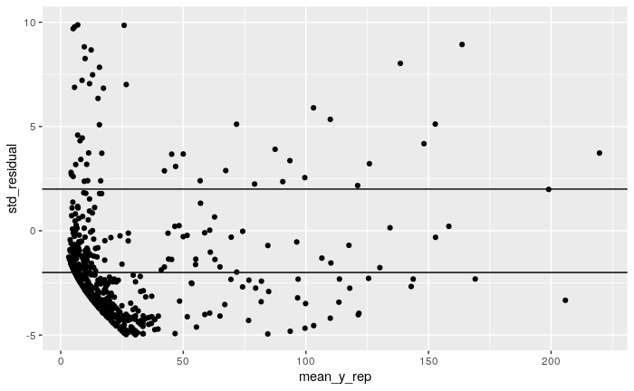

### Intervals - Poisson `New cases/day`

```{r Poisson_intervals_cases, echo=FALSE, warning=FALSE, eval=FALSE}
ppc_intervals(
  y = cases_dep$`New cases/day`, 
  yrep = y_rep,
  x = cases_dep$`Elapsed time`
) + 
  labs(x = "Days", y = "Cases")
```


### Accuracy - Poisson `New cases/day`

```{r Poisson_accuracy_cases, echo=FALSE, warning=FALSE, eval=FALSE}
ppc_stat_grouped(
  y = model.data.cases$cases,
  yrep = y_rep,
  group = cases_dep$Department,
  stat = "median",
  binwidth = 0.2
)
```

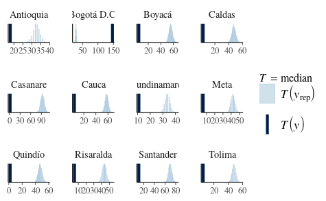

```{r looic_poisson_cases, eval=FALSE, include=FALSE}
loo.model.Poisson.cases <- loo(fit1.1)$estimates
```

## Negative Binomial model for `Cumulative cases /Department`

We try to improve the previous model using the Negative Binomial model:

$$
ln(\lambda_i) = \alpha + \beta\cdot elapsed\_time_i \\
y_i \sim \mathcal{Negative Binomial}(\lambda_i, \phi)  \\
\alpha \sim \mathcal{N}(0,1) \\
\beta \sim \mathcal{N}(0.25,1)
$$

Where the parameter $\phi$ is called *precision* and it is such that:

$$
E[y_i] = \lambda_i \\  Var[y_i] = \lambda_i + \frac{\lambda_i^2}{\phi}
$$

again $i=1,\dots,134$. As $\phi \rightarrow \infty$ the negative binomial approaches the Poisson distribution.

The `stan` function that we use here are `neg_binomial_2_log_rng` to specify the distribution of $y_i$ and the function `neg_binomial_2_log_lpmf` for the likelihood.

```{r NB1, echo=FALSE, warning=FALSE, eval=FALSE}
#compile
model.NB <- stan_model("stan/negative_binomial.stan")
#fit
fit2 <- sampling(model.NB, data=model.data)
```

### Posterior predictive check - NB `Cumulative cases /Department`

```{r NB_posterior_cumulative, echo=TRUE, warning=FALSE, eval=FALSE}
samples_NB <- rstan::extract(fit2)
y_rep <- samples_NB$y_rep
ppc_dens_overlay(y = model.data$cases, y_rep[1:200,]) + 
  coord_cartesian(xlim = c(-1, 6000))
```


```{r NB_posterior_2, echo=TRUE, warning=FALSE, eval=FALSE}
ppc_ecdf_overlay(model.data$cases, y_rep)
```


### Residual check - NB `Cumulative cases /Department`

```{r looic_NB, eval=FALSE, warning=FALSE, include=FALSE}
loo.model.NB <- loo(fit2)$estimates
```

```{r residuals_NB, echo=TRUE, warning=FALSE, eval=FALSE}
mean_inv_phi <- mean(samples_NB$inv_phi)
mean_y_rep <- colMeans(y_rep)
std_residual <- (model.data$cases - mean_y_rep) / sqrt(mean_y_rep + mean_y_rep^2*mean_inv_phi)
qplot(mean_y_rep, std_residual) + hline_at(2) + hline_at(-2)
```


The situation is better now, but still we have too many residuals outside the $95\%$ interval.

### Intervals - NB `Cumulative cases /Department`

```{r intervals_NB, echo=TRUE, warning=FALSE, eval=FALSE}
ppc_intervals(
  y = cases_dep$`Cumulative cases/Department`, 
  yrep = y_rep,
  x = cases_dep$`Elapsed time`
) + 
  labs(x = "Days", y = "Cases")
```


### Accuracy across departments - NB `Cumulative cases /Department`

```{r NB_deps, echo=TRUE, warning=FALSE, eval=FALSE}
ppc_stat_grouped(
  y = model.data$cases,
  yrep = y_rep,
  group = cases_dep$Department,
  stat = "median",
  binwidth = 0.2
)
```


We should take into account the differences across departments. 

### Negative Binomial model for `New cases/day`

```{r NB1_cases, echo=FALSE, warning=FALSE, eval=FALSE}
#fit
fit2.1 <- sampling(model.NB, data=model.data.cases)
```

### Posterior predictive check - NB `New cases/day`

```{r NB_posterior_cases, echo=TRUE, warning=FALSE, eval=FALSE}
samples_NB <- rstan::extract(fit2.1)
y_rep <- samples_NB$y_rep
ppc_dens_overlay(y = model.data.cases$cases, y_rep[1:200,]) + 
  coord_cartesian(xlim = c(-1, 1000))
```


```{r NB_posterior_cases_ecdf, eval=FALSE, warning=FALSE, include=FALSE}
ppc_ecdf_overlay(model.data.cases$cases, y_rep)
```


### Residual check - NB `New cases/day`

```{r looic_NB_cases, eval=FALSE, warning=FALSE, include=FALSE}
loo.model.NB.cases <- loo(fit2.1)$estimates
```

```{r residuals_NB_cases, echo=TRUE, warning=FALSE, eval=FALSE}
mean_inv_phi <- mean(samples_NB$inv_phi)
mean_y_rep <- colMeans(y_rep)
std_residual <- (model.data.cases$cases - mean_y_rep) / sqrt(mean_y_rep + mean_y_rep^2*mean_inv_phi)
qplot(mean_y_rep, std_residual) + hline_at(2) + hline_at(-2)
```


The situation is better now, but still we have too many residuals outside the $95\%$ interval.

### Intervals - NB `New cases/day`

```{r intervals_NB_cases, echo=TRUE, warning=FALSE, eval=FALSE}
ppc_intervals(
  y = cases_dep$`New cases/day`, 
  yrep = y_rep,
  x = cases_dep$`Elapsed time`
) + 
  labs(x = "Days", y = "Cases")
```


### Accuracy across departments - NB `New cases/day`

```{r NB_deps_cases, echo=TRUE, warning=FALSE, eval=FALSE}
ppc_stat_grouped(
  y = model.data.cases$cases,
  yrep = y_rep,
  group = cases_dep$Department,
  stat = "median",
  binwidth = 0.2
)
```


## Multilevel Negative Binomial regression for `Cumulative/Department`

We try to fit the following model, which also includes `Age` as covariat:

$$
ln(\lambda_i) = \alpha + \beta_{time}\cdot elapsed\_time_i + \beta_{age}\cdot age \\
y_i \sim \mathcal{Negative Binomial}(\lambda_i, \phi) \\
\alpha \sim \mathcal{N}(0,1) \\
\beta_{time} \sim \mathcal{N}(0.5,1) \\
\beta_{age} \sim \mathcal{N}(0,1)
$$

```{r NB2_fit, echo=FALSE, warning=FALSE, eval=FALSE}
#compile
model2.NB<-stan_model("stan/NB_model2.stan")
#arrange data
model.data2<-list(
  N = nrow(cases_dep),
  cases = cases_dep$`Cumulative cases/Department`,
  time = cases_dep$`Elapsed time`,
  age = cases_dep$`Mean age`
)
#fit
fit3<-sampling(model2.NB, model.data2)
```

### Posterior predictive check - multi NB `Cumulative/Department`

```{r NB2_posterior_check, echo=TRUE, warning=FALSE, eval=FALSE}
samples_NB2 <- rstan::extract(fit3)
y_rep <- samples_NB2$y_rep
ppc_dens_overlay(y = model.data2$cases, y_rep[1:200,]) + 
  coord_cartesian(xlim = c(-1, 6000))
```


```{r NB2_cum_ecdf, echo=TRUE, warning=FALSE, eval=FALSE}
ppc_ecdf_overlay(cases_dep$`Cumulative cases/Department`, y_rep)
```

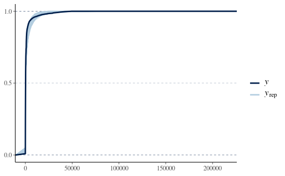

```{r looic_NB2, echo=FALSE, warning=FALSE, eval=FALSE}
loo.model.NB2 <- loo(fit3)$estimates
```

### Residual check - multi NB `Cumulative/Department`

```{r residuals_NB2, echo=TRUE, warning=FALSE, eval=FALSE}
mean_inv_phi <- mean(samples_NB2$inv_phi)
mean_y_rep <- colMeans(y_rep)
std_residual <- (model.data2$cases - mean_y_rep) / sqrt(mean_y_rep + mean_y_rep^2*mean_inv_phi)
qplot(mean_y_rep, std_residual) + hline_at(2) + hline_at(-2)
```

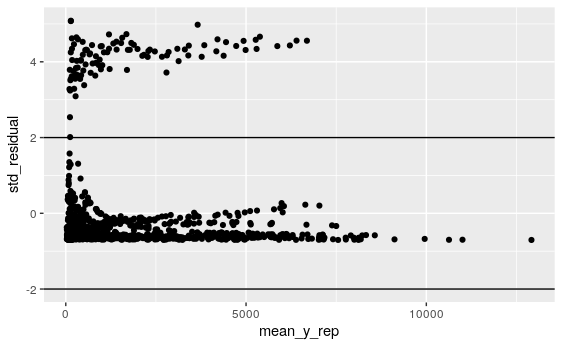

### Intervals - - multi NB `Cumulative/Department`

```{r intervals_NB2, echo=TRUE, warning=FALSE, eval=FALSE}
ppc_intervals(
  y = cases_dep$`Cumulative cases/Department`, 
  yrep = y_rep,
  x = cases_dep$`Elapsed time`
) + 
  labs(x = "Days", y = "Cases")
```

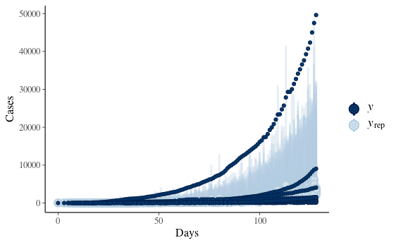

### Accuracy across departments - multi NB `Cumulative/Department`

```{r deps_NB2, echo=TRUE, warning=FALSE, eval=FALSE}
ppc_stat_grouped(
  y = model.data2$cases,
  yrep = y_rep,
  group = cases_dep$Department,
  stat = "median",
  binwidth = 0.2
)
```

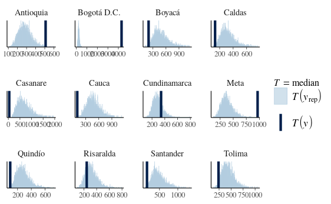

## Multilevel Negative Binomial Regression for `New cases/day`

```{r NB2_fit_cases, echo=FALSE, warning=FALSE, eval=FALSE}
#arrange data
model.data2.cases<-list(
  N = nrow(cases_dep),
  cases = cases_dep$`New cases/day`,
  time = cases_dep$`Elapsed time`,
  age = cases_dep$`Mean age`
)
#fit
fit3.1<-sampling(model2.NB, model.data2.cases)
```

### Posterior predictive check - multi NB `New cases/day`

```{r NB2_posterior_check_cases, echo=TRUE, warning=FALSE, eval=FALSE}
samples_NB2 <- rstan::extract(fit3.1)
y_rep <- samples_NB2$y_rep
ppc_dens_overlay(y = model.data2.cases$cases, y_rep[1:200,]) + 
  coord_cartesian(xlim = c(-1, 750))
```

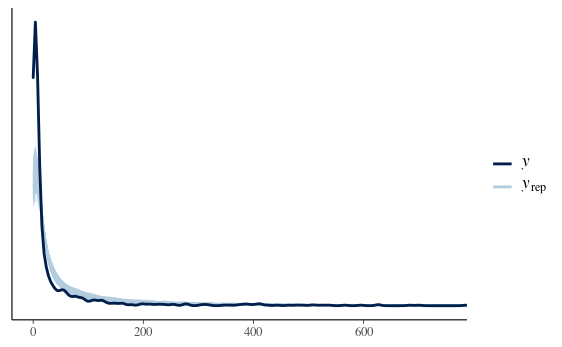

```{r NB2_cum_ecdf_cases, echo=TRUE, warning=FALSE, eval=FALSE}
ppc_ecdf_overlay(cases_dep$`New cases/day`, y_rep)
```


```{r looic_NB2_cases, echo=FALSE, warning=FALSE, eval=FALSE}
loo.model.NB2.cases <- loo(fit3.1)$estimates
```

### Residual check - multi NB `New cases/day`

```{r residuals_NB2_cases, echo=TRUE, warning=FALSE, eval=FALSE}
mean_inv_phi <- mean(samples_NB2$inv_phi)
mean_y_rep <- colMeans(y_rep)
std_residual <- (model.data2.cases$cases - mean_y_rep) / sqrt(mean_y_rep + mean_y_rep^2*mean_inv_phi)
qplot(mean_y_rep, std_residual) + hline_at(2) + hline_at(-2)
```

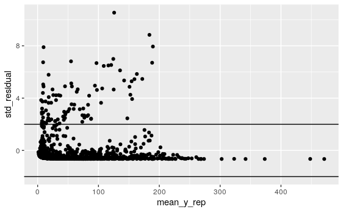

### Intervals - multi NB `New cases/day`

```{r intervals_NB2_cases, echo=TRUE, warning=FALSE, eval=FALSE}
ppc_intervals(
  y = cases_dep$`New cases/day`, 
  yrep = y_rep,
  x = cases_dep$`Elapsed time`
) + 
  labs(x = "Days", y = "Cases")
```


### Accuracy across departments - multi NB `New cases/day`

```{r deps_NB2_cases, echo=TRUE, warning=FALSE, eval=FALSE}
ppc_stat_grouped(
  y = model.data2.cases$cases,
  yrep = y_rep,
  group = cases_dep$Department,
  stat = "median",
  binwidth = 0.2
)
```


## Hierarchical model for `Cumulative/Department`

In order to improve the fit, we fit a model with department-specific intercept term.

So the varying intercept model that we take into account is now:

$$
ln(\lambda_{i,d}) = \alpha_d +  + \beta_{time}\cdot elapsed\_time_i + \beta_{age}\cdot age_i\\
\alpha_d \sim \mathcal{N}(\mu + \beta_{pop}\cdot pop_d + \beta_{sur}\cdot surface_d + \beta_{dens} \cdot density_d, \sigma_{\alpha})\\
y_i \sim \mathcal{Negative Binomial}(\lambda_{i,d}, \phi)
$$
  
The priors used for the above model are the following:

$$
\beta_{time} \sim \mathcal{N}(0.5,1) \\
\beta_{age} \sim \mathcal{N}(0,1) \\
\psi \sim \mathcal{N}(0,1)
$$

being $\psi = [\beta_{pop}, \beta_{sur}, \beta_{dens}]$.

## New dataset

We added the following covariats into the dataset:

  * `People`: millions of inhabitants for each region;
  
  * `Surface`: $km^3$, extent of each region;
  
  * `Density`: $\frac{people}{km^2}$, density of the population in each region.
  
```{r complete_hierarchical_data_fix, warning=FALSE, include=FALSE}
# Million inhabitants per department
cases_dep$People <- rep(0, nrow(cases_dep))
cases_dep[which(cases_dep$`Department ID` == 1),]$People  <- 6.4
cases_dep[which(cases_dep$`Department ID` == 2),]$People  <- 7.4
cases_dep[which(cases_dep$`Department ID` == 3),]$People  <- 1.2
cases_dep[which(cases_dep$`Department ID` == 4),]$People  <- 0.99

cases_dep[which(cases_dep$`Department ID` == 5),]$People  <- 0.4
cases_dep[which(cases_dep$`Department ID` == 6),]$People  <- 1.4
cases_dep[which(cases_dep$`Department ID` == 7),]$People  <- 2.9
cases_dep[which(cases_dep$`Department ID` == 8),]$People  <- 1.04
cases_dep[which(cases_dep$`Department ID` == 9),]$People  <- 0.53
cases_dep[which(cases_dep$`Department ID` == 10),]$People <- 0.94
cases_dep[which(cases_dep$`Department ID` == 11),]$People <- 2.18
cases_dep[which(cases_dep$`Department ID` == 12),]$People <- 1.33
#cases_dep[which(cases_dep$`Department ID` == 13),]$People <- 4.4

# km^2
cases_dep$Surface <- rep(0, nrow(cases_dep))
cases_dep[which(cases_dep$`Department ID` ==1),]$Surface  <- 63600
cases_dep[which(cases_dep$`Department ID` ==2),]$Surface  <- 1775
cases_dep[which(cases_dep$`Department ID` ==3),]$Surface  <- 23189
cases_dep[which(cases_dep$`Department ID` ==4),]$Surface  <- 7888
cases_dep[which(cases_dep$`Department ID` ==5),]$Surface  <- 44640
cases_dep[which(cases_dep$`Department ID` ==6),]$Surface  <- 29308
cases_dep[which(cases_dep$`Department ID` ==7),]$Surface  <- 24210
cases_dep[which(cases_dep$`Department ID` ==8),]$Surface  <- 85635
cases_dep[which(cases_dep$`Department ID` ==9),]$Surface  <- 1845
cases_dep[which(cases_dep$`Department ID` ==10),]$Surface <- 4140
cases_dep[which(cases_dep$`Department ID` ==11),]$Surface <- 30537
cases_dep[which(cases_dep$`Department ID` ==12),]$Surface <- 23562
#cases_dep[which(cases_dep$`Department ID` ==13),]$Surface <- 22195

# Population density inhabitants/km^2
cases_dep$Density <- rep(0, nrow(cases_dep))
cases_dep[which(cases_dep$`Department ID` == 1),]$Density <- 88.06
cases_dep[which(cases_dep$`Department ID` ==2),]$Density  <- 4552
cases_dep[which(cases_dep$`Department ID` ==3),]$Density  <- 93
cases_dep[which(cases_dep$`Department ID` ==4),]$Density  <- 130
cases_dep[which(cases_dep$`Department ID` ==5),]$Density  <- 9.4
cases_dep[which(cases_dep$`Department ID` ==6),]$Density  <- 50
cases_dep[which(cases_dep$`Department ID` ==7),]$Density  <- 99.15
cases_dep[which(cases_dep$`Department ID` ==8),]$Density  <- 12
cases_dep[which(cases_dep$`Department ID` ==9),]$Density  <- 290
cases_dep[which(cases_dep$`Department ID` ==10),]$Density <- 59.16
cases_dep[which(cases_dep$`Department ID` ==11),]$Density <- 72
cases_dep[which(cases_dep$`Department ID` ==12),]$Density <- 56
#cases_dep[which(cases_dep$`Department ID` ==13),]$Density <- 183.04
```

The model is:
  
```{r hierarchical_complete_data, eval=FALSE, warning=FALSE, include=FALSE}
#compile the model 
model3.NB <- stan_model("stan/NB_model3.stan")

People <- cases_dep %>% select(People) %>% unique()
People <- as.vector(People[1])
Density <- cases_dep %>% select(Density) %>% unique()
Density <- as.vector(Density[1])
Surface <- cases_dep %>% select(Surface) %>% unique()
Surface <- as.vector(Surface[1])

dep_data.complete <- cbind(People, Surface, Density)
dep_data.complete <- dep_data.complete %>% as.matrix()

#prepare the new data
data.hier.NB.complete<-
  with(cases_dep,
       list(N = nrow(cases_dep),
            cases = cases_dep$`Cumulative cases/Department`,
            time = cases_dep$`Elapsed time`,
            age = cases_dep$`Mean age`,
            K = 3, 
            J = 12, #13,
            dep_id = cases_dep$`Department ID`,
            dep_data = dep_data.complete
       )
  )

#fit the model 
fit.4 <- sampling(model3.NB, data.hier.NB.complete)
```
  
### Posterior predictive check - hierarchical NB `Cumulative/Department`

```{r hier_posterior_check, echo=TRUE, warning=FALSE, eval=FALSE}
samples_hier <- rstan::extract(fit.4)
y_rep <- samples_hier$y_rep
ppc_dens_overlay(y = data.hier.NB.complete$cases, y_rep[1:200,]) + 
  coord_cartesian(xlim = c(-1, 6000))
```

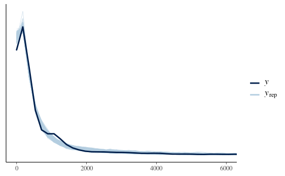

```{r hier_cum_ecdf, echo=TRUE, warning=FALSE, eval=FALSE}
ppc_ecdf_overlay(cases_dep$`Cumulative cases/Department`, y_rep)
```


### Residual check - hierarchical NB `Cumulative/Department`

```{r residuals_hier, echo=TRUE, warning=FALSE, eval=FALSE}
mean_inv_phi <- mean(samples_hier$inv_phi)
mean_y_rep <- colMeans(y_rep)
std_residual <- (data.hier.NB.complete$cases - mean_y_rep) / sqrt(mean_y_rep + mean_y_rep^2*mean_inv_phi)
qplot(mean_y_rep, std_residual) + hline_at(2) + hline_at(-2)
```

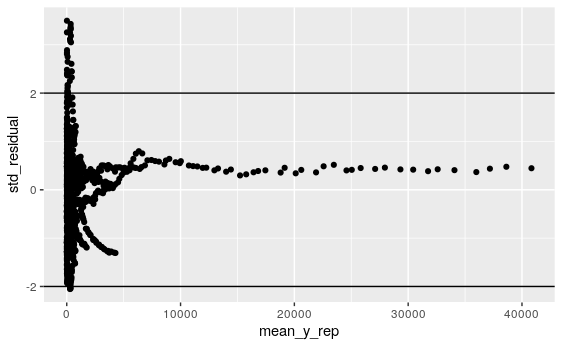

Very few points are now outside the $95\%$ confidence interval.

### Intervals - hierarchical NB `Cumulative/Department`

```{r intervals_hier, echo=TRUE, warning=FALSE, eval=FALSE}
ppc_intervals(
  y = cases_dep$`Cumulative cases/Department`, 
  yrep = y_rep,
  x = cases_dep$`Elapsed time`
) + 
  labs(x = "Days", y = "Cases")
```


### Accuracy across departments - hierarchical NB `Cumulative/Department`

```{r deps_hier, echo=TRUE, warning=FALSE, eval=FALSE}
ppc_stat_grouped(
  y = data.hier.NB.complete$cases,
  yrep = y_rep,
  group = cases_dep$Department,
  stat = "median",
  binwidth = 0.2
)
```

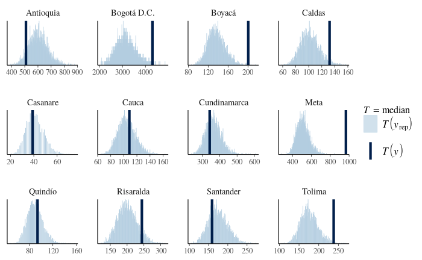

We can clearly see that the accuracy across the departments has significantly increased with respect to the previous models.

```{r eval=FALSE, include=FALSE}
#looic has decreased significantly
loo.model.NB.hier<-loo(fit.4)$estimates 
```

## Hierarchical model for `New cases/day`

```{r hierarchical_complete_data_cases, eval=FALSE, warning=FALSE, include=FALSE}
#prepare the new data
data.hier.NB.complete.cases<-
  with(cases_dep,
       list(N = nrow(cases_dep),
            cases = cases_dep$`New cases/day`,
            time = cases_dep$`Elapsed time`,
            age = cases_dep$`Mean age`,
            K = 3, 
            J = 12, #13,
            dep_id = cases_dep$`Department ID`,
            dep_data = dep_data.complete
       )
  )

#fit the model 
fit.4.1 <- sampling(model3.NB, data.hier.NB.complete.cases)
```
  
### Posterior predictive check - hierarchical NB `New cases/day`

```{r hier_posterior_check_cases, echo=TRUE, warning=FALSE, eval=FALSE}
samples_hier <- rstan::extract(fit.4.1)
y_rep <- samples_hier$y_rep
ppc_dens_overlay(y = data.hier.NB.complete.cases$cases, y_rep[1:200,]) + 
  coord_cartesian(xlim = c(-1, 500))
```

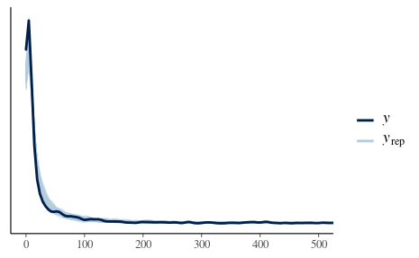

```{r hier_cum_ecdf_cases, echo=TRUE, warning=FALSE, eval=FALSE}
ppc_ecdf_overlay(cases_dep$`New cases/day`, y_rep)
```


### Residual check - hierarchical NB `New cases/day`

```{r residuals_hier_cases, echo=TRUE, warning=FALSE, eval=FALSE}
mean_inv_phi <- mean(samples_hier$inv_phi)
mean_y_rep <- colMeans(y_rep)
std_residual <- (data.hier.NB.complete.cases$cases - mean_y_rep) / sqrt(mean_y_rep + mean_y_rep^2*mean_inv_phi)
qplot(mean_y_rep, std_residual, ylim = c(-3, 4)) + hline_at(2) + hline_at(-2)
```


Very few points are now outside the $95\%$ confidence interval.

### Intervals - hierarchical NB `New cases/day`

```{r intervals_hier_cases, echo=TRUE, warning=FALSE, eval=FALSE}
ppc_intervals(
  y = cases_dep$`New cases/day`, 
  yrep = y_rep,
  x = cases_dep$`Elapsed time`
) + 
  labs(x = "Days", y = "Cases")
```

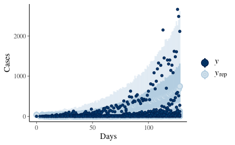

### Accuracy across departments - hierarchical NB `New cases/day`

```{r deps_hier_cases, echo=TRUE, warning=FALSE, eval=FALSE}
ppc_stat_grouped(
  y = data.hier.NB.complete.cases$cases,
  yrep = y_rep,
  group = cases_dep$Department,
  stat = "median",
  binwidth = 0.2
)
```


We can clearly see that the accuracy across the departments has significantly increased with respect to the previous models.

```{r eval=FALSE, include=FALSE}
#looic has decreased significantly
loo.model.NB.hier.cases<-loo(fit.4.1)$estimates 
```

## LOOIC

The Leave-One-Out cross validation is a method for estimating pointwise out-of-sample prediction accuracy from a fitted Bayesian model using the log-likelihood evaluated at the posterior simulation of the parameters values. 

Plot the `looic` to compare models:

```{r bayesian_model_comparison, echo=TRUE, warning=FALSE, eval=FALSE}
loo.all.deps<-c(loo.model.Poisson.cases[3], loo.model.NB.cases[3], loo.model.NB2.cases[3], loo.model.NB.hier.cases[3])

sort.loo.all.deps<- sort.int(loo.all.deps, index.return = TRUE)$x

par(xaxt="n")
plot(sort.loo.all.deps, type="b", xlab="", ylab="LOOIC", main="Model comparison")
par(xaxt="s")
axis(1, c(1:4), c("Poisson", "NB-sl", "NB-ml", 
                  "hier")[sort.int(loo.all.deps,
                    index.return = TRUE)$ix],
                    las=2)
```

