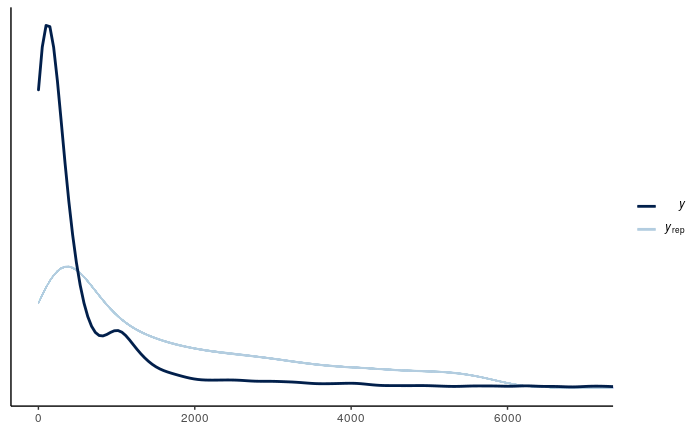
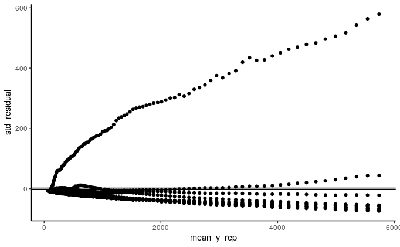
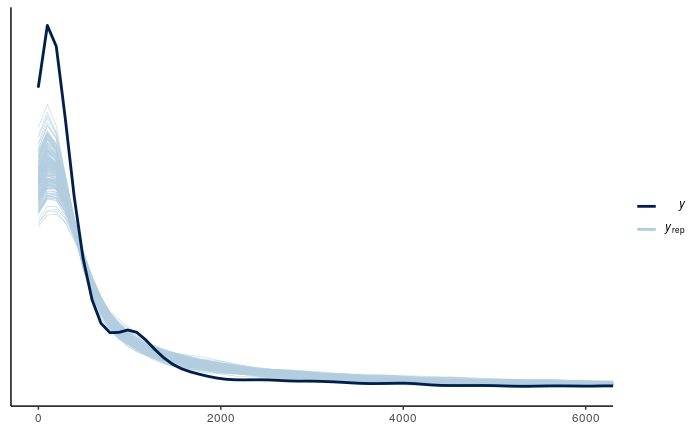
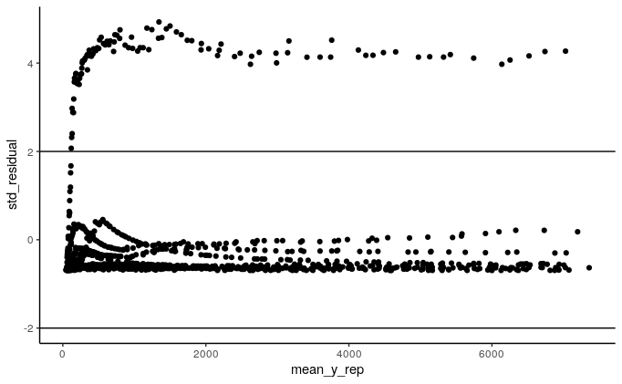
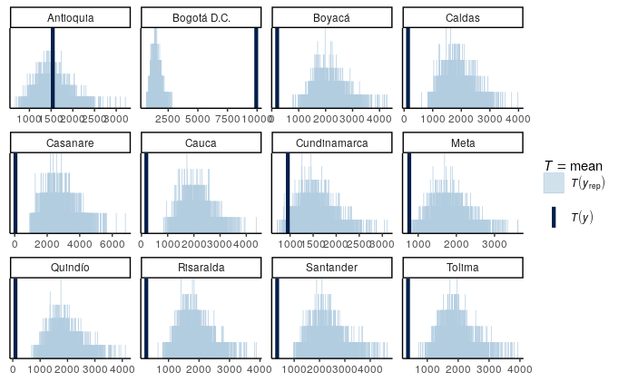
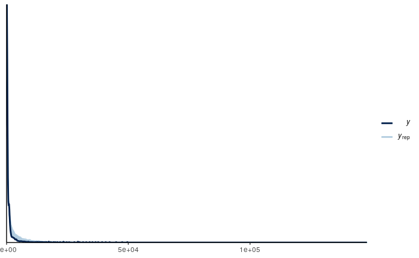
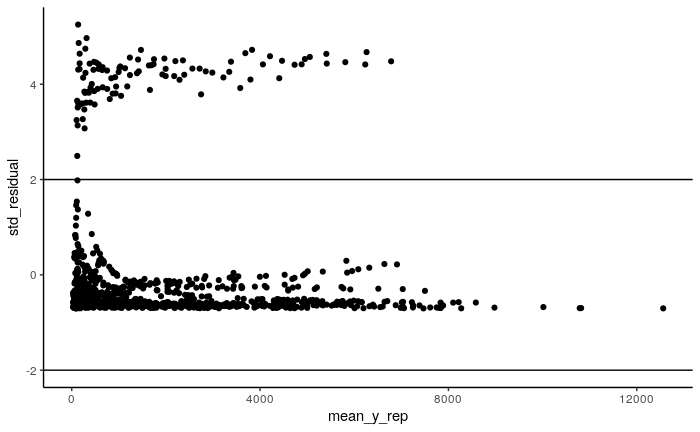
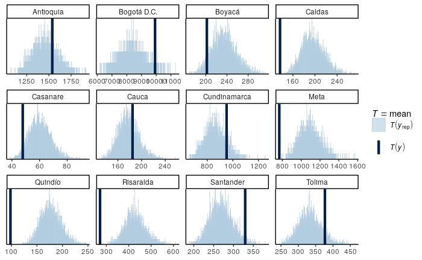
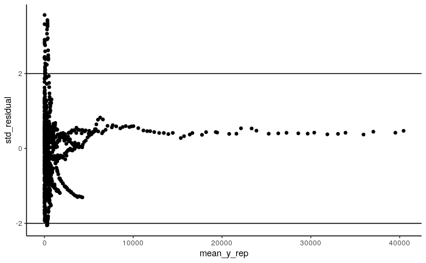
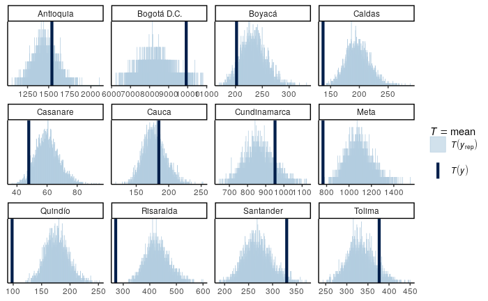

```{r global_options, include=FALSE}
knitr::opts_chunk$set(fig.align = 'center', warning=FALSE, message=FALSE, fig.asp=0.625, dev='png', global.par = TRUE, dev.args=list(pointsize=10), fig.path = 'figs/')
```

```{r setup, include=FALSE}
library(knitr)
local({
  hook_plot = knit_hooks$get('plot')
  knit_hooks$set(plot = function(x, options) {
    paste0('\n\n----\n\n', hook_plot(x, options))
  })
})
knitr::opts_chunk$set(echo = FALSE)#, tidy = TRUE)
```

```{r message=FALSE, include=FALSE}
library(MASS)
library(readr)
library(dplyr)
library(ggplot2)
library(bayesplot)
library(ggthemes)
library(ggrepel)
library(RColorBrewer)
library(leaflet)
library(geojsonio)
library(htmltools)
library(htmlwidgets)
library(rstan)
library(lubridate)
```

## Our project

We decided to do **central Colombia**, basically because it is where the capital is.

We built a model for the number of `confirmed` cases using all the others covariates (plus some we created) and we estimated the predictive accuracy of our selected model.

We decided to consider as **central Colombia** the following departments/districts: Bogotà DC, Boyacá, Tolima, Cundinamarca, Meta, Quindío, Valle del Cauca, Risaralda, Celdas, Boyacá, Antioquia, Santander, Casanare.

## Loading the dataset

This dataset is missing completely the department `Quindío`!

```{r loading}
colombia_covid <- as.data.frame(read_csv("data/covid19co_official.csv"))
cols <- colnames(colombia_covid)[c(1, 4, 5, 6, 7, 8, 9, 10, 14)]  # also include 11 ?!?!?!
colombia_covid <- colombia_covid[cols]
colombia_covid <- colombia_covid[, c(1, 9, 2, 3, 4, 5, 6, 7, 8)]
colnames(colombia_covid) <- c("ID de caso", "Fecha de diagnóstico", "Ciudad de ubicación", "Departamento o Distrito", "Atención", "Edad" , "Sexo", "Tipo", "País de procedencia") # "Estado"
central.colombia.dep <- c("Bogotá D.C.", "Tolima", "Cundinamarca", "Meta", "Boyacá", "Quindío", "Cauca",
    "Valle del Cauca", "Risaralda", "Caldas", "Boyacá", "Antioquia", "Santander", "Casanare")
central.colombia.rows <- which(colombia_covid$`Departamento o Distrito` %in% central.colombia.dep)
colombia_covid <- colombia_covid[central.colombia.rows, ]
unique(colombia_covid$`Departamento o Distrito`)
```


 
## Description of variables

- **ID de caso**: ID of the confirmed case. 

- **Fecha de diagnóstico**: Date in which the disease was diagnosed. 

- **Ciudad de ubicación**: City where the case was diagnosed.

- **Departamento o Distrito**: Department or district where the city belongs to.

- **Atención**: Situation of the patient: recovered, at home, at the hospital, at the ICU or deceased.

- **Edad**: Age of the confirmed case.

- **Sexo**: Sex of the confirmed case.

- **Tipo**: How the person got infected: in Colombia, abroad or unknown. 

- **País de procedencia**: Country of origin if the person got infected abroad.
 
## Map

Here we can see our selected cities. The color of the pins is related with the number of cases: if they are less than $10$ the color is "green", if they are less than $100$ the color is "orange", otherwise it is "red".

```{r create_gis_df, include=FALSE}
#lat-long
#bogota<c(4.592164298, -74.072166378, 542)
valle_de_cauca<-c("Valle del Cauca", 3.4372200, -76.5225000, 150)
cauca<-c("Cauca", 2.43823, -76.6131592, 12) 
antioquia<-c("Antioquia",6.2518400, -75.5635900, 127)
cartagena<-c("Cartagena D.T. y C", 10.39972, -75.51444, 39)
huila<-c("Huila", 2.9273, -75.2818909, 30)
meta<-c("Meta", 4.1420000, -73.6266400, 12)
risaralda<-c("Risaralda", 4.8133302, -75.6961136, 35)
norte_santander<-c("Norte de Santander", 7.8939100, -72.5078200, 21)
caldas<-c("Caldas", 5.0688900, -75.5173800, 16)
cudinamarca<-c("Cundinamarca", 4.862437, -74.058655, 42)
barraquilla<-c("Barranquilla D.E.", 10.9685400, -74.7813200, 35) #atlantico
santader<-c("Santander", 7.1253900, -73.1198000, 12)
quindio<-c("Quindío", 4.535000, -75.675690, 23)
tolima<-c("Tolima", 4.43889, -75.2322235, 14)
santa_marta<-c("Santa Marta D.T. y C.", 11.24079, -74.19904, 12)
cesar<-c("Cesar", 10.4631400, -73.2532200, 16)
san_andres<-c("San Andrés", 12.5847197, -81.7005615, 2)
casanare<-c("Casanare", 5.3377500, -72.3958600, 2)
narino<-c("Nariño", 1.2136100, -77.2811100, 6)
boyaca<-c("Boyacá", 5.767222, -72.940651, 6)
cordoba<-c("Córdoba", 8.7479800, -75.8814300, 2)
bolivar<-c("Bolívar", 10.3997200, -75.5144400, 3)
sucre<-c("Sucre", 9.3047199, -75.3977814, 1)
guajira<-c("La Guajira", 11.5444400, -72.9072200, 1)

gis_data<-data.frame(name="Bogotá D.C.", latitude=4.624335, longitude=-74.063644, cases=542) #bogotà
gis_data$name<-as.character(gis_data$name)
gis_data<-rbind(gis_data, cauca)
gis_data<-rbind(gis_data, valle_de_cauca)
gis_data<-rbind(gis_data, antioquia)
gis_data<-rbind(gis_data, cartagena)
gis_data<-rbind(gis_data, huila)
gis_data<-rbind(gis_data, meta)
gis_data<-rbind(gis_data, risaralda)
gis_data<-rbind(gis_data, norte_santander)
gis_data<-rbind(gis_data, caldas)
gis_data<-rbind(gis_data, cudinamarca)
gis_data<-rbind(gis_data, barraquilla)
gis_data<-rbind(gis_data, santader)
gis_data<-rbind(gis_data, quindio)
gis_data<-rbind(gis_data, tolima)
gis_data<-rbind(gis_data, santa_marta)
gis_data<-rbind(gis_data, cesar)
gis_data<-rbind(gis_data, san_andres)
gis_data<-rbind(gis_data, casanare)
gis_data<-rbind(gis_data, narino)
gis_data<-rbind(gis_data, boyaca)
gis_data<-rbind(gis_data, cordoba)
gis_data<-rbind(gis_data, bolivar)
gis_data<-rbind(gis_data, sucre)
gis_data<-rbind(gis_data, guajira)

gis_data$latitude<-as.numeric(gis_data$latitude)
gis_data$longitude<-as.numeric(gis_data$longitude)
gis_data$cases<-as.numeric(gis_data$cases)
```

```{r central_colombia, inlcude=FALSE}
dept<-geojsonio::geojson_read("data/Colombia.geo.json", what="sp")
#slice the gis_data dataset
central_gis_data<-gis_data[which(gis_data$name %in% central.colombia.dep),]
#slice the geojson dataset 
central_dept<-c("SANTAFE DE BOGOTA D.C", "TOLIMA", "CUNDINAMARCA", "META", "BOYACA", "QUINDIO", "CAUCA", "VALLE DEL CAUCA", "RISARALDA", "CALDAS", "BOYACA", "ANTIOQUIA", "SANTANDER", "CASANARE")
central.dept<-dept[which(dept@data$NOMBRE_DPT %in% central_dept),]
```

```{r our_map, echo=TRUE, warning=FALSE, include=FALSE}
getColor <- function(central_gis_data) {
  sapply(central_gis_data$cases, function(cases) {
  if(cases <= 10) {
    "green"
  } else if(cases <= 100) {
    "orange"
  } else {
    "red"
  } })
}

icons <- awesomeIcons(
  icon = 'ios-close',
  iconColor = 'black',
  library = 'ion',
  markerColor = getColor(central_gis_data)
)

#now colombia is yellow and our departments are red

central_map <- leaflet(data=central_gis_data) %>% addTiles() %>%
  addAwesomeMarkers(~longitude, ~latitude, icon=icons, label = ~htmlEscape(paste(name,cases,sep=" : "))) %>%
  addProviderTiles(providers$CartoDB.Positron) %>%
  addPolygons(data=dept,
              opacity=0.1,
              color="yellow",
              fillOpacity = 0.1) %>%
  addPolygons(data=central.dept,     
              opacity = 0.2,
              color = "red",
              dashArray = "3",
              fillOpacity = 0.1)
#saveWidget(central_map, file="figs/central_colombia.html")
```

```{r map}
central_map
```


## Preprocessing {.smaller}

```{r types, include=FALSE}
## day column in "international" format (so that R can fix the sorting properly)
colombia_covid$`Fecha de diagnóstico` <- as.Date(colombia_covid$`Fecha de diagnóstico`, format="%d/%m/%Y")
colombia_covid <- colombia_covid[order(colombia_covid$`Fecha de diagnóstico`), ]
# there were missing rows since we cancelled some departments
colombia_covid$`ID de caso` <- 1:dim(colombia_covid)[1]
colombia_covid[which(colombia_covid$Sexo == "m"), "Sexo"] <- "M"
colombia_covid[which(colombia_covid$Sexo == "f"), "Sexo"] <- "F"
colombia_covid <- colombia_covid %>% mutate("Grupo de edad" = case_when(Edad <= 18 ~ '0_18',
                                                   Edad >= 19  & Edad <= 30 ~ '19_30',
                                                   Edad >=  31 & Edad <= 45 ~ '31_45',
                                                   Edad >= 46 & Edad <= 60 ~ '46_60',
                                                   Edad >=61 & Edad <= 75 ~ '60_75',
                                                   Edad >=76 ~ '76+'))
#colombia_covid$`Grupo de edad` <- as.factor(colombia_covid$`Grupo de edad`)
#colombia_covid$`Departamento o Distrito` <- as.factor(colombia_covid$`Departamento o Distrito`)
#colombia_covid$`Ciudad de ubicación` <- as.factor(colombia_covid$`Ciudad de ubicación`)
#colombia_covid$Sexo <- as.factor(colombia_covid$Sexo)
#colombia_covid$Atención <- as.factor(colombia_covid$Atención)
#colombia_covid$Tipo <- as.factor(colombia_covid$Tipo)
```

We had to clean the dataset:

- We transformed the `Fecha de diagnóstico` variable into a `Date` type variable,

- we fixed the variable `Id de caso` (since we removed some departments, so some lines, the numbers weren't consecutive),

- we created a variable `Grupo de edad`,

- we cleaned the column `País de procedencia` (replaced cities with the country) and created the variable `Continente de procedencia` (as the first is too fragmented we thought to consider the continents).

<!-- - we transformed the variables `Grupo de edad`, `Departamento o Distrito`, `Ciudad de ubicación`, `Sexo`, `Atención`, `Tipo` into factors, -->

```{r display}
head(colombia_covid, 3)
```

## New dataset I

```{r cases}
cases <- colombia_covid %>%
  group_by(`Fecha de diagnóstico`) %>%
  count() %>% rename("Date" = `Fecha de diagnóstico`, "New cases/day" = n)
cases2 <- colombia_covid %>%
  group_by(`Fecha de diagnóstico`) %>%
  summarise(`Cumulative cases` = max(`ID de caso`))
cases <- bind_cols(cases, cases2%>%
  dplyr::select(-c(`Fecha de diagnóstico`)))
cases <- as.data.frame(cases)
cases <- cases %>% mutate(BETWEEN0 = as.numeric(difftime(Date, lag(Date, 1), units = "days")),
            BETWEEN = ifelse(is.na(BETWEEN0), 0, BETWEEN0), `Elapsed time` =
              cumsum(as.numeric(BETWEEN))) %>% dplyr::select(-c(BETWEEN0,BETWEEN))
cases <- cases[, c(1,4,2,3)]
```

```{r cases_head, echo=FALSE}
head(cases, 10)
```

## New dataset II

```{r cases_per_dep}
cases_dep <- colombia_covid %>%
  group_by(`Fecha de diagnóstico`, `Departamento o Distrito`) %>%
  count() %>% rename("Date" = `Fecha de diagnóstico`, "Department"=`Departamento o Distrito`, "New cases/day" = n)
cases_dep <- cases_dep %>%
  group_by(`Department`) %>%
  mutate(`Cumulative cases/Department` = cumsum(`New cases/day`))
cases_dep <- as.data.frame(cases_dep)
cases_dep <- cases_dep %>% mutate(BETWEEN0 = as.numeric(difftime(Date, lag(Date, 1), units = "days")),
            BETWEEN = ifelse(is.na(BETWEEN0), 0, BETWEEN0), `Elapsed time` =
            cumsum(as.numeric(BETWEEN))) %>% dplyr::select(-c(BETWEEN0,BETWEEN))
```


```{r fix_dataset, warning=FALSE, include=FALSE}
cases_dep <- cases_dep[order(cases_dep$Department) ,]
cases_dep <- cases_dep %>%
  dplyr::mutate(dep_idx = factor(Department, levels=unique(Department)),
         `Department ID` = as.integer(dep_idx)) %>%
  dplyr::select(-dep_idx)
cases_dep <- cases_dep[, c(1, 5, 2, 6, 3, 4)]

mean_age <- colombia_covid %>%
  group_by(`Departamento o Distrito`, `Fecha de diagnóstico`) %>% 
  summarise_at(vars(Edad), funs(`Mean age` = mean(., na.rm=TRUE)))

cases_dep <- cbind(cases_dep, `Mean age` = mean_age$`Mean age`)
```

```{r}
head(cases_dep, 10)
#head(cases_dep[order(cases_dep$Date), ], 10)
#cases_dep[c(1, 2, 16, 17, 18, 40, 41, 42, 54, 55), ]
```

```{r relevant_dep, include=FALSE}
#departments with more than 30 cases:
relevant <- unique(cases_dep[cases_dep$`Cumulative cases/Department`>30,]$Department)
cases_relev_dep <- as.data.frame(subset(cases_dep, Department %in% relevant))
cases_relev_dep <- cases_relev_dep[order(cases_relev_dep$Department), ]
row.names(cases_relev_dep) <- seq(1:nrow(cases_relev_dep))
```

```{r cases_dep_head, eval=FALSE, include=FALSE}
#head(cases_relev_dep)
cases_relev_dep[c(1, 2, 16, 17, 18, 40, 41, 42, 54, 55), ]
```

## Exploring the dataset {.smaller}

Scattered infos about pandemic in Colombia (https://en.wikipedia.org/wiki/COVID-19_pandemic_in_Colombia): 

  * the quarantine started on the 20th of March, since our data are from 6th of March to 2nd of April, it is very likeliy that quarantine effects are not witnessed in our data.
  
  * on March the 26th there was a damage in the machine that prepared the samples for processing and subsequent diagnosis of COVID-19, which affected the speed at which results were being produced. This could explain the very low number of confirmed cases.

<!-- Number of cases confirmed day by day -->

```{r barplot, echo=FALSE, warning=FALSE, fig.pos='htb!'}
theme_set(theme_classic())

colorCount<-length(unique(colombia_covid$`Departamento o Distrito`)) 
getPalette<-colorRampPalette(brewer.pal(9, "Spectral"))(colorCount)

ggplot(colombia_covid, aes(x = `Fecha de diagnóstico`)) +
  scale_fill_manual(values = getPalette) +
  geom_histogram(aes(fill=`Departamento o Distrito`), width = 0.8, stat="count") + 
  theme(axis.text.x = element_text(angle=65, vjust=0.6),
        legend.position = "right") +
  labs(title = "Daily number of confirmed cases", 
       subtitle = "subdivided across departments",
       x = "Date of confirmation",
       fill = "Department")
```

The previous plot represents the daily incidence of the desease across all the departments we are taking into account.

## Other plots

```{r waffle_chart, echo=FALSE, warning=FALSE}
# theme_set(theme_classic())
# region<-colombia_covid$`Departamento o Distrito`
# nrows<-10
# df <- expand.grid(y = 1:nrows, x = 1:nrows)
# categ_table <- round(table(region) * ((nrows*nrows+1)/(length(region))))
# df$category<-factor(rep(names(categ_table), categ_table))
# waffle_chart <- ggplot(df, aes(x = x, y = y, fill = df$category)) + 
#         geom_tile(color = "black", size = 0.5) +
#         scale_x_continuous(expand = c(0, 0)) +
#         scale_y_continuous(expand = c(0, 0), trans = 'reverse') +
#         scale_fill_brewer(palette = "Set3") +
#         labs(title="Frequency of cases across Departments", subtitle="Waffle Chart") + 
#         theme(#panel.border = element_rect(size = 2),
#         plot.title = element_text(size = rel(1.2)),
#               axis.text = element_blank(),
#               axis.title = element_blank(),
#               axis.ticks = element_blank(),
#               legend.title = element_blank(),
#               legend.position = "right")
# waffle_chart
```

The major number of cases are in the capital Bogotà.

```{r cumulative_plot, echo=FALSE}
ggplot(cases, aes(x=Date, y=`Cumulative cases`)) +
  geom_point(size=3) +
  geom_segment(aes(x=Date,
                   xend=Date,
                   y=0,
                   yend=`Cumulative cases`)) +
  labs(title = "Cumulative number of confirmed cases",
       x = "Date of confirmation") +
  theme(axis.text.x = element_text(angle=65, vjust=0.6))
```

Here the growth seems exponential (and this is consistent with the fact that we are studying the early stages of the outbreak).

```{r gender_plot, echo=TRUE, warning=FALSE}
brks <- seq(-250, 250, 50)
lbls <- as.character(c(seq(-250, 0, 50), seq(50, 250, 50)))

ggplot(data=colombia_covid, aes(x=`Departamento o Distrito`, fill = Sexo)) +  
                              geom_bar(data = subset(colombia_covid, Sexo == "F")) +
                              geom_bar(data = subset(colombia_covid, Sexo == "M"), aes(y=..count..*(-1))) + 
                              scale_y_continuous(breaks = brks,
                                               labels = lbls) + 
                              coord_flip() +  
                              labs(title="Spread of the desease across genders",
                                   y = "Number of cases",
                                   x = "Department",
                                   fill = "Gender") +
                              theme_tufte() +  
                              theme(plot.title = element_text(hjust = .5), 
                                    axis.ticks = element_blank()) +   
                              scale_fill_brewer(palette = "Dark3")  
```

The desease (number of cases) is more or less equally distributed across genders.

```{r age_grps_plot, echo=TRUE, warning=FALSE}
#compute percentage so that we can label more precisely the pie chart
age_groups_pie <- colombia_covid %>% 
  group_by(`Grupo de edad`) %>%
  count() %>%
  ungroup() %>%
  mutate(per=`n`/sum(`n`)) %>% 
  arrange(desc(`Grupo de edad`))
age_groups_pie$label <- scales::percent(age_groups_pie$per)

age_pie <- ggplot(age_groups_pie, aes(x = "", y = per, fill = factor(`Grupo de edad`))) + 
  geom_bar(stat="identity", width = 1) +
  theme(axis.line = element_blank(), 
        plot.title = element_text(hjust=0.5)) + 
  labs(fill="Age groups", 
       x=NULL, 
       y=NULL, 
       title="Distribution of the desease across ages") +
  coord_polar(theta = "y") +
  #geom_text(aes(x=1, y = cumsum(per) - per/2, label=label))
  geom_label_repel(aes(x=1, y=cumsum(per) - per/2, label=label), size=3, show.legend = F, nudge_x = 0) +
  guides(fill = guide_legend(title = "Group"))
  
age_pie 
```

People from 31 to 45 years old are the most affected by the disease and people over 76 years old are the least affected.
Colombia is a very young country. In 2018 the median age of the population was 30.4 years old and the largest age group is made of people from 25 to 54 years old, which comprises 41.98% of the population.
(https://www.indexmundi.com/colombia/demographics_profile.html)

## Age-Sex plot

```{r age-sex_plot, echo=FALSE, warning=FALSE}
keep <- c("Sexo", "Grupo de edad")
age_groups<-colombia_covid$`Grupo de edad`[names(colombia_covid$`Grupo de edad`)%in%keep]
age_groups_count <- aggregate(cbind(pop=Sexo) ~ `Grupo de edad` + Sexo,
                      data=colombia_covid,
                      FUN = function(x){NROW(x)})
age_groups_count$count <- ifelse(age_groups_count$Sexo == "F", age_groups_count$pop * -1, age_groups_count$pop)
age_groups_count<-as.data.frame(age_groups_count[names(age_groups_count)!="pop"])

ggplot(age_groups_count, aes(x=`Grupo de edad`, y=count, fill=Sexo)) +
  geom_col() + 
  #facet_share(~Sexo, dir = "h") +
  coord_flip(clip="off") +
  theme_minimal() +
  labs(title = "Distribution of sex by age",
       y = "",
       x = "Age group")
```

There isn’t much difference between the sexes among the different group of ages.

## Tipo plot

```{r tipo_plot, echo=TRUE, warning=FALSE}
theme_set(theme_classic())

ggplot(colombia_covid, aes(x = `Fecha de diagnóstico`)) +
  scale_fill_brewer(palette = "Set3") +
  geom_histogram(aes(fill=Tipo), width = 0.8, stat="count") +
  theme(axis.text.x = element_text(angle=65, vjust=0.6)) +
  labs(title = "Daily number of confirmed cases", 
       subtitle = "subdivided across type",
       x = "Date of confirmation",
       fill = "Type")
```

## Tipo

I think that `en estudio` means that it is not clear while the case is imported or not, however it seems like there are more imported cases, we can count them:

```{r tipo2, echo=TRUE, warning=FALSE}
type_pie <- colombia_covid %>% 
  group_by(Tipo) %>%
  count() %>%
  ungroup() %>%
  mutate(per=`n`/sum(`n`)) %>% 
  arrange(desc(Tipo))
type_pie$label <- scales::percent(type_pie$per)
type_pie<-type_pie[names(type_pie)!="per"]
colnames(type_pie)<-c("Tipo", "Total number", "Percentage")
type_pie
```

<!-- ## Continent

Now let's plot a pie chart to be able to see the distribution of cases across the continents.  -->

<!-- ```{r country2, warning=FALSE, include=FALSE} -->
<!-- unique(colombia_covid$`Continente de procedencia`) -->
<!-- #Some observations came from more than one continent. So these observations we will assign them as "more than one continent" -->
<!-- #change the `Continente de procedencia` columns  (didn't modify the original dataset though) -->
<!-- continent_of_origin <- colombia_covid -->
<!-- continent_of_origin$`Continente de procedencia`[continent_of_origin$`Continente de procedencia`=="Europa - Asia"] <- "More than one continent" -->
<!-- continent_of_origin$`Continente de procedencia`[continent_of_origin$`Continente de procedencia`=="Europa - África"] <- "More than one continent" -->
<!-- continent_of_origin$`Continente de procedencia`[continent_of_origin$`Continente de procedencia`=="Europa - Centroamérica"] <- "More than one continent" -->
<!-- continent_of_origin$`Continente de procedencia`[continent_of_origin$`Continente de procedencia`=="Asia - África"] <- "More than one continent" -->
<!-- unique(continent_of_origin) -->

<!-- # compute percentage so that we can label more precisely the pie chart -->
<!-- continents_pie <- continent_of_origin %>% group_by(`Continente de procedencia`) %>% count() %>% ungroup() %>%  -->
<!--   mutate(per = n/sum(n)) %>% arrange(desc(`Continente de procedencia`)) -->
<!-- continents_pie$label <- scales::percent(continents_pie$per) -->

<!-- cont_pie <- ggplot(continents_pie, aes(x = "", y = per, fill = factor(`Continente de procedencia`))) +  -->
<!--   geom_bar(stat = "identity", width = 1) + theme(axis.line = element_blank(),  -->
<!--                                                  plot.title = element_text(hjust = 0.5)) + labs(fill = "Continents", x = NULL,  -->
<!--                                                                                                 y = NULL, title = "Distribution of the desease across infection location") + coord_polar(theta = "y") +  -->
<!--   # geom_text(aes(x=1, y = cumsum(per) - per/2, label=label)) -->
<!--   geom_label_repel(aes(x = 1, y = cumsum(per) - per/2, label = label), size = 3,  -->
<!--                    show.legend = F, nudge_x = 0) + guides(fill = guide_legend(title = "Group")) -->
<!-- ``` -->

<!-- ```{r country_plot} -->
<!-- cont_pie -->
<!-- ``` -->

The majority of the cases in the country are people that got infected inside Colombia. Then, people that contracted the disease abroad came mainly from Europe, followed by North America and Central America. 


# The frequentist approach

## Train/test split

We splitted the data so to leave out the last three points for prediction, because we have few points and because in this models it has no sense to predict a week, because the situation changes really fast.

```{r dataset_Giullia, include=FALSE}
covid19 <- dplyr::select(colombia_covid, -c(`Ciudad de ubicación`,`Atención`,`Tipo`))
library(fastDummies)
covid19_dummy <- dummy_cols(covid19, select_columns = c("Departamento o Distrito", "Grupo de edad", "Sexo", "País de procedencia"), remove_first_dummy = TRUE, ignore_na=TRUE, split="-", remove_selected_columns=TRUE)
group_dummy <- covid19_dummy %>%
  group_by(`Fecha de diagnóstico`) %>%
  summarise_all(funs(sum)) %>%
  dplyr::select(-c(`Fecha de diagnóstico`,`ID de caso`))
data1 <- bind_cols(cases, group_dummy)
```

## Poisson with `Elapsed time` as predictor

```{r pois_time, results = "hold", echo=TRUE, warning=FALSE}
poisson1 <- glm(`Cumulative cases` ~ `Elapsed time`, data=data1[1:47, ], family=poisson)
pred.pois <- poisson1$fitted.values
res.st <- (data1$`Cumulative cases`[1:47] - pred.pois)/sqrt(pred.pois)
#n=47
#k=2
#n-k=118
print(paste("Estimated overdispersion", sum(res.st^2)/118))
poisson1.pred <- predict(poisson1, newdata = data1[47:53, ], type="response")
paste("RMSE:", sqrt(mean((poisson1.pred - data1$`Cumulative cases`[47:53])^2)))
#paste("MSE:", mean(poisson1$residuals^2))
#print(sprintf("MSE: %0.2f", sum(poisson1$residuals^2)/poisson1$df.residual))
#print(sprintf("MSE: %0.2f", anova(poisson1)['Residuals', 'Mean Sq']))
paste("AIC:", poisson1$aic)
paste(c("Null deviance: ", "Residual deviance:"),
       round(c(poisson1$null.deviance, deviance(poisson1)), 2))
plot(poisson1, which=1)
```

## Using `cases_relev_dep`

```{r pois_time/dep, results = "hold", echo=TRUE, warning=FALSE}
poisson1A <- glm(`Cumulative cases/Department` ~ `Elapsed time`, data=cases_relev_dep, family=poisson)
summary(poisson1A)
paste("MSE:", mean(poisson1A$residuals^2))
paste("AIC:", poisson1A$aic)
```

We can see that the AIC is enormous.

## Using `New cases/day`

```{r things, results = "hold", echo=TRUE, warning=FALSE}
poisson1B <- glm(`New cases/day` ~ `Elapsed time`, data=cases, family=poisson)
#print(paste("Estimated overdispersion", sum(res.st^2)/23))
plot(poisson1B, which=1)
paste("MSE:", mean(poisson1B$residuals^2))
paste("AIC:", poisson1B$aic)
paste(c("Null deviance: ", "Residual deviance:"),
       round(c(poisson1B$null.deviance, deviance(poisson1B)), 2))
```

## Poisson with `Elapsed time` plus `Elapsed time`^2 as predictor

```{r pois_time2, results = "hold", echo=TRUE, warning=FALSE}
poisson1 <- glm(`Cumulative cases` ~ `Elapsed time` + I(`Elapsed time`^2), data=cases[1:47, ], family=poisson)
pred.pois <- poisson1$fitted.values
res.st <- (cases$`Cumulative cases`[1:47] - pred.pois)/sqrt(pred.pois)
#n=47, k=2, n-k=118
print(paste("Estimated overdispersion", sum(res.st^2)/118))
poisson1.pred <- predict(poisson1, newdata = cases[47:53, ], type="response")
paste("RMSE:", sqrt(mean((poisson1.pred - cases$`Cumulative cases`[47:53])^2)))
#paste("MSE:", mean(poisson1$residuals^2))
#print(sprintf("MSE: %0.2f", sum(poisson1$residuals^2)/poisson1$df.residual))
#print(sprintf("MSE: %0.2f", anova(poisson1)['Residuals', 'Mean Sq']))
paste("AIC:", poisson1$aic)
paste(c("Null deviance: ", "Residual deviance:"),
       round(c(poisson1$null.deviance, deviance(poisson1)), 2))
plot(poisson1, which=1)
```

### Poisson with `Elapsed time` plus `Sexo`

```{r pois2, results = "hold", echo=TRUE, warning=FALSE}
poisson2 <- glm(`Cumulative cases` ~ `Elapsed time` + Sexo_M, data=data1[1:47, ], family=poisson)
poisson2.pred <- predict(poisson2, newdata = data1[47:53, ], type="response")
paste("RMSE:", sqrt(mean((poisson2.pred - data1$`Cumulative cases`[47:53])^2)))
#paste("MSE:", mean(poisson2$residuals^2))
paste("AIC:", poisson2$aic)
paste(c("Null deviance: ", "Residual deviance:"),
       round(c(poisson2$null.deviance, deviance(poisson2)), 2))
plot(poisson2, which=1)
```

### Poisson with `Elapsed time` plus `Group de edad`

```{r pois3, results = "hold", echo=TRUE, warning=FALSE}
poisson3 <- glm(`Cumulative cases` ~ `Elapsed time` + `Grupo de edad_19_30` + `Grupo de edad_31_45` + `Grupo de edad_46_60` + `Grupo de edad_60_75` + `Grupo de edad_76+`, data=data1[1:47, ], family=poisson)
pred.pois3 <- poisson3$fitted.values
res.st3 <- (data1$`Cumulative cases` - pred.pois3)/sqrt(pred.pois3)
#n=47, k=7, n-k=113
print(paste("Estimated overdispersion", est.overdispersion <- sum(res.st3^2)/113))
poisson3.pred <- predict(poisson3, newdata = data1[47:53, ], type="response")
paste("RMSE:", sqrt(mean((poisson3.pred - data1$`Cumulative cases`[47:53])^2)))
#paste("MSE:", mean(poisson3$residuals^2))
paste("AIC:", poisson3$aic)
paste(c("Null deviance: ", "Residual deviance:"),
       round(c(poisson3$null.deviance, deviance(poisson3)), 2))
plot(poisson3, which=1)
```

## Poisson with `Elapsed time`, `Age` and `Departments` as predictors

```{r pois4, results = "hold", echo=TRUE, warning=FALSE}
poisson4 <- glm(`Cumulative cases` ~ `Elapsed time` + `Grupo de edad_19_30` + `Grupo de edad_31_45` + `Grupo de edad_46_60` + `Grupo de edad_60_75` + `Grupo de edad_76+` + `Departamento o Distrito_Bogotá D.C.` + `Departamento o Distrito_Boyacá` + `Departamento o Distrito_Caldas` + `Departamento o Distrito_Casanare` + `Departamento o Distrito_Cauca` + `Departamento o Distrito_Cundinamarca` + `Departamento o Distrito_Meta` + `Departamento o Distrito_Risaralda` + `Departamento o Distrito_Santander` + `Departamento o Distrito_Tolima`+ `Departamento o Distrito_Valle del Cauca`, data=data1[1:47, ], family=poisson)
plot(poisson4, which=1)
pred.pois4 <- poisson4$fitted.values
res.st4 <- (data1$`Cumulative cases` - pred.pois4)/sqrt(pred.pois4)
#n=47, k=17, n-k=103
print(paste("Estimated overdispersion", est.overdispersion <- sum(res.st4^2)/103))
poisson4.pred <- predict(poisson4, newdata = data1[47:53, ], type="response")
#paste("Real: ", data1$`Cumulative cases`[47:53], "Predict: ", poisson4.pred)
paste("RMSE:", sqrt(mean((poisson4.pred - data1$`Cumulative cases`[47:53])^2)))
#paste("MSE:", mean(poisson4$residuals^2))
paste("AIC:", poisson4$aic)
paste(c("Null deviance: ", "Residual deviance:"),
       round(c(poisson4$null.deviance, deviance(poisson4)), 2))
```

## Poisson with `Elapsed time`, `Age` and `Departments` as predictors for `New cases/day`

```{r pois4day, results = "hold", echo=TRUE, warning=FALSE}
poisson4bis <- glm(`New cases/day` ~ `Elapsed time` + `Grupo de edad_19_30` + `Grupo de edad_31_45` + `Grupo de edad_46_60` + `Grupo de edad_60_75` + `Grupo de edad_76+` + `Departamento o Distrito_Bogotá D.C.` + `Departamento o Distrito_Boyacá` + `Departamento o Distrito_Caldas` + `Departamento o Distrito_Casanare` + `Departamento o Distrito_Cauca` + `Departamento o Distrito_Cundinamarca` + `Departamento o Distrito_Meta` + `Departamento o Distrito_Risaralda` + `Departamento o Distrito_Santander` + `Departamento o Distrito_Tolima` + `Departamento o Distrito_Valle del Cauca`, data=data1[1:47, ], family=poisson)
plot(poisson4bis, which=1)
pred.pois4bis <- poisson4bis$fitted.values
res.st4bis <- (data1$`Cumulative cases` - pred.pois4bis)/sqrt(pred.pois4bis)
#n=47, k=19, n-k=101
print(paste("Estimated overdispersion", est.overdispersion <- sum(res.st4bis^2)/101))
poisson4bis.pred <- predict(poisson4bis, newdata = data1[47:53, ], type="response")
paste("RMSE:", sqrt(mean((poisson4bis.pred - data1$`New cases/day`[47:53])^2)))
#paste("MSE:", mean(poisson4$residuals^2))
paste("AIC:", poisson4bis$aic)
paste(c("Null deviance: ", "Residual deviance:"),
       round(c(poisson4bis$null.deviance, deviance(poisson4bis)), 2))
```

## Poisson with `Elapsed time`, `Age` and `Departments` as predictors

```{r pois5, results = "hold", echo=TRUE, warning=FALSE}
poisson5 <- glm(`Cumulative cases` ~ `Elapsed time` + I(`Elapsed time`^2) + `Grupo de edad_19_30` + `Grupo de edad_31_45` + `Grupo de edad_46_60` + `Grupo de edad_60_75` + `Grupo de edad_76+` + `Departamento o Distrito_Bogotá D.C.` + `Departamento o Distrito_Boyacá` + `Departamento o Distrito_Caldas` + `Departamento o Distrito_Casanare` + `Departamento o Distrito_Cauca` + `Departamento o Distrito_Cundinamarca` + `Departamento o Distrito_Meta` + `Departamento o Distrito_Risaralda` + `Departamento o Distrito_Santander` + `Departamento o Distrito_Tolima` + `Departamento o Distrito_Valle del Cauca`, data=data1[1:47, ], family=poisson)
plot(poisson5, which=1)
pred.pois5 <- poisson5$fitted.values
res.st5 <- (data1$`Cumulative cases` - pred.pois5)/sqrt(pred.pois5)
#n=47, k=18, n-k=102
print(paste("Estimated overdispersion", est.overdispersion <- sum(res.st5^2)/102))
poisson5.pred <- predict(poisson5, newdata = data1[47:53, ], type="response")
#paste("Real: ", data1$`Cumulative cases`[47:53], "Predict: ", poisson5.pred)
paste("RMSE:", sqrt(mean((poisson5.pred - data1$`Cumulative cases`[47:53])^2)))
#paste("MSE:", mean(poisson4$residuals^2))
paste("AIC:", poisson5$aic)
paste(c("Null deviance: ", "Residual deviance:"),
       round(c(poisson5$null.deviance, deviance(poisson5)), 2))
```

## ANOVA to compare the Poisson models

```{r Angela11, echo=TRUE, warning=FALSE}
anova(poisson1, poisson3, poisson4, test="Chisq")
```

### Predictive accuracy of the Poisson model for `Cumulative cases`

Predicting with a $95\%$ confidence interval

```{r function, include=FALSE}
predict.confidence <- function(object, newdata, level = 0.95, ...) {
    if (!is(object, "glm")) {
        stop("Model should be a glm")
    }
    if (!is(newdata, "data.frame")) {
        stop("Plase input a data frame for newdata")
    }
    if (!is.numeric(level) | level < 0 | level > 1) {
        stop("level should be numeric and between 0 and 1")
    }
    ilink <- family(object)$linkinv
    ci.factor <- qnorm(1 - (1 - level)/2)
    # calculate CIs:
    fit <- predict(object, newdata = newdata, level = level, 
                    type = "link", se.fit = TRUE, ...)
    lwr <- ilink(fit$fit - ci.factor * fit$se.fit)
    upr <- ilink(fit$fit + ci.factor * fit$se.fit)
    df <- data.frame("fit" = ilink(fit$fit), "lwr" = lwr, "upr" = upr)
    return(df)
}
```

```{r pre_acc_pois, warning=FALSE, include=FALSE}
attach(data1)
conf.df_pois <- predict.confidence(poisson4, newdata = data1[1:47, ])
#conf.df_pois <- predict.glm(poisson4, newdata = data1, interval = "confidence", type="response")
n <- 47
freq_coverage_pois <- sum(`Cumulative cases` >= conf.df_pois[, 2] & `Cumulative cases` <= conf.df_pois[, 3])
freq_coverage_pois <- freq_coverage_pois/n
detach(data1)
```

```{r precc_acc_pois_plot, echo=FALSE, warning=FALSE}
ggplot(data1, aes(`Elapsed time`, `Cumulative cases`)) +
  geom_ribbon(aes(x = `Elapsed time`, ymin = conf.df_pois$lwr[1:122], ymax = conf.df_pois$upr[1:122]),
              data = data1[1:122, ],
              fill = color_scheme_get("blue")[[2]]) + 
  geom_ribbon(aes(x = `Elapsed time`, ymin = conf.df_pois$lwr[47:53],
              ymax = conf.df_pois$upr[47:53]),
              data = data1[47:53, ],
              fill = color_scheme_get("red")[[2]]) +
  geom_line(aes(x = `Elapsed time`, y = conf.df_pois$fit[1:47]),
              data = data1[1:47, ],
              color = color_scheme_get("blue")[[4]], 
              size = 1.1) +
  geom_line(aes(x= `Elapsed time`, y = poisson4.pred),
              data = data1[47:53, ],
              color = color_scheme_get("red")[[4]],
              size = 1.1) +
  geom_point(aes(x = `Elapsed time`, y = `Cumulative cases`)) +
  expand_limits(x = 28) +
  ggtitle("Central Colombia") + xlab("Days") + ylab("Total cases") +
  #scale_x_discrete(limit = c(0, 7, 12, 17, 22, 27),
  #              labels = c("3-06", "3-13", "3-18", "3-23", "3-28", "4-02")) +
  # facet_wrap('reg', scales ='free') +
  theme(strip.text.x = element_text(size = 12, colour = "black"),
        axis.text.x = element_text(face = "bold",
        color = "#993333", angle = 45, size = 9),
        plot.title = element_text(size = 22),
        axis.title.x = element_text(size = 18), 
        axis.title.y = element_text(size = 18))
```

```{r pre_acc_pois2, warning=FALSE, include=FALSE}
attach(data1)
conf.df_pois2 <- predict.confidence(poisson5, newdata = data1[1:47, ])
#conf.df_pois <- predict.glm(poisson4, newdata = data1, interval = "confidence", type="response")
n <- 47
freq_coverage_pois2 <- sum(`Cumulative cases` >= conf.df_pois2[, 2] & `Cumulative cases` <= conf.df_pois2[, 3])
freq_coverage_pois2 <- freq_coverage_pois2/n
detach(data1)
```

```{r precc_acc_pois2_plot, echo=FALSE, warning=FALSE}
ggplot(data1, aes(`Elapsed time`, `Cumulative cases`)) +
  geom_ribbon(aes(x = `Elapsed time`, ymin = conf.df_pois2$lwr[1:122], ymax = conf.df_pois2$upr[1:122]),
              data = data1[1:122, ],
              fill = color_scheme_get("blue")[[2]]) + 
  geom_ribbon(aes(x = `Elapsed time`, ymin = conf.df_pois2$lwr[47:53],
              ymax = conf.df_pois$upr[47:53]),
              data = data1[47:53, ],
              fill = color_scheme_get("red")[[2]]) +
  geom_line(aes(x = `Elapsed time`, y = conf.df_pois2$fit[1:47]),
              data = data1[1:47, ],
              color = color_scheme_get("blue")[[4]], 
              size = 1.1) +
  geom_line(aes(x= `Elapsed time`, y = poisson5.pred),
              data = data1[47:53, ],
              color = color_scheme_get("red")[[4]],
              size = 1.1) +
  geom_point(aes(x = `Elapsed time`, y = `Cumulative cases`)) +
  expand_limits(x = 28) +
  ggtitle("Central Colombia") + xlab("Days") + ylab("Total cases") +
  #scale_x_discrete(limit = c(0, 7, 12, 17, 22, 27),
  #              labels = c("3-06", "3-13", "3-18", "3-23", "3-28", "4-02")) +
  # facet_wrap('reg', scales ='free') +
  theme(strip.text.x = element_text(size = 12, colour = "black"),
        axis.text.x = element_text(face = "bold",
        color = "#993333", angle = 45, size = 9),
        plot.title = element_text(size = 22),
        axis.title.x = element_text(size = 18), 
        axis.title.y = element_text(size = 18))
```

### Predictive accuracy of the Poisson model for `New cases/day`

Predicting with a $95\%$ confidence interval

```{r pre_acc_pois_new, warning=FALSE, include=FALSE}
attach(data1)
conf.df_pois2 <- predict.confidence(poisson4bis, newdata = data1[1:47, ])
#conf.df_pois <- predict.glm(poisson4, newdata = as.data.frame(cbind(data1$`Elapsed time`, data1$`Cumulative cases`)), interval = 'confidence')
n <- 47
freq_coverage_pois2 <- sum(`New cases/day` >= conf.df_pois2[, 2] & `New cases/day` <= conf.df_pois2[, 3])
freq_coverage_pois2 <- freq_coverage_pois2/n
detach(data1)
```

```{r precc_acc_pois_new_plot, echo=FALSE, warning=FALSE}
ggplot(data1, aes(`Elapsed time`, `New cases/day`)) +
  geom_ribbon(aes(x = `Elapsed time`, ymin = conf.df_pois2$lwr[1:47], ymax = conf.df_pois2$upr[1:47]),
              data = data1[1:47, ],
              fill = color_scheme_get("blue")[[2]]) + 
  geom_ribbon(aes(x = `Elapsed time`, ymin = conf.df_pois2$lwr[47:53],
              ymax = conf.df_pois2$upr[47:53]),
              data = data1[47:53, ],
              fill = color_scheme_get("red")[[2]]) +
  geom_line(aes(x = `Elapsed time`, y = conf.df_pois2$fit[1:47]),
              data = data1[1:47, ],
              color = color_scheme_get("blue")[[4]], 
              size = 1.1) +
  geom_line(aes(x= `Elapsed time`, y = poisson4bis.pred),
              data = data1[47:53, ],
              color = color_scheme_get("red")[[4]],
              size = 1.1) +
  geom_point(aes(x = `Elapsed time`, y = `New cases/day`)) +
  expand_limits(x = 28) +
  ggtitle("Central Colombia") + xlab("Days") + ylab("Daily cases") +
  scale_x_discrete(limit = c(0, 7, 12, 17, 22, 27), labels = c("3-06", "3-13", "3-18", "3-23", "3-28", "4-02")) +
  # facet_wrap('reg', scales ='free') +
  theme(strip.text.x = element_text(size = 12, colour = "black"),
        axis.text.x = element_text(face = "bold",
        color = "#993333", angle = 45, size = 9),
        plot.title = element_text(size = 22),
        axis.title.x = element_text(size = 18), 
        axis.title.y = element_text(size = 18))
```

## Quasi Poisson with `Elapsed time` as predictor

```{r quasi_pois_time, results = "hold", echo=TRUE, warning=FALSE}
poisson1quasi <- glm(`Cumulative cases` ~ `Elapsed time`, data=data1[1:47, ], family=quasipoisson)
plot(poisson1quasi, which=1)
pred.poisq <- poisson1quasi$fitted.values
res.stq <- (data1$`Cumulative cases` - pred.poisq)/sqrt(summary(poisson1quasi)$dispersion*pred.poisq)
#n=47, k= ?, n-k=?
print(paste("Estimated overdispersion", sum(res.stq^2)/23))
poisson1quasi.pred <- predict(poisson1quasi, newdata = data1[47:53, ], type = "response")
paste("RMSE:", sqrt(mean((poisson1quasi.pred - data1$`Cumulative cases`[47:53])^2)))
#paste("MSE:", mean(poisson1quasi$residuals^2))
paste("AIC:", poisson1quasi$aic)
paste(c("Null deviance: ", "Residual deviance:"),
       round(c(poisson1quasi$null.deviance, deviance(poisson1quasi)), 2))
```

## Quasi Poisson with `Elapsed time` and `Age` as predictor

```{r quasi_pois, results = "hold", echo=TRUE, warning=FALSE}
poisson2quasi <- glm(`Cumulative cases` ~ `Elapsed time` + `Grupo de edad_19_30` + `Grupo de edad_31_45` + `Grupo de edad_46_60` + `Grupo de edad_60_75` + `Grupo de edad_76+`, data=data1[1:47, ], family=quasipoisson)
plot(poisson1quasi, which=1)
pred.poisq2 <- poisson2quasi$fitted.values
res.stq2 <- (data1$`Cumulative cases` - pred.poisq2)/sqrt(summary(poisson2quasi)$dispersion*pred.poisq2)
#n=47, k= ?, n-k=?
print(paste("Estimated overdispersion", sum(res.stq2^2)/18))
poisson2quasi.pred <- predict(poisson2quasi, newdata = data1[47:53, ], type = "response")
paste("RMSE:", sqrt(mean((poisson2quasi.pred - data1$`Cumulative cases`[47:53])^2)))
#paste("MSE:", mean(poisson2quasi$residuals^2))
paste("AIC:", poisson2quasi$aic)
paste(c("Null deviance: ", "Residual deviance:"),
       round(c(poisson2quasi$null.deviance, deviance(poisson2quasi)), 2))
```

## Negative Binomial with `Elapsed time` as predictor

```{r nb1, results = "hold", echo=TRUE, warning=FALSE}
nb1 <- glm.nb(`Cumulative cases` ~ `Elapsed time`, data=data1[1:47, ])
plot(nb1, which=1)
#n=47, k=2, n-k=118
stdres <- rstandard(nb1)
print(paste("Estimated overdispersion", sum(stdres^2)/118))
nb1.pred <- predict(nb1, newdata = data1[47:53, ], type = "response")
paste("RMSE:", sqrt(mean((nb1.pred - data1$`Cumulative cases`[47:53])^2)))
#paste("MSE:", mean(nb1$residuals^2))
paste("AIC:", nb1$aic)
paste(c("Null deviance: ", "Residual deviance:"),
       round(c(nb1$null.deviance, deviance(nb1)), 2))
```

## Negative Binomial with `Elapsed time` plus `Age` as predictors

```{r nb2, results = "hold", echo=TRUE, warning=FALSE}
nb2 <- glm.nb(`Cumulative cases` ~ `Elapsed time` + `Grupo de edad_19_30` + `Grupo de edad_31_45` + `Grupo de edad_46_60` + `Grupo de edad_60_75` + `Grupo de edad_76+`, data=data1[1:47, ])
plot(nb2, which=1)
nb2.pred <- predict(nb2, newdata = data1[47:53, ], type = "response")
paste("RMSE:", sqrt(mean((nb2.pred - data1$`Cumulative cases`[47:53])^2)))
#paste("MSE:", mean(nb2$residuals^2))
paste("AIC:", nb2$aic)
paste(c("Null deviance: ", "Residual deviance:"),
       round(c(nb2$null.deviance, deviance(nb2)), 2))
```

## Negative Binomial with `Elapsed time` plus `Department` as predictors

```{r nb3, results = "hold", echo=TRUE, warning=FALSE}
nb3 <- glm.nb(`Cumulative cases` ~ `Elapsed time` + `Departamento o Distrito_Bogotá D.C.` + `Departamento o Distrito_Boyacá`+`Departamento o Distrito_Caldas`+`Departamento o Distrito_Casanare`+`Departamento o Distrito_Cauca`+`Departamento o Distrito_Cundinamarca`+`Departamento o Distrito_Meta`+`Departamento o Distrito_Risaralda`+`Departamento o Distrito_Santander`+`Departamento o Distrito_Tolima` + `Departamento o Distrito_Valle del Cauca`, data=data1[1:47, ])
plot(nb3, which=1)
nb3.pred <- predict(nb3, newdata = data1[47:53, ], type = "response")
paste("RMSE:", sqrt(mean((nb3.pred - data1$`Cumulative cases`[47:53])^2)))
#paste("MSE:", mean(nb3$residuals^2))
paste("AIC:", nb3$aic)
paste(c("Null deviance: ", "Residual deviance:"),
       round(c(nb3$null.deviance, deviance(nb3)), 2))
```

## Negative Binomial with `Elapsed time` plus `Continent of origin` as predictors

```{r nb4, results = "hold", echo=TRUE, warning=FALSE}
# nb4 <- glm.nb(`Cumulative cases` ~ `Elapsed time` + `Continente de procedencia_Asia`+`Continente de procedencia_Centroamérica`+`Continente de procedencia_Colombia`+`Continente de procedencia_Europa`+`Continente de procedencia_Norteamérica`+`Continente de procedencia_Sudamerica`, data=data1[1:22, ])
# plot(nb4, which=1)
# nb4.pred <- predict(nb4, newdata = data1[23:25, ], type = "response")
# paste("RMSE:", sqrt(mean((nb4.pred - data1$`Cumulative cases`[23:25])^2)))
# #paste("MSE:", mean(nb4$residuals^2))
# paste("AIC:", nb4$aic)
# paste(c("Null deviance: ", "Residual deviance:"),
#        round(c(nb4$null.deviance, deviance(nb4)), 2))
```

## Negative Binomial with `Elapsed time`, `Age` and `Departments` as pedictors

```{r nb5, results = "hold", echo=TRUE, warning=FALSE}
nb5 <- glm.nb(`Cumulative cases` ~ `Elapsed time` + `Grupo de edad_19_30` + `Grupo de edad_31_45` + `Grupo de edad_46_60` + `Grupo de edad_60_75` + `Grupo de edad_76+` + `Departamento o Distrito_Bogotá D.C.`+`Departamento o Distrito_Boyacá`+`Departamento o Distrito_Caldas`+`Departamento o Distrito_Casanare`+`Departamento o Distrito_Cauca`+`Departamento o Distrito_Cundinamarca`+`Departamento o Distrito_Meta`++`Departamento o Distrito_Risaralda`+`Departamento o Distrito_Santander`+`Departamento o Distrito_Tolima` + `Departamento o Distrito_Valle del Cauca`, data=data1[1:47, ])
plot(nb5, which=1)
# Calculating overdispersion n=47 k=19 n-k=101
stdres <- rstandard(nb5)
print(paste("Estimated overdispersion", sum(stdres^2)/101))
nb5.pred <- predict(nb5, newdata = data1[47:53, ], type = "response")
paste("RMSE:", sqrt(mean((nb5.pred - data1$`Cumulative cases`[47:53])^2)))
#paste("MSE:", mean(nb5$residuals^2))
paste("AIC:", nb5$aic)
paste(c("Null deviance: ", "Residual deviance:"),
       round(c(nb5$null.deviance, deviance(nb5)), 2))
```

## Negative Binomial with `Elapsed time`, `Age` and `Departments` as pedictors

```{r nb5bis, results = "hold", echo=TRUE, warning=FALSE}
nb5bis <- glm.nb(`New cases/day` ~ `Elapsed time` + `Grupo de edad_19_30` + `Grupo de edad_31_45` + `Grupo de edad_46_60` + `Grupo de edad_60_75` + `Grupo de edad_76+` + `Departamento o Distrito_Bogotá D.C.`+`Departamento o Distrito_Boyacá`+`Departamento o Distrito_Caldas`+`Departamento o Distrito_Casanare`+`Departamento o Distrito_Cauca`+`Departamento o Distrito_Cundinamarca`+`Departamento o Distrito_Meta`+`Departamento o Distrito_Risaralda`+`Departamento o Distrito_Santander`+`Departamento o Distrito_Tolima` + `Departamento o Distrito_Valle del Cauca`, data=data1[1:47, ])
plot(nb5bis, which=1)
# Calculating overdispersion n=47 k=19 n-k=101
stdres2 <- rstandard(nb5bis)
print(paste("Estimated overdispersion", sum(stdres2^2)/101))
nb5bis.pred <- predict(nb5bis, newdata = data1[47:53, ], type = "response")
paste("RMSE:", sqrt(mean((nb5bis.pred - data1$`New cases/day`[47:53])^2)))
#paste("MSE:", mean(nb5bis$residuals^2))
paste("AIC:", nb5bis$aic)
paste(c("Null deviance: ", "Residual deviance:"),
       round(c(nb5bis$null.deviance, deviance(nb5bis)), 2))
```

### Applying ANOVA to compare the negative binomial models

We decided to compare `nb1`, `nb2`, `nb5`, because they are nested and we are more interested in seeing if the fifth model is in fact better than the first model.

```{r anova_nb, echo=TRUE, warning=FALSE}
#Applying ANOVA to compare the negative binomial models
anova(nb1, nb2, nb5)
```

## Predictive accuracy of the Negative Binomial model

Predicting with a $95\%$ confidence interval

```{r pre_acc_nb, warning=FALSE, include=FALSE}
attach(data1)
conf.df_nb <- predict.confidence(nb5, newdata = data1[1:47, ])
#conf.df_nb <- predict.glm(nb5, newdata = as.data.frame(cbind(data1$`Elapsed time`, data1$`Cumulative cases`)), interval = 'confidence')
n <- 47
freq_coverage_nb <- sum(`Cumulative cases` >= conf.df_nb[, 2] & `Cumulative cases` <= conf.df_nb[, 3])
freq_coverage_nb <- freq_coverage_nb/n
detach(data1)
```

```{r precc_acc_nb_plot, echo=FALSE, warning=FALSE}
ggplot(data1, aes(`Elapsed time`, `Cumulative cases`)) +
  geom_ribbon(aes(x = `Elapsed time`, ymin = conf.df_nb$lwr[1:47], ymax = conf.df_nb$upr[1:47]),
              data = data1[1:47, ],
              fill = color_scheme_get("blue")[[2]]) + 
  geom_ribbon(aes(x = `Elapsed time`, ymin = conf.df_nb$lwr[47:53], ymax = conf.df_nb$upr[47:53]),
              data = data1[47:53, ],
              fill = color_scheme_get("red")[[2]]) +
  geom_line(aes(x = `Elapsed time`, y = conf.df_nb$fit[1:47]),
              data = data1[1:47, ],
              color = color_scheme_get("blue")[[4]], 
              size = 1.1) +
  geom_line(aes(x= `Elapsed time`, y = nb5.pred),
              data = data1[47:53, ],
              color = color_scheme_get("red")[[4]],
              size = 1.1) +
  geom_point(aes(x = `Elapsed time`, y = `Cumulative cases`)) +
  expand_limits(x = 28) +
  ggtitle("Central Colombia") + xlab("Days") + ylab("Total cases") +
  #scale_x_discrete(limit = c(0, 7, 12, 17, 22, 27), labels = c("3-06", "3-13", "3-18", "3-23", "3-28", "4-02")) +
  # facet_wrap(~"Department", scales ='free') +
  theme(strip.text.x = element_text(size = 12, colour = "black"),
        axis.text.x = element_text(face = "bold",
        color = "#993333", angle = 45, size = 9),
        plot.title = element_text(size = 22),
        axis.title.x = element_text(size = 18), 
        axis.title.y = element_text(size = 18))
```

### Predictive accuracy of the NB model for `New cases/day`

Predicting with a $95\%$ confidence interval

```{r pre_acc_nb2, warning=FALSE, include=FALSE}
attach(data1)
conf.df_nb2 <- predict.confidence(nb5bis, newdata = data1[1:47, ])
#conf.df_nb2 <- predict.glm(nb5, newdata = data1[1:47, ], interval = 'confidence')
n <- 47
freq_coverage_nb2 <- sum(`New cases/day` >= conf.df_nb2[, 2] & `New cases/day` <= conf.df_nb2[, 3])
freq_coverage_nb2 <- freq_coverage_nb2/n
detach(data1)
```

```{r precc_acc_nb_plot2, echo=FALSE, warning=FALSE}
ggplot(data1, aes(`Elapsed time`, `New cases/day`)) +
  geom_ribbon(aes(x = `Elapsed time`, ymin = conf.df_nb2$lwr[1:47], ymax = conf.df_nb2$upr[1:47]),
              data = data1[1:47, ],
              fill = color_scheme_get("blue")[[2]]) + 
  geom_ribbon(aes(x = `Elapsed time`, ymin = conf.df_nb2$lwr[47:53], ymax = conf.df_nb2$upr[47:53]),
              data = data1[47:53, ],
              fill = color_scheme_get("red")[[2]]) +
  geom_line(aes(x = `Elapsed time`, y = conf.df_nb2$fit[1:47]),
              data = data1[1:47, ],
              color = color_scheme_get("blue")[[4]], 
              size = 1.1) +
  geom_line(aes(x= `Elapsed time`, y = nb5bis.pred),
              data = data1[47:53, ],
              color = color_scheme_get("red")[[4]],
              size = 1.1) +
  geom_point(aes(x = `Elapsed time`, y = `New cases/day`)) +
  expand_limits(x = 28) +
  ggtitle("Central Colombia") + xlab("Days") + ylab("Daily cases") +
  scale_x_discrete(limit = c(0, 7, 12, 17, 22, 27), labels = c("3-06", "3-13", "3-18", "3-23", "3-28", "4-02")) +
  # facet_wrap('reg', scales ='free') +
  theme(strip.text.x = element_text(size = 12, colour = "black"),
        axis.text.x = element_text(face = "bold",
        color = "#993333", angle = 45, size = 9),
        plot.title = element_text(size = 22),
        axis.title.x = element_text(size = 18), 
        axis.title.y = element_text(size = 18))
```


# The Bayesian approach

## Poisson regression

As a first attempt, we fit a simple Poisson regression:

$$
ln(\lambda_i) = \alpha + \beta\cdot elapsed\_time_i \\
y_i \sim \mathcal{Poisson}(\lambda_i) \\
\alpha \sim \mathcal{N}(0,1) \\
\beta \sim \mathcal{N}(0.25,1)
$$

with $i = 1,\dots,134$, being $134$ the number of rows of our dataset, and $y_i$ represents the number of cases.

For what concerns the `stan` program, we used the function `poisson_log_rng` to describe the distribution of $y_i$, namely the number of cases each day and the function `poisson_log_lpmf` to specify the likelihood.

```{r stan_poisson_regression, warning=FALSE, include=FALSE, eval=FALSE}
model.data <- list(
  N = nrow(cases_dep),
  cases = cases_dep$`Cumulative cases/Department`,
  time = cases_dep$`Elapsed time`
)

fit1 <- stan("stan/poisson_regression.stan", data=model.data, chains = 4, iter = 2000)
```

## Posterior predictive check

```{r poisson_posterior, echo=TRUE, warning=FALSE, eval=FALSE}
y_rep <- as.matrix(fit1, pars="y_rep")
ppc_dens_overlay(y = model.data$cases, y_rep[1:200,]) + 
  coord_cartesian(xlim = c(-1, 7000))
```



The fit is not satisfactory, it is probably due to overdispersion, we can check the residuals to confirm this hypothesis.

## Residual check

```{r first_residual, echo=TRUE, warning=FALSE, eval=FALSE}
#in this way we check the standardized residuals
mean_y_rep <- colMeans(y_rep)
std_residual <- (model.data$cases - mean_y_rep) / sqrt(mean_y_rep)
qplot(mean_y_rep, std_residual) + hline_at(2) + hline_at(-2)
```



The variance of the residuals increases as the predicted value increase. The standardized residuals should have mean 0 and standard deviation 1 (hence the lines at $+2$ and $-2$ indicates approximate $95\%$ error bounds). 

The plot of the standardized residuals indicates a large amount of overdispersion. 

Classically the problem of having overdispersed data is solved using the negative binomial model instead of the Poisson's one.

```{r Poisson_looic, echo=FALSE, warning=FALSE, eval=FALSE}
loo.model.Poisson <- loo(fit1)$estimates
```


## Negative Binomial model {.smaller}

We try to improve the previous model using the Negative Binomial model:

$$
ln(\lambda_i) = \alpha + \beta\cdot elapsed\_time_i \\
y_i \sim \mathcal{Negative Binomial}(\lambda_i, \phi)  \\
\alpha \sim \mathcal{N}(0,1) \\
\beta \sim \mathcal{N}(0.25,1)
$$

Where the parameter $\phi$ is called *precision* and it is such that:

$$
E[y_i] = \lambda_i \\  Var[y_i] = \lambda_i + \frac{\lambda_i^2}{\phi}
$$

again $i=1,\dots,134$. As $\phi \rightarrow \infty$ the negative binomial approaches the Poisson distribution.

The `stan` function that we use here are `neg_binomial_2_log_rng` to specify the distribution of $y_i$ and the function `neg_binomial_2_log_lpmf` for the likelihood.

```{r NB1, echo=FALSE, warning=FALSE, eval=FALSE}
#compile
model.NB <- stan_model("stan/negative_binomial.stan")
#fit
fit2 <- sampling(model.NB, data=model.data)
```

## Posterior predictive check

```{r NB_posterior, echo=TRUE, warning=FALSE, eval=FALSE}
samples_NB <- rstan::extract(fit2)
y_rep <- samples_NB$y_rep
ppc_dens_overlay(y = model.data$cases, y_rep[1:200,]) + 
  coord_cartesian(xlim = c(-1, 6000))
```



## Residual check

```{r looic_NB, eval=FALSE, warning=FALSE, include=FALSE}
loo.model.NB <- loo(fit2)$estimates
```

```{r residuals_NB, echo=TRUE, warning=FALSE, eval=FALSE}
mean_inv_phi <- mean(samples_NB$inv_phi)
mean_y_rep <- colMeans(y_rep)
std_residual <- (model.data$cases - mean_y_rep) / sqrt(mean_y_rep + mean_y_rep^2*mean_inv_phi)
qplot(mean_y_rep, std_residual) + hline_at(2) + hline_at(-2)
```



The situation is better now, but still we have too many residuals outside the $95\%$ interval.

## Accuracy across departments

```{r NB_deps, echo=TRUE, warning=FALSE, eval=FALSE}
ppc_stat_grouped(
  y = model.data$cases,
  yrep = y_rep,
  group = cases_dep$Department,
  stat = "mean",
  binwidth = 0.2
)
```



We should take into account the differences across departments. 

## Multilevel Negative Binomial regression

We try to fit the following model, which also includes `Age` as covariat:

$$
ln(\lambda_i) = \alpha + \beta_{time}\cdot elapsed\_time_i + \beta_{age}\cdot age \\
y_i \sim \mathcal{Negative Binomial}(\lambda_i, \phi) \\
\alpha \sim \mathcal{N}(0,1) \\
\beta_{time} \sim \mathcal{N}(0.5,1) \\
\beta_{age} \sim \mathcal{N}(0,1)
$$

```{r NB2_fit, echo=FALSE, warning=FALSE, eval=FALSE}
#compile
model2.NB<-stan_model("stan/NB_model2.stan")
#arrange data
model.data2<-list(
  N = nrow(cases_dep),
  cases = cases_dep$`Cumulative cases/Department`,
  time = cases_dep$`Elapsed time`,
  age = cases_dep$`Mean age`
)
#fit
fit3<-sampling(model2.NB, model.data2)
```

## Posterior predictive check

```{r NB2_posterior_check, echo=TRUE, warning=FALSE, eval=FALSE}
samples_NB2 <- rstan::extract(fit3)
y_rep <- samples_NB2$y_rep
ppc_dens_overlay(y = model.data2$cases, y_rep[1:200,]) + 
  coord_cartesian(xlim = c(-1, 6000))
```



```{r looic_NB2, echo=FALSE, warning=FALSE, eval=FALSE}
loo.model.NB2 <- loo(fit3)$estimates
```

## Residual check

```{r residuals_NB2, echo=TRUE, warning=FALSE, eval=FALSE}
mean_inv_phi <- mean(samples_NB2$inv_phi)
mean_y_rep <- colMeans(y_rep)
std_residual <- (model.data2$cases - mean_y_rep) / sqrt(mean_y_rep + mean_y_rep^2*mean_inv_phi)
qplot(mean_y_rep, std_residual) + hline_at(2) + hline_at(-2)
```



## Accuracy across departments

```{r deps_NB2, eval=FALSE, warning=FALSE, include=FALSE}
ppc_stat_grouped(
  y = model.data2$cases,
  yrep = y_rep,
  group = cases_dep$Department,
  stat = "mean",
  binwidth = 0.2
)
```



## Hierarchical model {.smaller}

In order to improve the fit, we fit a model with department-specific intercept term.

So the varying intercept model that we take into account is now:

$$
ln(\lambda_{i,d}) = \alpha_d +  + \beta_{time}\cdot elapsed\_time_i + \beta_{age}\cdot age_i\\
\alpha_d \sim \mathcal{N}(\mu + \beta_{pop}\cdot pop_d + \beta_{sur}\cdot surface_d + \beta_{dens} \cdot density_d, \sigma_{\alpha})\\
y_i \sim \mathcal{Negative Binomial}(\lambda_{i,d}, \phi)
$$
  
The priors used for the above model are the following:

$$
\beta_{time} \sim \mathcal{N}(0.5,1) \\
\beta_{age} \sim \mathcal{N}(0,1) \\
\psi \sim \mathcal{N}(0,1)
$$

being $\psi = [\beta_{pop}, \beta_{sur}, \beta_{dens}]$.

## New dataset

We added the following covariats into the dataset:

  * `People`: millions of inhabitants for each region;
  
  * `Surface`: $km^3$, extent of each region;
  
  * `Density`: $\frac{people}{km^2}$, density of the population in each region.
  
```{r complete_hierarchical_data_fix, warning=FALSE, include=FALSE}
# Million inhabitants per department
cases_dep$People <- rep(0, nrow(cases_dep))
cases_dep[which(cases_dep$`Department ID` == 1),]$People  <- 6.4
cases_dep[which(cases_dep$`Department ID` == 2),]$People  <- 7.4
cases_dep[which(cases_dep$`Department ID` == 3),]$People  <- 1.2
cases_dep[which(cases_dep$`Department ID` == 4),]$People  <- 0.99

cases_dep[which(cases_dep$`Department ID` == 5),]$People  <- 0.4
cases_dep[which(cases_dep$`Department ID` == 6),]$People  <- 1.4
cases_dep[which(cases_dep$`Department ID` == 7),]$People  <- 2.9
cases_dep[which(cases_dep$`Department ID` == 8),]$People  <- 1.04
#cases_dep[which(cases_dep$`Department ID` == 9),]$People  <- 0.53
cases_dep[which(cases_dep$`Department ID` == 9),]$People <- 0.94
cases_dep[which(cases_dep$`Department ID` == 10),]$People <- 2.18
cases_dep[which(cases_dep$`Department ID` == 11),]$People <- 1.33
cases_dep[which(cases_dep$`Department ID` == 12),]$People <- 4.4

# km^2
cases_dep$Surface <- rep(0, nrow(cases_dep))
cases_dep[which(cases_dep$`Department ID` ==1),]$Surface  <- 63600
cases_dep[which(cases_dep$`Department ID` ==2),]$Surface  <- 1775
cases_dep[which(cases_dep$`Department ID` ==3),]$Surface  <- 23189
cases_dep[which(cases_dep$`Department ID` ==4),]$Surface  <- 7888
cases_dep[which(cases_dep$`Department ID` ==5),]$Surface  <- 44640
cases_dep[which(cases_dep$`Department ID` ==6),]$Surface  <- 29308
cases_dep[which(cases_dep$`Department ID` ==7),]$Surface  <- 24210
cases_dep[which(cases_dep$`Department ID` ==8),]$Surface  <- 85635
#cases_dep[which(cases_dep$`Department ID` ==9),]$Surface  <- 1845
cases_dep[which(cases_dep$`Department ID` ==9),]$Surface <- 4140
cases_dep[which(cases_dep$`Department ID` ==10),]$Surface <- 30537
cases_dep[which(cases_dep$`Department ID` ==11),]$Surface <- 23562
cases_dep[which(cases_dep$`Department ID` ==12),]$Surface <- 22195

# Population density inhabitants/km^2
cases_dep$Density <- rep(0, nrow(cases_dep))
cases_dep[which(cases_dep$`Department ID` == 1),]$Density <- 88.06
cases_dep[which(cases_dep$`Department ID` ==2),]$Density  <- 4552
cases_dep[which(cases_dep$`Department ID` ==3),]$Density  <- 93
cases_dep[which(cases_dep$`Department ID` ==4),]$Density  <- 130
cases_dep[which(cases_dep$`Department ID` ==5),]$Density  <- 9.4
cases_dep[which(cases_dep$`Department ID` ==6),]$Density  <- 50
cases_dep[which(cases_dep$`Department ID` ==7),]$Density  <- 99.15
cases_dep[which(cases_dep$`Department ID` ==8),]$Density  <- 12
#cases_dep[which(cases_dep$`Department ID` ==9),]$Density  <- 290
cases_dep[which(cases_dep$`Department ID` ==9),]$Density <- 59.16
cases_dep[which(cases_dep$`Department ID` ==10),]$Density <- 72
cases_dep[which(cases_dep$`Department ID` ==11),]$Density <- 56
cases_dep[which(cases_dep$`Department ID` ==12),]$Density <- 183.04
```

The model is:
  
```{r hierarchical_complete_data, eval=FALSE, warning=FALSE, include=FALSE}
#compile the model 
model3.NB <- stan_model("stan/NB_model3.stan")

People <- cases_dep %>% select(People) %>% unique()
People <- as.vector(People[1])
Density <- cases_dep %>% select(Density) %>% unique()
Density <- as.vector(Density[1])
Surface <- cases_dep %>% select(Surface) %>% unique()
Surface <- as.vector(Surface[1])

dep_data.complete <- cbind(People, Surface, Density)
dep_data.complete <- dep_data.complete %>% as.matrix()

#prepare the new data
data.hier.NB.complete<-
  with(cases_dep,
       list(N = nrow(cases_dep),
            cases = cases_dep$`Cumulative cases/Department`,
            time = cases_dep$`Elapsed time`,
            age = cases_dep$`Mean age`,
            K = 3, 
            J = 12, #13,
            dep_id = cases_dep$`Department ID`,
            dep_data = dep_data.complete
       )
  )

#fit the model 
fit.4 <- sampling(model3.NB, data.hier.NB.complete)
```
  
## Posterior predictive check

```{r hier_posterior_check, echo=TRUE, warning=FALSE, eval=FALSE}
samples_hier <- rstan::extract(fit.4)
y_rep <- samples_hier$y_rep
ppc_dens_overlay(y = data.hier.NB.complete$cases, y_rep[1:200,]) + 
  coord_cartesian(xlim = c(-1, 6000))
```


## Residual check

```{r residuals_hier, echo=TRUE, warning=FALSE, eval=FALSE}
mean_inv_phi <- mean(samples_hier$inv_phi)
mean_y_rep <- colMeans(y_rep)
std_residual <- (data.hier.NB.complete$cases - mean_y_rep) / sqrt(mean_y_rep + mean_y_rep^2*mean_inv_phi)
qplot(mean_y_rep, std_residual) + hline_at(2) + hline_at(-2)
```



Very few points are now outside the $95\%$ confidence interval.

## Accuracy across departments

```{r deps_hier, echo=TRUE, warning=FALSE, eval=FALSE}
ppc_stat_grouped(
  y = data.hier.NB.complete$cases,
  yrep = y_rep,
  group = cases_dep$Department,
  stat = "mean",
  binwidth = 0.2
)
```



We can clearly see that the accuracy across the departments has significantly increased with respect to the previous models.

```{r eval=FALSE, include=FALSE}
#looic has decreased significantly
loo.model.NB.hier<-loo(fit.4)$estimates 
loo.model.NB.hier
```


## LOOIC

The Leave-One-Out cross validation is a method for estimating pointwise out-of-sample prediction accuracy from a fitted Bayesian model using the log-likelihood evaluated at the posterior simulation of the parameters values. 

Plot the `looic` to compare models:

```{r bayesian_model_comparison, echo=TRUE, warning=FALSE, eval=FALSE}
loo.all.deps<-c(loo.model.Poisson[3], loo.model.NB[3], loo.model.NB2[3], loo.model.NB.hier[3])

sort.loo.all.deps<- sort.int(loo.all.deps, index.return = TRUE)$x

par(xaxt="n")
plot(sort.loo.all.deps, type="b", xlab="", ylab="LOOIC", main="Model comparison")
par(xaxt="s")
axis(1, c(1:4), c("Poisson", "NB-sl", "NB-ml", 
                  "hier")[sort.int(loo.all.deps,
                    index.return = TRUE)$ix],
                    las=2)
```

